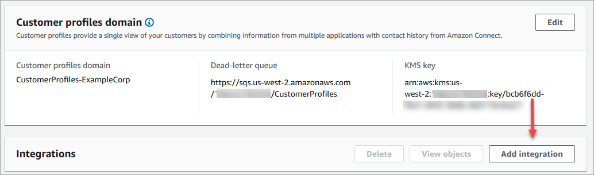
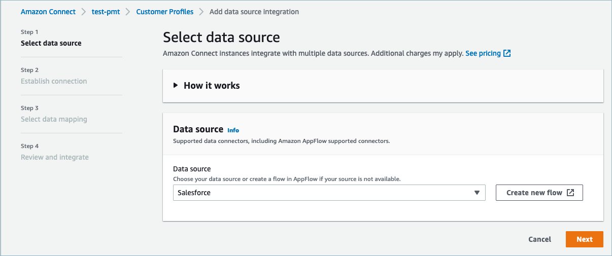
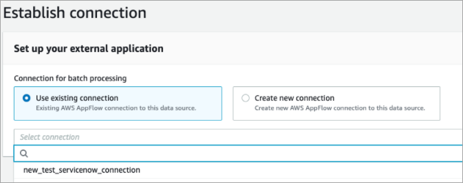
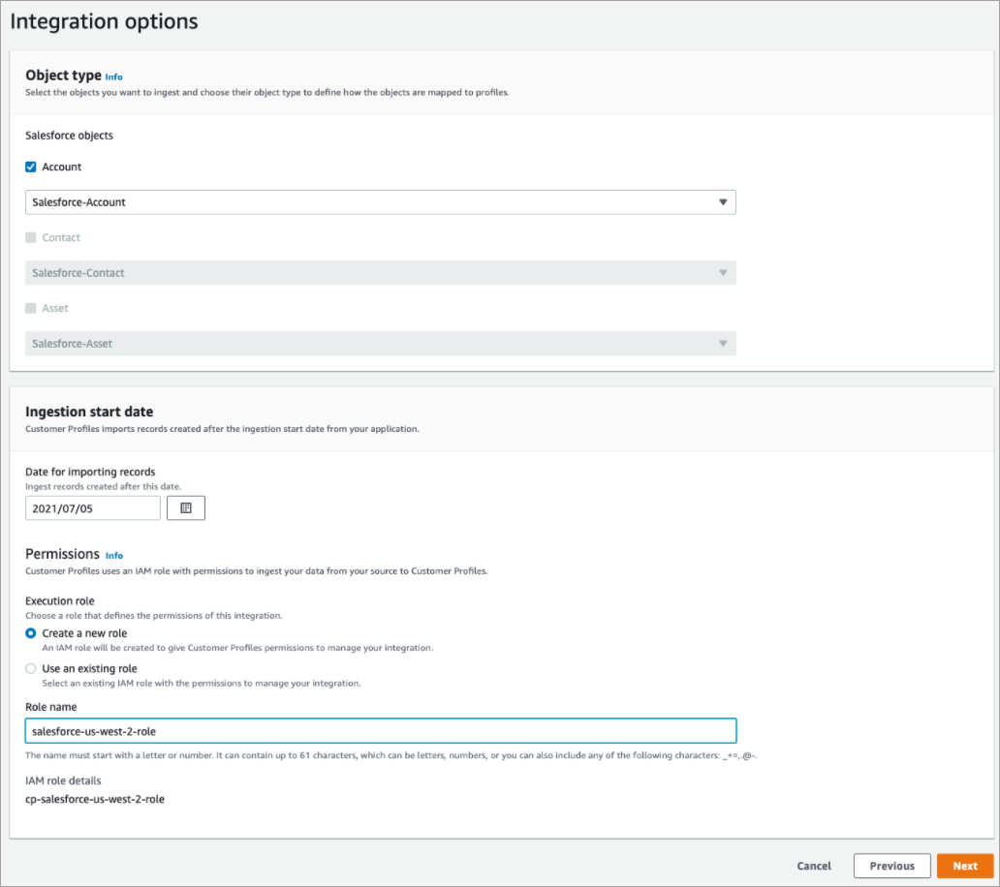
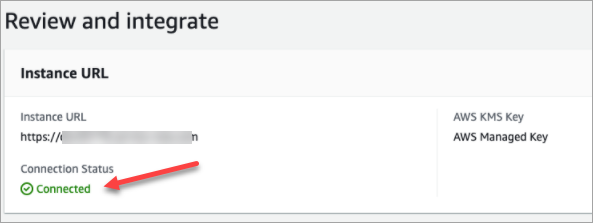
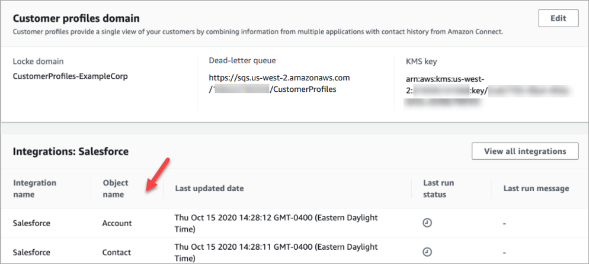

# Set up Amazon Connect

integration with Salesforce, ServiceNow, Marketo, or Zendesk

To provide periodic updates to Amazon Connect Customer Profiles, you can integrate with Salesforce,
ServiceNow, Marketo, or Zendesk using Amazon AppFlow. You first set up the connection in
Amazon Connect and the application of your choice, and then verify the
integration.

## Set up the

connection in Amazon Connect and Salesforce, ServiceNow, Marketo, or
Zendesk

1. Open the Amazon Connect console at
   [https://console.aws.amazon.com/connect/](https://console.aws.amazon.com/connect/ "https://console.aws.amazon.com/connect/").
2. On the instances page, choose the instance alias. The instance alias is also
   your **instance name**, which appears in your Amazon Connect
   URL. The following image shows the **Amazon Connect virtual contact center instances** page, with a box
   around the instance alias.

 3. In the navigation pane, choose **Customer
profiles**. 4. On the **Customer profiles configuration** page,
choose **Add integration**, as shown in the
following image.

 5. On the **Select data source** page, choose which
external application you want to get customer profiles data from.
You can view the [integration
requirements](../../../appflow/latest/userguide/requirements.md "../../../appflow/latest/userguide/requirements.md") to better understand the connection
requirements needed for your application.

 6. On the **Establish connection** page, choose one
of the following:

    * **Use existing connection**: This allows
     you to reuse existing Amazon AppFlow resources you may have created
     in your AWS account..
    * **Create new connection**: Enter the
     information required by the external application.

 7. On the **Integration options** page, choose which
source objects you want to ingest and select their object type.

Object types store your ingested data. They also define how
objects from your integrations are mapped to profiles when they are
ingested. Customer Profiles provides default object type templates you can use
that define how attributes in your source objects are mapped to the
standard objects in Customer Profiles. You can also use the object mappings that
you’ve created from the [PutProfileObjectType](../../../customerprofiles/latest/APIReference/API_PutProfileObjectType.md "../../../customerprofiles/latest/APIReference/API_PutProfileObjectType.md"). When adding or creating the
Salesforce integration for the user created data mapping, you need
to specify the specific data mapping, otherwise it will choose the
Salesforce default data mapping for object type. You can create your
data mapping and use it when setting up a featured data
connector.

 8. For the **Ingestion start date**, Customer Profiles starts
ingesting records created after this date. By default, the date for
importing records is set at 30 days prior. 9. On the **Review and integrate** page, check that
the **Connection status** says
**Connected**, and then choose **Create
integration**.

 10. After the integration is set up, back on the **Customer
profiles configuration** page, choose **View
objects** to see what data is being batched and sent.
Currently, this process ingests records that were created or
modified in the last 30 days.

