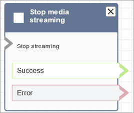

# Flow block in Amazon Connect: Stop media streaming

This topic defines the flow block to stop capturing customer audio.

## Description

- Stops capturing customer audio after it is started with a **Start
  media streaming** block.
- You must use a **Stop media streaming** block to stop
  media streaming.

## Supported channels

The following table lists how this block routes a contact who is using the
specified channel.

| Channel | Supported?        |
| ------- | ----------------- | --------------------------------------------------------------------------------------------------------------------------------------------------------------------------------------------------------------------------------------------------------------------------------------------------------------------------------------------------------------------------------------------------------------------------------------------------------------------------------------------------------------------------------------------------------------------------------------------------------------------------------------------------------------------------------------------------------------------------------------------------------------------------------------------------------------------------------------------------------------------------------------------------------------------------------------------------------------------------------------------------------------------------------------------------------------------------------------------------------------------------------------------------------------------------------------------------------------------------------------------------------------------------------------------------------------------------------------------------------------------------------------------------------------------------------------------------------------------------------------------------------------------------------------------------------------------------------------------------------------------------------------------------------- |
| Voice   | Yes               |
| Chat    | No - Error branch |
| Task    | No - Error branch |
| Email   | No - Error branch | ## Flow types You can use this block in the following [flow types](create-contact-flow.md#contact-flow-types "create-contact-flow.md#contact-flow-types"):  • Inbound flow  • Customer Queue flow  • Customer Whisper flow  • Outbound Whisper flow  • Agent Whisper flow  • Transfer to Agent flow  • Transfer to Queue flow ## Properties This block doesn't have any properties. ## Configuration tips  • You must enable live media streaming in your instance to successfully capture customer audio. For instructions, see [Set up live media streaming of customer audio in Amazon Connect](customer-voice-streams.md "customer-voice-streams.md").  • Customer audio is captured until a **Stop media streaming** block is invoked, even if the contact is passed to another flow.  • If this block is triggered during a chat conversation, the contact is routed down the **Error** branch. ## Configured block The following image shows an example of what this block looks like when it is configured. It has the following branches: **Success** and **Error**.  ## Sample flows Amazon Connect includes a set of sample flows. For instructions that explain how to access the sample flows in the flow designer, see [Sample flows in Amazon Connect](contact-flow-samples.md "contact-flow-samples.md"). Following are topics that describe the sample flows which include this block. [Example flow for testing live media streaming in Amazon Connect](use-media-streams-blocks.md "use-media-streams-blocks.md") |
