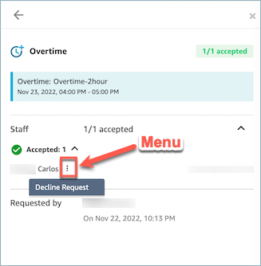

# Amazon Connect contact center supervisor ability to

override approval for overtime and time off

Managers can override the system approval for OT/VTO and force decline a request
by clicking on the vertical ellipsis next to the agent name. This option is shown in
the following image of the **Overtime** pane.

