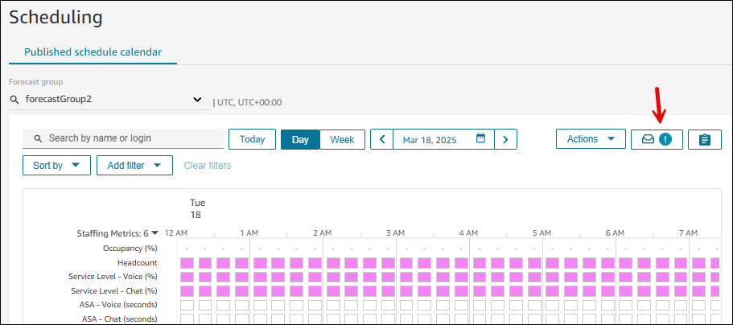
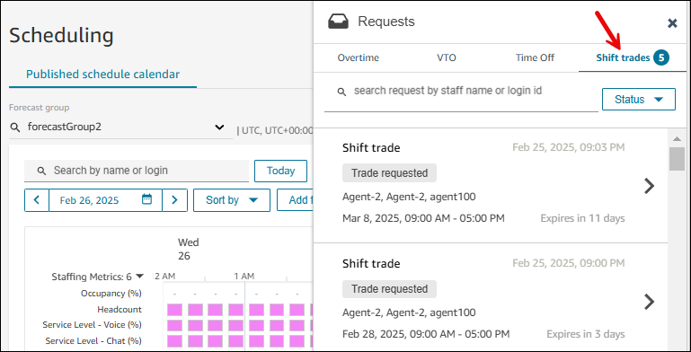

# How supervisors

approve shift trade requests

A supervisor can manually approve, decline, or cancel any trade request that
is not complete.

If the trade group is changed from Automatic to Manual at any time, all trade
requests not yet approved will immediately require manual approval.

###### Tip

If agents across staffing groups want to trade shifts, both staffing group
managers get the notification, and either one of them can approve the
request. Approval is not required from both managers.

If you decline an offer, the original trade request goes back into the pool.
Both agents can still trade with other agents.

If you Cancel trade request, then the agent cannot change their shift on that
day.

You are always prompted for a comment that is sent to the agent.

If you accidentally approve a shift trade, you then have to manually edit the
shifts to undo it. This is because after a shift is traded, the older shift no
longer exists.

1. To view shift trade requests, supervisors or managers view their
   **Published schedule calendar**. A shift trade
   notification appears on the request drawer icon, as shown in the
   following image.

 2. Choose the **Shift trades** tab to view the details
of the shift trade requests from all the agents you manage. The
following image shows an example with current and past shift trades.

 3. Approve or decline the requests. The comment you enter will be sent to
the agent.
