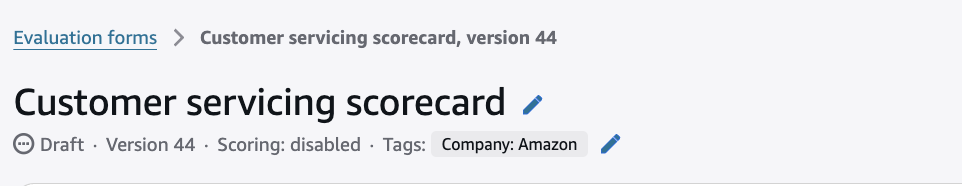
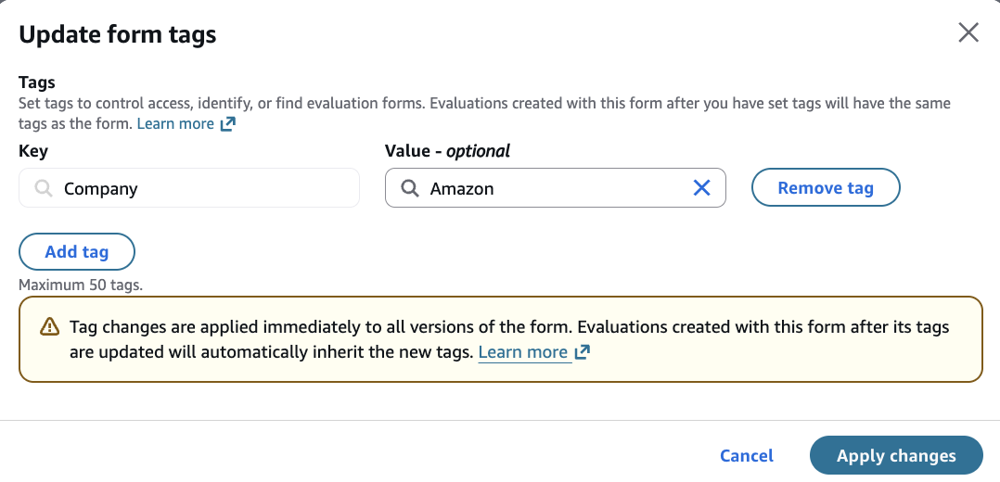
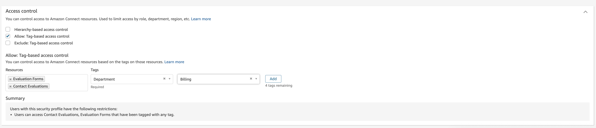

# Set up

tag-based-access controls on performance evaluations

Amazon Connect enables businesses to restrict access to specific performance
evaluation forms, preventing unauthorized access to evaluation form templates and
completed evaluations. Businesses can provide managers access to modify or use only the
evaluation form templates that are relevant to their business line or function,
improving security and making it easier for managers to select the right form while
completing evaluations. Additionally, both managers and agents can be restricted from
viewing certain completed evaluations. For example, you can restrict agents from viewing
test evaluations filled with a form template that is yet to be finalized.

You can start by tagging evaluation forms, for example "Department: New customer".
When you tag an evaluation form, all subsequent evaluations filled with the evaluation
form also carry the same tag. You can then enable tag-based access controls to
evaluation forms and evaluations within the security profiles of users for whom you wish
to restrict access to specific evaluation forms and evaluations. Once tag-based-access
control on evaluation forms is enabled, users will be able to modify only specific
evaluation forms on the **Evaluation forms** page. On Contact Search,
users will only be able to search for evaluation forms for which they have access, and
use the evaluation forms to start evaluations. Similarly within Amazon Connect
**Dashboards**, users will only be able to view aggregated scores for
evaluation forms for which they have access. Tag-based access control on evaluations
restricts users to only be able to view specific evaluations on the **Contact
Details** page. For example, if a specific evaluation should only be visible to certain personas,
such as fraud investigation, then you can restrict agents from viewing those evaluations
on the Contact Details page.

###### Important Notes

- Once you enable tag based access control on evaluations, the users will lose
  access to any evaluations prior to tagging the evaluation form. If you are already
  using performance evaluations, we recommend to first tag evaluation forms and
  accumulate evaluations over several months, prior to enabling tag based access to
  evaluations.
- It is recommended to use a single tag on an evaluation form (e.g. "Department: New customer")
  while configuring tag-based access. While assigning and permitting access on multiple tags is
  possible, it creates complexity. This is discussed in more detail below.

## Tagging evaluation forms

You can tag evaluation forms while creating a new evaluation form, or by updating an existing
evaluation form. The tags that you can add to an evaluation form will depend on tag-based-access
control granted on your security profile(s):

- If your security profile has no tag-based access controls configured for evaluation forms,
  then you can create or update a form with any tag(s).
- If you have one security profile with tag-based-access control enabled on an evaluation forms,
  then evaluation form tags from your security profile will be added automatically while creating
  evaluation forms through the Amazon Connect UI. You will not be able to update tags on evaluation forms
  in this scenario.
- If you have multiple security profiles, you must add all the tags from one of your security
  profiles to the evaluation form while creating or updating an evaluation form. For example, if one
  of your security profile grants you access to "Department: Sales" and another grants you access to
  "Department: Retention", then you must add either the "Department: Sales" or "Department: Retention"
  tag on the evaluation form. While creating an evaluation form, tags from one of your security
  profiles will be automatically added.

Below are the steps to add tags to an evaluation form.

###### While creating an evaluation form

- You will be prompted to add tags to an evaluation form when you create it (see [Create an evaluation
  form](create-evaluation-forms.md "create-evaluation-forms.md")).

###### While editing an evaluation form

1. Open the evaluation form with a security profile that has the permission
   **Evaluation forms - manage form definitions** - **Edit**.
2. Click on the edit icon next to the Tags.

 3. Update the tags.

###### Note

Tag changes are applied immediately to all versions of the form. Updating tags does not
require you to save or activate the form.

## Tag inheritance from evaluation forms to evaluations

While creating an evaluation from the Amazon Connect UI, the tags from the evaluation form are copied
over to the evaluation upon creation. For example, if the evaluation form is tagged as "Department: Sales"
then the evaluation created with this evaluation will also carry the same tag. If the evaluation form
contains multiple tags (Department: Sales, Product: Dishwasher) then those will also be carried over to
the evaluation provided you have access to create an evaluation with those tags (discussed in more detail
in the next section).

###### Note

Tags are copied over only to new evaluations. If you have existing evaluations, then adding or
updating tags on evaluation forms will not change evaluations on historically completed evaluations.

## Set up tag-based access to evaluation forms and evaluations

1. Login to **Amazon Connect** with a user profile that has access to
   **Security Profiles - View** and **Edit** permissions.
2. Go to the **Users > Security Profiles** page within security profiles,
   and select a security profile that you want to modify.
3. Click **Show advanced options**.
4. Select **Allow: Tag-based access control**.
5. Under resources, select **Evaluation forms** and
   **Contact Evaluations**.
6. Enter the tag that you want to restrict the users' security profile to.

If you have existing evaluations, then enabling tag-based access to contact evaluations will result
in individuals who already have access to evaluations losing access to historical evaluations. To retain
access to historical evaluations you can:

- Start by tagging forms. This would result in any evaluations performed subsequently carrying
  the same tag. Once you have accumulated several months' evaluations you can enable tag-based-access.
- Your technical administrator can use the [TagResource](../APIReference/API_TagResource.md "../APIReference/API_TagResource.md") API to tag any
  historical evaluations.
- Enable tag-based access on **evaluation forms** but not
  **contact evaluations**. This may be desirable in situations where there is already
  security that limits access to which contacts are accessible. For example, supervisors may already
  be restricted to access contacts within their own hierarchy, and you may want to grant your
  supervisors access to all evaluations on those contacts.

If you have enabled tag-based access control on **Contact Evaluations**, it is
recommended to have consistency with tag-based-access on the **Evaluation Forms**. It is
also recommended that users' security profiles have access to all tags on the form(s) that they need to use.
For example, if a user is to use a form with tags "Department: New customer", "Product: Auto Insurance",
the security profile of the user should have access control enabled for both these tags across both
**Evaluation Forms** and **Contact Evaluations**. If they have only one
of the tags, then creating an evaluation manually in the UI will fail.

## Restricting access to automated evaluation forms under testing

Tag-based-access-control can be used to run automated evaluation tests in production,
without revealing evaluation results to agents and supervisors. This is useful if you are
already using evaluation forms in production. An example setup is as follows:

- On the **Evaluation forms** page, tag evaluation forms that are
  live and should be visible to agents and supervisors as "Live: Yes"
- On **Users > Security Profiles**, you can turn on tag-based
  access control on **Evaluation Forms** and **Evaluations**,
  restricting agent and supervisors access to forms with the tag "Live:Yes"

###### Note

Before enabling tag-based-access-control, you may want sufficient history to accumulate,
e.g. 2 months of evaluations, as this would result in a loss in historical evaluations

- Automated evaluation forms that are still under testing can be tagged as "Live:No",
  preventing them from being visible by agents and supervisors
- Quality managers responsible for creating evaluation forms can be granted access to
  evaluation forms without tag-based restrictions. Alternatively, you can assign two
  security profiles to quality managers:
  - The first would grant them access to **Evaluation Forms**
    and **Evaluations** with the tag "Live: No"
  - The second would grant them access to **Evaluation Forms**
    and **Evaluations** with the tag "Live: Yes"

- Once you are ready to go live with automated evaluations, you can duplicate the form,
  and change the tag to "Live: Yes". The original form when it was under testing should
  continue carrying the tag "Live: No". This ensures that supervisors and agents cannot
  see historical aggregated evaluation scores in **Dashboards** when the
  form was under testing.

## Tag Based Access Control while setting up rules to submit automated evaluations

You can only create a rule to submit automated evaluations using a form that you have access to.
For example, suppose there is an automated evaluation form **Auto Insurance Sales Scorecard**
with the tags "Department: New customer", "Product: Auto Insurance", and your security profile grants you
access to the tag "Department: New customer" for evaluation forms. Then you would be able to setup a rule
to auto-submit evaluations using the form **Auto Insurance Sales Scorecard**.

## Tag Based Access Control while setting up Calibration Sessions

As an administrator of a calibration session, you can only create a calibration session with evaluation
forms that you have access to.
