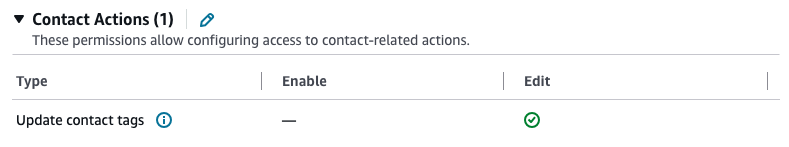
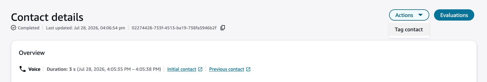
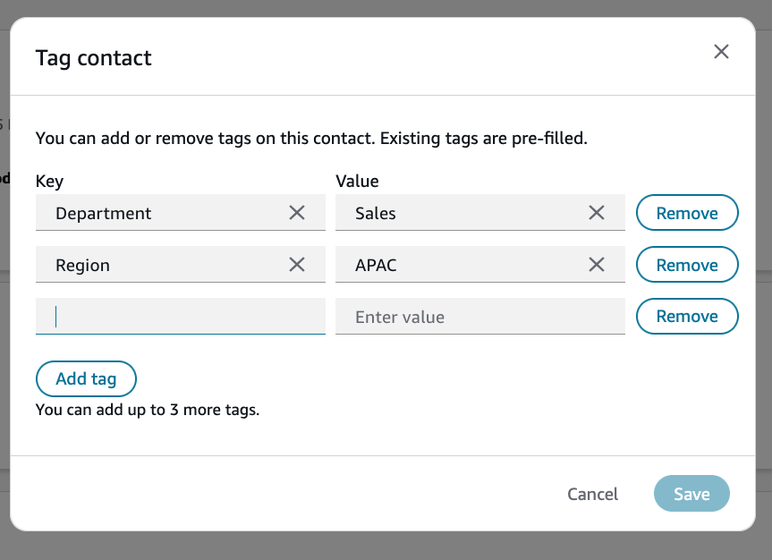

# Tag contacts on the Contact details page in Connect Customer

Tags are key-value pairs that help you categorize and organize contacts so you can
find related contacts in **Contact search**. On the **Contact
details** page, you can add up to 6 tags to an in-progress or completed
contact that you can access.

To add or remove tags programmatically, use the [TagContact](../APIReference/API_TagContact.md "../APIReference/API_TagContact.md") and [UntagContact](../APIReference/API_UntagContact.md "../APIReference/API_UntagContact.md")
operations.

###### Note

Tag-based access control is not yet supported on contacts.

## Required permissions

- Enable one of the following permissions to view contacts on the
  **Contact search** and **Contact
  details** pages:

  - **Contact search - View**: Allows a user to view
    all contacts.
  - **View my contacts - View**: Allows agents to view
    only those contacts that they handled.

- (Optional) **Restrict contact access**: Restricts a
  user's access on the **Contact search** and
  **Contact details** pages to contacts in their hierarchy
  group and any groups below it. For more information, see [Manage who can search for contacts and access detailed information](contact-search.md#required-permissions-search-contacts "contact-search.md#required-permissions-search-contacts").
- **Update contact tags**: Allows a user to add and remove
  tags from contacts on the **Contact details** page.

The following image shows the **Contact Actions - Update contact
tags** permission.

## How to tag a contact

1. Log in to Connect Customer with a user account that has permissions to access contact
   records.
2. In Connect Customer, choose **Analytics and optimization**,
   **Contact search**.
3. Search for the contact you want to tag. The contact can be in-progress or
   completed.
4. Choose the contact to view its details.
5. On the **Contact details** page, choose
   **Actions**, **Tag contact**.

 6. The **Tag contact** dialog opens. Existing tags on the
contact are pre-filled.

 7. Enter a **Key** and **Value** for the
tag. 8. (Optional) To add another tag, choose **Add tag**, and
then enter its **Key** and **Value**. 9. Choose **Save**.

## How to remove a tag from a contact

1. On the **Contact details** page, choose
   **Actions**, **Tag contact**.
2. In the **Tag contact** dialog, choose
   **Remove** next to the tag you want to remove.
3. Choose **Save**.
