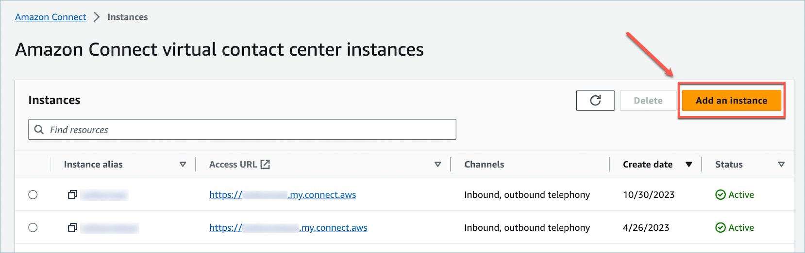
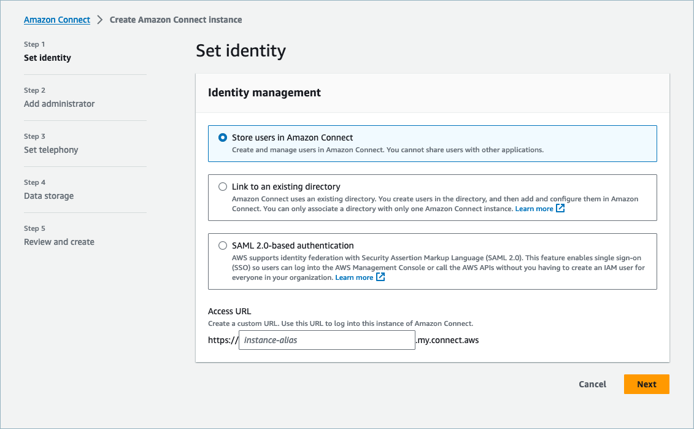
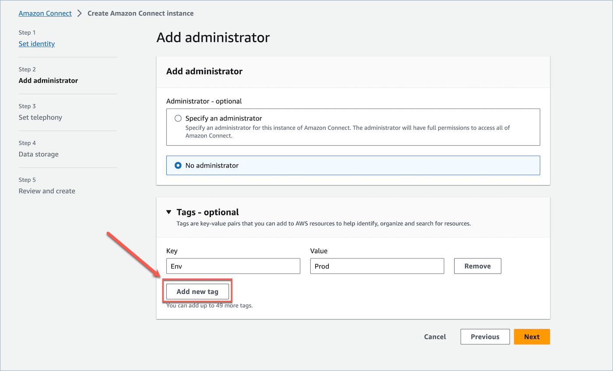
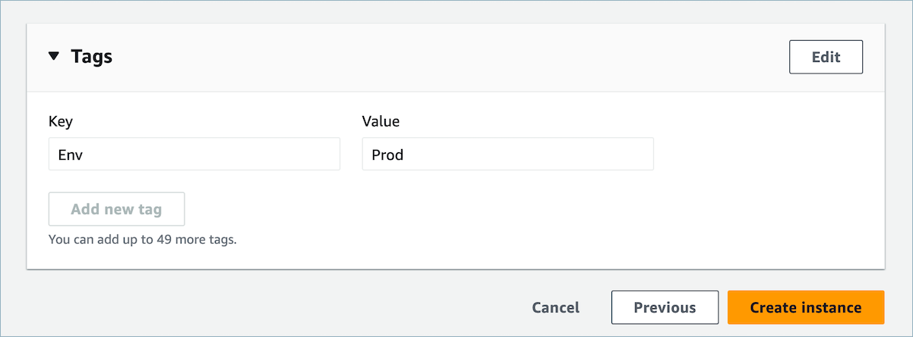
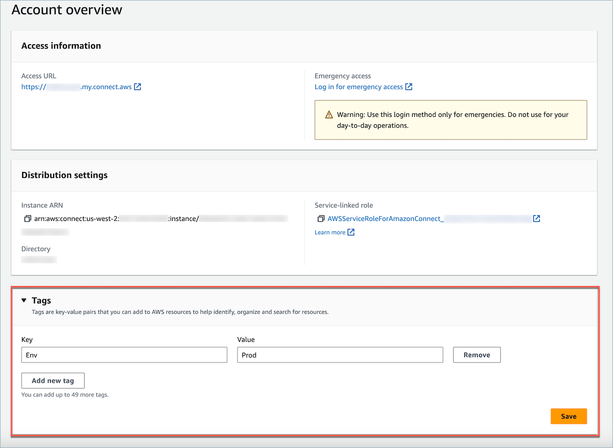
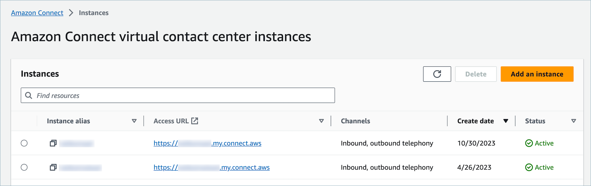
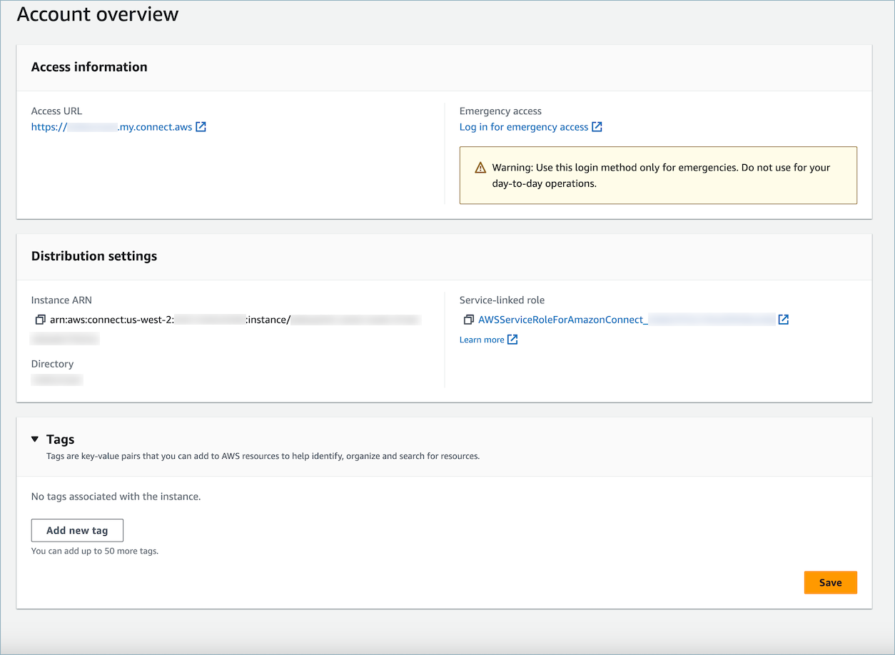
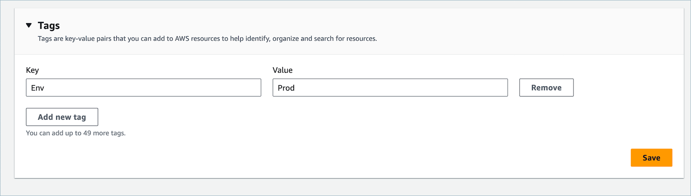
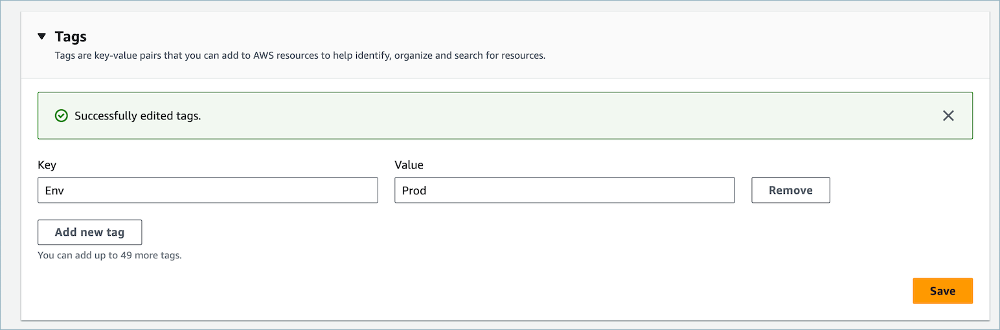

# Tagging an Amazon Connect

instance

Instance Tagging provides the ability for you to tag Amazon Connect instances and
build tailored authorization through tag-based access control (TBAC). To help you manage
your Amazon Connect instances, you can assign your own metadata in the form of tags
to the instance. If you have multiple Amazon Connect instances in a single AWS account, each serving different functions or catering to specific lines
of business, using tags can help you better organize and apply tag-based access control
(TBAC) policies to these instances for improved management and control.

[AWS Tags](tagging.md "tagging.md") serve as a useful tool for organizing your
AWS resources. They consist of key-value pairs that help you
categorize resources based on criteria like purpose, owner, or environment. This enables
you to identify and manage your resources. Amazon Connect, allows you to add tags to
your instances directly from the AWS console, or by utilizing public
APIs.

## Tagging Amazon Connect

instances at creation

1. Open the Amazon Connect console at
   [https://console.aws.amazon.com/connect/](https://console.aws.amazon.com/connect/ "https://console.aws.amazon.com/connect/").
2. Choose **Add an instance**.

 3. Under **Set identity**, select the type of
**Identity management** that you would like to use,
enter a customer **Access URL**, and choose
**Next**.

 4. Under the **Add administrator** section, you can choose
the **Add new tag** option if you would like to add tags to
your instance.

 5. Enter a `Key` and `Value` pair and choose
**Next**. 6. Once you have made your desired configurations under the **Set
telephony** and **Data storage** steps, review
your configurations and choose **Create instance**.

 7. Once the instance has been created, navigate to the **Account
overview** page of the instance and the tags that you added
will appear in the **Tags** section.



## Tagging an existing Amazon Connect instance

1. Open the Amazon Connect console at
   [https://console.aws.amazon.com/connect/](https://console.aws.amazon.com/connect/ "https://console.aws.amazon.com/connect/").
2. Select an existing instance that you would like to add tags too.

 3. On the **Account overview**, choose **Add new
tag**.

 4. Enter a `Key` and `Value` pair and choose
**Next**. You can add up to 50 tags on a single
instance.

 5. Choose **Save** to add your tags to your instance.



## Tagging an Amazon Connect

instance using the API

To tag Amazon Connect instances using the public APIs, see [TagResource](../APIReference/API_TagResource.md "../APIReference/API_TagResource.md") and [UntagResource](../APIReference/API_UntagResource.md "../APIReference/API_UntagResource.md").

## Sample IAM policies

for scenarios with and without instance tags

For TBAC on instances, you can define IAM policies based on instance tags and
assign them to IAM roles to control access to specific instances. The following are
sample scenarios and sample IAM policies for how to use conditions on tags or
conditions on resource IDs.

**Scenario 1**: Controlling access to a specific
Amazon Connect instance through an IAM role using tags associated with the
instance. The following policy allows access only to instances which are tagged with
key:`Environment` and value:`Dev`.

JSON

```
`{
 "Version":"2012-10-17",
 "Statement": [
 {
 "Effect": "Allow",
 "Action": "connect:*",
 "Resource": "*",
 "Condition": {
 "StringEquals": {
 "aws:ResourceTag/Environment": "Dev"
 }
 }
 }
 ]
}`

```

**Scenario 2**: Controlling access to a specific
instance and all resources within the instance without using tags.

JSON

```
`{
 "Version":"2012-10-17",
 "Statement": [
 {
 "Sid": "VisualEditor0",
 "Effect": "Allow",
 "Action": "connect:*",
 "Resource": "*",
 "Condition": {
 "ForAnyValue:StringEquals": {
 "connect:InstanceId": [
 "`AllowedInstanceID-1`",
 "`AllowedInstanceID-2`"
 ]
 }
 }
 },
 {
 "Sid": "VisualEditor1",
 "Effect": "Deny",
 "Action": "connect:*",
 "Resource": "*",
 "Condition": {
 "ForAnyValue:StringEquals": {
 "connect:InstanceId": "`DeniedInstanceID-1`"
 }
 }
 }
 ]
}`

```

## Additional information

about instance tagging

**Replicating instances:** When you create a [replica of your existing Amazon Connect instance](create-replica-connect-instance.md "create-replica-connect-instance.md") to another region using the [ReplicateInstance](../APIReference/API_ReplicateInstance.md "../APIReference/API_ReplicateInstance.md") API, tags from the source instance will not be
automatically tagged to the newly replicated instance. You will have to tag the
replicated instance manually.

**Tag inheritance:** When you tag an Amazon Connect instance, all underlying resources in Amazon Connect, such as routing
profiles, queues, will not inherit the instance tags. To learn how to control
granular access to specific resources in Amazon Connect, see how to configure
more granular access by using [tag-based
access control](tag-based-access-control.md "tag-based-access-control.md").
