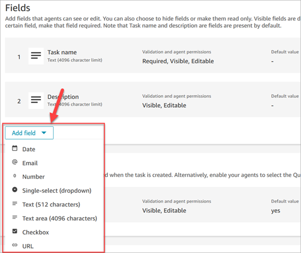
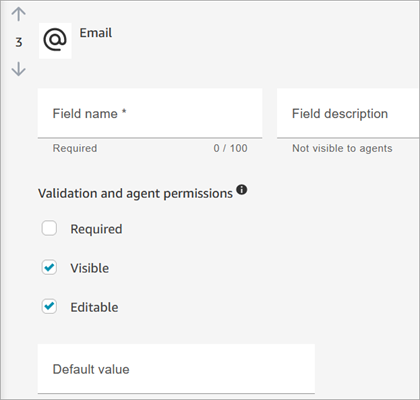
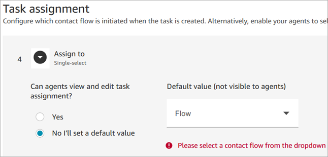
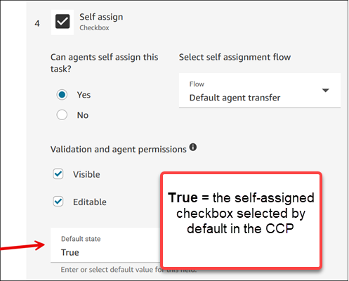
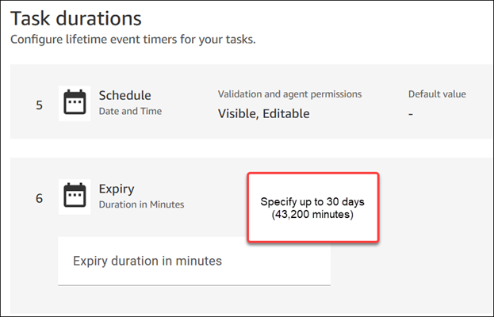
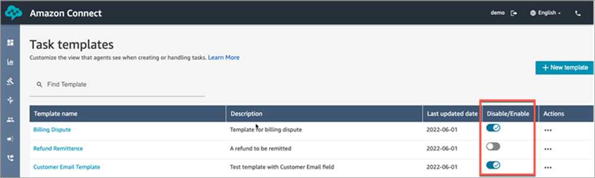
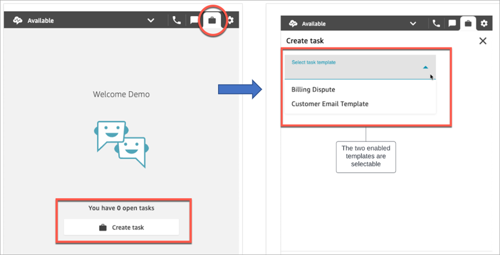
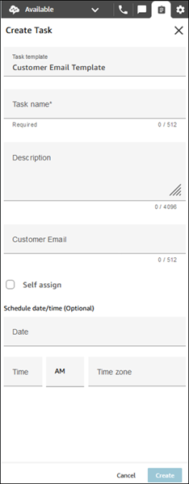
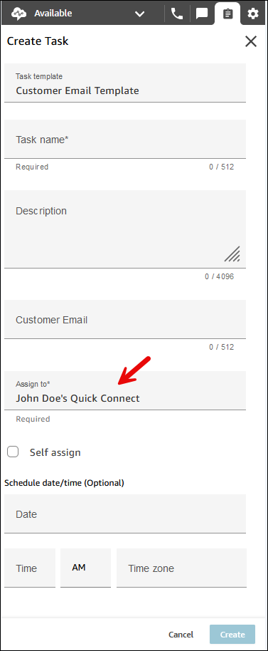
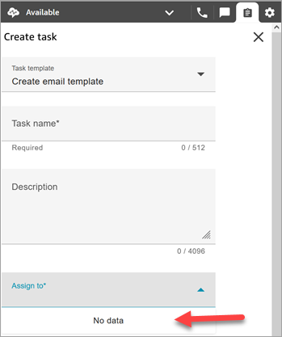

# Create task templates in Amazon Connect

Task templates make it easy for agents to capture the right information to create and
complete a [task](tasks.md "tasks.md"). All the fields they need to create a given
type of task are provided for them.

## Important things to know before you

create your first template

- When you publish your first template, your agents will be prompted to
  select a template when they create a new task. Agents must select one of the
  templates you have published.
- If you want to return to the standard task experience and not require
  agents to select a template, on the **Task templates**
  page, use the **Disable/Enable** toggle to disable all
  templates you published.
- Verify your Amazon Connect account has [permissions to create task templates](task-template-permissions.md "task-template-permissions.md").
- Review the list of quotas for task templates, such as the **Task
  templates per instance** and **Task template customized
  fields per instance**. See [Amazon Connect service quotas](amazon-connect-service-limits.md "amazon-connect-service-limits.md").
- You can configure a task template to allow an agent to assign the tasks to
  themselves. The agent needs the security profile permission
  **Contact Control Panel - Allow self assigning of
  contacts** and the **Restrict Task Creation**
  permission must be disabled. The agent will then be able to check a box when
  they create a task from the CCP and assign it to themselves.

## How to create a task template

### Step 1: Name the template

1. Log in to the Amazon Connect console with an **Admin**
   account, or an account assigned to a security profile that has [permissions to create task
   templates](task-template-permissions.md "task-template-permissions.md").
2. In the left navigation menu, choose **Channels**,
   **Task templates**.
3. On the **Task templates page**, choose **+
   New template**.
4. On the **Create new template** page, in the
   **Template name** box, enter the name that will be
   displayed your agents.
5. In the **Description** box, describe the purpose of
   the template. This information is not displayed to agents; it's for your
   own use.

### Step 2: Add fields, task assignment,

schedule, and expiry

1. In the **Fields** section, choose the **Add
   field** dropdown, and then select the type of field you
   want to add to your template.

 2. Use the up and down arrows as needed to change the order the field
appears on the template. 3. In the **Validation and permissions** section, choose
whether the field is required to be populated by the agent when they
create a task, or add a default value to pre-populate the field when the
agent opens the template.

The following image shows what this section looks like for a field
that is type **Email**.

###### Note

It is not possible to use attributes in the task templates
page. 4. In the **Task assignment** section:

    1. **Assign to**: Choose
     **Yes** to allow agents to view and edit a
     task assignment when they create the task. Or, assign a default
     value, as shown in the following image. Choose a published flow
     that runs after the agent chooses **Create** to
     create the task. Agents don't see the name of the flow on the
     CCP.

    ###### Note

    Only published flows are listed in the **Default
     value** dropdown.

    
    2. **Self-assign**: Choose
     **Yes** to allow agents to assign tasks to
     themselves on the CCP. For **Default state**,
     choose **True** if you want the self-assigned
     checkbox selected by default in the CCP.

    

5. In the **Task schedule** section, choose whether you
   want agents to be able to schedule a future start date and time for
   tasks.
6. In the **Expiry** section, specify how long the task
   should exist before it expires. The default is 7 days. You can configure
   it for up to 90 days (129,600 minutes)

### Step 3: Publish

After you configure your template, choose **Publish** to
create it and make it visible to your agents.

###### Important

If this is your first template, when you choose
**Publish**, agents are automatically required to
select a task template when they create a task.

If you want to maintain the standard task experience without selectable
templates, disable all templates.

## What your agents experience

After you publish a template, agents are required to select a template to create a
task.

For example, the following image shows two templates have published:
**Customer Email Template** and **Billing
Dispute**.

In the Contact Control Panel, when agents choose **Create task**
they must choose one of the templates: **Billing Dispute** or
**Customer Email Template**.

Let's assume the agent chooses **Customer Email Template**. The
following image shows the fields the agent must complete in order to create a task.
Notice that there is no option for the agent to assign the task to others; this
template has **Task assignment** set to a default value. However,
the agent can opt to assign the task to themselves.

## "No data" message in the Assign to

dropdown

Let's say that in the **Task assignment** section, you choose to
allow agents to assign the task to another agent. To set up for this scenario, you
must create a quick connect for the destination agent so it appears in the dropdown
list of choices, as shown in the following image. For instructions about creating a
quick connect for an agent, see [Test tasks](chat-testing.md#test-tasks "chat-testing.md#test-tasks").

If no quick connects exist, then the message **No data** appears
when you choose the **Assign to** dropdown menu, as shown in the
following image.

