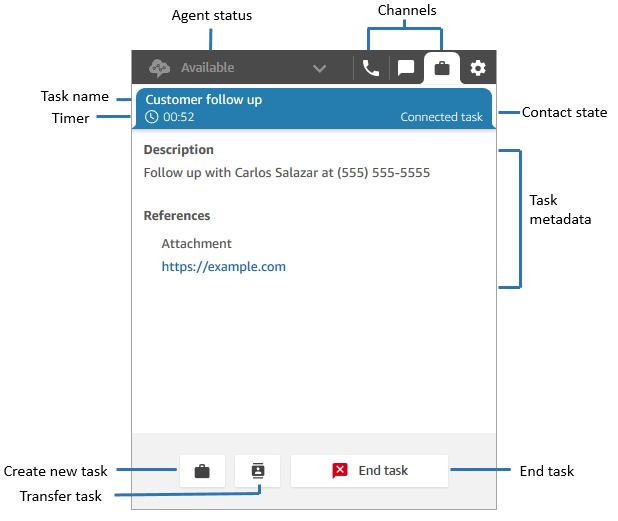
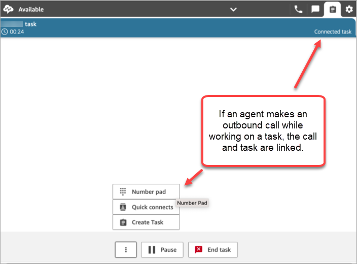
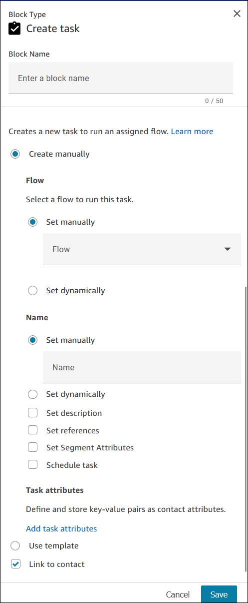
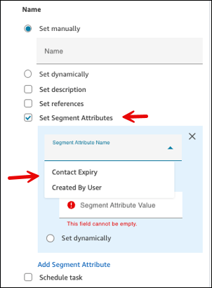
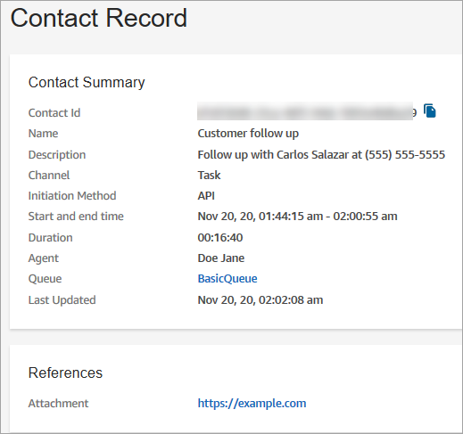

# The task channel in Amazon Connect

Amazon Connect Tasks allows you to prioritize, assign, track, and even automate tasks across
the disparate tools agents use to support customers. For example, using Tasks you
can:

- Follow-up on customer issues recorded in a customer relationship management
  (CRM) solution such as Salesforce.
- Follow-up with a customer through a call.
- Complete actions in a business-specific system, such as processing a customer
  claim in an insurance application.
  Currently, Amazon Connect Tasks can be used in compliance with [GDPR](https://aws.amazon.com/compliance/gdpr-center "https://aws.amazon.com/compliance/gdpr-center") and is approved for SOC, PCI, HITRUST,
  ISO, and HIPAA.

## What is a task?

In a business a _task_ is a unit of work that an agent must
complete. This includes work that may have originated in external applications. In
Amazon Connect this unit of work is a contact. It's routed, prioritized, assigned, and
tracked just like a voice or chat contact. Everything that is applicable to a voice
or chat contact is also applicable to a task contact.

Agents handle tasks in their Contact Control Panel (CCP), again just like any
other contact. When assigned a task, agents see a notification with the description
of the task, information associated with the tasks, and links to any applications
that they might need to complete the task. The following image shows what an agent's
CCP may look like when they manage tasks.



## How to create tasks

Amazon Connect provides different ways for you to create tasks:

1. You can use pre-built connectors with CRM applications (for example,
   Salesforce and Zendesk) to automatically create tasks based on a set of
   pre-defined conditions, without any custom development.

For example, you can configure a rule in Amazon Connect to automatically create a
task when a new case is created in Salesforce.

For more information, see [Set up application integration to create
tasks in Amazon Connect](integrate-external-apps-tasks.md "integrate-external-apps-tasks.md") and [Create rules that generate tasks for third-party
integrations in Amazon Connect](add-rules-task-creation.md "add-rules-task-creation.md"). 2. You can integrate with your homegrown or business-specific applications to
create tasks using Amazon Connect APIs.

For more information, see the [StartTaskContact](../APIReference/API_StartTaskContact.md "../APIReference/API_StartTaskContact.md")
API. 3. You can add a [Create task](create-task-block.md "create-task-block.md") block to your flows. This
block enables you to create and orchestrate tasks directly from flows based
on customer input
(DTMF
input), and contact and tasks information. 4. You can enable your agents to create tasks from the Contact Control Panel
(CCP) without you doing any development work.

For example, agents can create tasks to ensure follow up work is not
forgotten, such as calling a customer back to provide a status update on
their issue.

For more information, see [Test voice, chat, and task experiences in Amazon Connect](chat-testing.md "chat-testing.md").

For more information on getting started with tasks, see [Set up tasks in Amazon Connect](concepts-getting-started-tasks.md "concepts-getting-started-tasks.md").

###### Important

The [Default customer
queue](default-customer-queue.md "default-customer-queue.md") flow does not support tasks.
It will fail if you use it out-of-the-box without any changes. The
**Default customer queue flow** flow contains a [Loop prompts](loop-prompts.md "loop-prompts.md") block, and that
block doesn't support tasks.

We recommend you create a new flow, and use it to check the channel and route
tasks to the desired queue. For instructions, see [How to send tasks to a
queue](#example-enqueue-task "#example-enqueue-task").
Or, update the **Loop prompts** block in the default flow so
the **Error** branch doesn't terminate; instead perform another
action on the contact.

## Supported flow

types

You can use tasks in the following flow types:

- Inbound flow
- Customer queue flow
- Agent whisper flow
- Transfer to queue flow
- Transfer to agent flow

## Supported contact

blocks

You can use tasks in the following flow blocks:

- Change routing priority/age
- Check contact attributes
- Check hours of operation
- Check queue status
- Check staffing
- Create task
- Disconnect / hang up
- Distribute by percentage
- End flow / resume
- Get queue metrics
- Invoke AWS Lambda function
- Loop
- Set contact attributes
- Set customer queue flow
- Set disconnect flow
- Set working queue
- Transfer to flow
- Transfer to queue
- Wait

## Linked tasks

When using tasks with the [StartTaskContact](../APIReference/API_StartTaskContact.md "../APIReference/API_StartTaskContact.md") API, a new contact can be associated with an existing
contact through `PreviousContactID` or `RelatedContactId`.
This new contact contains a copy of the [contact
attributes](connect-attrib-list.md "connect-attrib-list.md") from the linked contact.

The following code shows request syntax that includes
`PreviousContactID` and `RelatedContactId`.

```
PUT /contact/task HTTP/1.1
Content-type: application/json

{
   "Attributes": {
      "string" : "string"
   },
   "ClientToken": "string",
   "ContactFlowId": "string",
   "Description": "string",
   "InstanceId": "string",
   "Name": "string",
   "PreviousContactId": "string",
   "QuickConnectId": "string",
   "References": {
      "string" : {
         "Type": "string",
         "Value": "string"
      }
   },
   "RelatedContactId": "string",
   "ScheduledTime": number,
   "TaskTemplateId": "string"
}
```

When you use `PreviousContactID` or `RelatedContactID` to
create tasks, note the following:

- `PreviousContactID` - When contacts are linked using the
  `PreviousContactID`, updates that are made to contact
  attributes at any time in the chain will percolate through the entire
  chain.
- `RelatedContactID` - When contacts are linked using the
  `RelatedContactID`, updates that are made to contact
  attributes will percolate only to the contactID that is referenced in the
  [UpdateContactAttributes](../APIReference/API_UpdateContactAttributes.md "../APIReference/API_UpdateContactAttributes.md") API.

###### Note

You can specify only `PreviousContactID` or
`RelatedContactID` in a request body, but not both. If you do
specify both, Amazon Connect returns an `InvalidRequestException` error with a
400 status code.

For information about how `PreviousContactID` and
`RelatedContactId` are modeled in contact records, see [ContactTraceRecord](ctr-data-model.md#ctr-ContactTraceRecord "ctr-data-model.md#ctr-ContactTraceRecord") in the
contact records data model.

## Agents can link tasks to outbound

contacts

While agents are **actively working on a task**, the
**Number pad** appears on the Contact Control Panel (CCP). If
they make an outbound call using the Number pad, the call is automatically linked to
the task. Amazon Connect links the task and outbound call by using the
`relatedContactID` parameter.

The following image of the CCP shows the **Number pad** is
available while the agent works on a task.



## Link task to contact by

using the Create task block

The Create task block enables you to automatically link the task to the current
contact.

The following image of the Properties page of the **Create task**
block shows the **Link to contact** option.



## Track who created a task

Agents who create tasks through CCP automatically have their agent resource ARN
added onto the contact record as a
[segment attribute](connect-attrib-list.md#attribs-segment-attributes "connect-attrib-list.md#attribs-segment-attributes")
called `CreatedByUser`. This attribute
enables you to track the originating agent for a task. However, you can't
access `CreatedByUser` by using the Amazon Connect admin website; instead use the [DescribeContact](../APIReference/API_DescribeContact.md "../APIReference/API_DescribeContact.md") API.

The `CreatedByUser` segment attribute is available to you on the [Create task](create-task-block.md "create-task-block.md") block. You can set the segment
attribute of **Created By User**, which represents the ARN of the
user who created the task. The following image shows a section of the
**Create task** properties page where this attribute is
available.



You can also set this value
manually for tasks that are created through the [StartTaskContact](../APIReference/API_StartTaskContact.md "../APIReference/API_StartTaskContact.md") API.

## Agents can assign tasks to

themselves

When contact center supervisors create task templates, they can configure them to
allow agents to self-assign tasks. Agents assign tasks to themselves by using the
CCP.

Developers can specify the `assignmentType` on the [StartTaskContact](../APIReference/API_StartTaskContact.md "../APIReference/API_StartTaskContact.md") API with the value `SELF` and specify a
valid `CreatedByUser` and a valid `TaskTemplateID`.

## Using IAM? Add Task permissions

If your organization is using custom [IAM](../../../IAM/latest/UserGuide/introduction.md "../../../IAM/latest/UserGuide/introduction.md") policies to manage access to the Amazon Connect console, make sure users
have the appropriate permissions to set up applications for task creation. For a
list of required permissions, see [Tasks page](security-iam-amazon-connect-permissions.md#tasks-page "security-iam-amazon-connect-permissions.md#tasks-page").

###### Note

If your instance was created before October 2018, for information about how to
configure your service-linked roles (SLR), see [For instances created before October 2018](connect-slr.md#migrate-slr "connect-slr.md#migrate-slr").

## Track tasks in real-time and historical metrics

reports

You can track the status of all tasks in real-time and historical metrics reports,
just like you track contacts in other channels. For example, you can track:

- How long agents spent working on each task ([Agent contact time](metrics-definitions.md#agent-contact-time "metrics-definitions.md#agent-contact-time")).
- The total time from when a task was created to when it was completed.
  ([Contact handle time](metrics-definitions.md#contact-handle-time "metrics-definitions.md#contact-handle-time")).

### Metrics

- [Average active time](metrics-definitions.md#average-active-time "metrics-definitions.md#average-active-time")
- [Average agent pause time](metrics-definitions.md#average-agent-pause-time "metrics-definitions.md#average-agent-pause-time")

### Contact metrics

The following data is captured in the contact data model.

### Metrics that don't apply to tasks and have

a value of 0 on the report

- [Average agent interaction time](metrics-definitions.md#average-agent-interaction-time "metrics-definitions.md#average-agent-interaction-time")
- [Average customer hold time](metrics-definitions.md#average-customer-hold-time "metrics-definitions.md#average-customer-hold-time")
- [Agent interaction and hold
  time](metrics-definitions.md#agent-interaction-and-hold-time "metrics-definitions.md#agent-interaction-and-hold-time") -
  historical
- [Agent interaction time](metrics-definitions.md#agent-interaction-time "metrics-definitions.md#agent-interaction-time") - historical
- [Average agent interaction time](metrics-definitions.md#average-agent-interaction-time "metrics-definitions.md#average-agent-interaction-time")
- [Average customer hold time](metrics-definitions.md#average-customer-hold-time "metrics-definitions.md#average-customer-hold-time")

### Manage tasks to custom service levels

(SL)

While voice and chats may have short service level times based on seconds or
minutes, you may have some tasks with service levels that are hours or days. You
can create custom service level durations that are appropriate to each of your
channels. For more information, see [custom
service levels](metrics-definitions.md#custom-service-levels "metrics-definitions.md#custom-service-levels").

## When do tasks end?

The default total duration of a task can be up to 7 days. When you [create a task template](task-templates.md "task-templates.md"), you can extend the
duration of the task up to 90 days.

A task ends when one of the following happens:

- An agent completes the task.
- A flow runs a [Disconnect / hang up](disconnect-hang-up.md "disconnect-hang-up.md") block, which ends the
  task.
- A task reaches the default 7 day limit.
- It reaches the **Expiry Duration In Minutes**, if this
  option is configured on the task template.
- You end the task using the [StopContact](../APIReference/API_StopContact.md "../APIReference/API_StopContact.md") API.

You can also use the **Contact Expiry** setting on the [Create task](create-task-block.md "create-task-block.md") block.

## How to send tasks to a queue

Since the [Default customer
queue](default-customer-queue.md "default-customer-queue.md") flow is only for voice contacts,
we recommend you create a new flow to send tasks (and other non-voice channels) to a
queue.

Let's say you want an overall wait time of 10 minutes for a task, but want to
check every minute to see if there are still agents who are working on the queue and
could at some point pick up the task. For this use case you would do the
following:

1. Add a [Loop](loop.md "loop.md") block to your
   flow. Set **Number of loops** to 10.
2. For the **Looping** branch, a use [Check staffing](check-staffing.md "check-staffing.md") block to
   check agent availability for the queue.
3. If agents are available, transfer the contact to the queue by using a
   [Transfer to queue](transfer-to-queue.md "transfer-to-queue.md") block.
4. Set the **Complete** branch to route the contact to a
   [Disconnect / hang up](disconnect-hang-up.md "disconnect-hang-up.md") block. This will be triggered
   if there are no agents during the 10 minute loop.

## Search and review completed tasks

Use the [Contact search](contact-search.md "contact-search.md") page to search for
and review completed tasks.

The following image is an example of what the **Contact Summary**
and **References** look like in a contact record for a task.



The following data is appended to the contact record but not stored with it. The
data is included in an export.

- Flow ID
- Potential attributes:
  - [ContactDetails](ctr-data-model.md#ctr-contact-details "ctr-data-model.md#ctr-contact-details")
    - Name: the name of the task
    - Description: the description of the task

  - [References](ctr-data-model.md#ctr-contact-references "ctr-data-model.md#ctr-contact-references"): any links to forms or
    other sites

When task is scheduled for a future date and time, **Contact
Summary** also displays **Scheduled time**.

## More information

- [Amazon Connect feature specifications](feature-limits.md "feature-limits.md")
- [Accept a task assigned in the Contact Control Panel
  (CCP)](accept-task.md "accept-task.md")
- [Create a new task in the Contact Control Panel
  (CCP)](create-task.md "create-task.md")
- [Transfer a task to another agent or queue in the
  Amazon Connect Contact Control Panel (CCP)](transfer-task.md "transfer-task.md")
