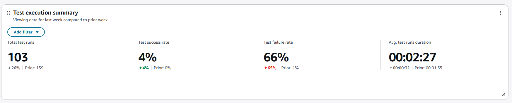
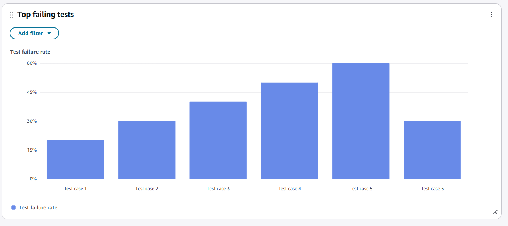
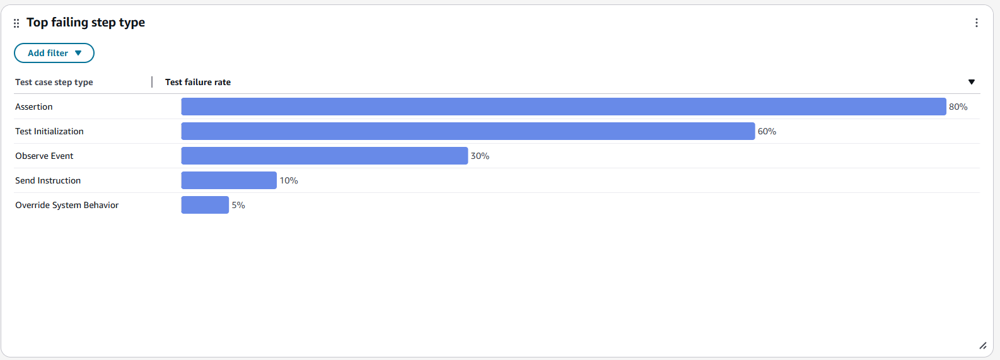
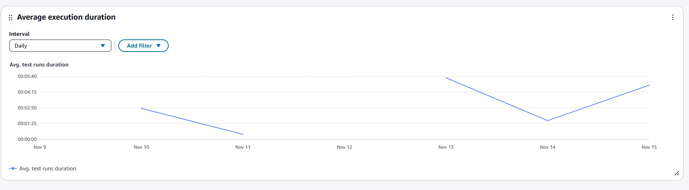
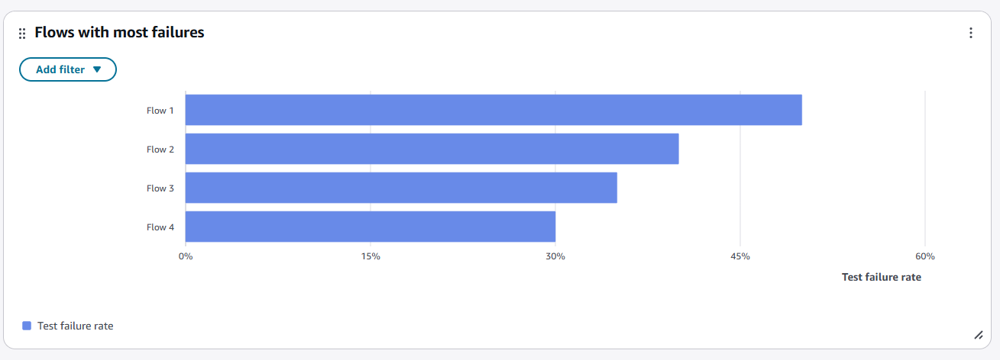

# Testing and simulation dashboard

The testing and simulation dashboard helps you monitor the quality and effectiveness
of your automated testing across Amazon Connect flows. You can track key metrics such as
test execution volume, success and failure rates, average test run duration, and failure
patterns by step type. Use the dashboard to identify top failing tests and flows,
compare performance against benchmark periods, and view execution trends over time.
Filter by test case, flow, channel, or time range to optimize your validation strategy
and ensure quality before production deployment.

## Enable access to the dashboard

Ensure users are assigned the appropriate security profile permissions:

- **Access metrics - Access** permission or the
  **Dashboard - Access** permission. For information
  about the difference in behavior, see [Assign permissions to view dashboards
  and reports in Amazon Connect](dashboard-required-permissions.md "dashboard-required-permissions.md").
- **Test Management > Test Cases - View** permissions: This permission is required to see data in your dashboard.

###### Note

You must have the Test Cases - View permission to see the dashboard

## Test execution summary chart

The **Test Execution Summary Chart** provides aggregated metrics
based on your selected filters. Each metric is compared to your "compare to"
benchmark time range filter. For example, if test runs during your selected time
range totaled 103, this represents a 26% decrease compared to your benchmark of 139
completed test runs. Percentages are rounded to the nearest whole number. Red
coloring indicates negative performance compared to your benchmark.

The following image shows an example of this chart.

The following metrics are displayed on this chart

- Total test runs: The count of test runs that started within the specified time range.
- Test success rate: The percentage of test runs completed with a successful outcome.
- Test failure rate: The percentage of test runs completed with a failed outcome.
- Average test run duration: The average duration of all test runs that successfully started and completed.

## Top failing tests

The **Top Failing Tests** chart displays the test cases with the
highest failure rates.

The following metrics are displayed on this chart

- **Top Failure rate:** The percentage of test runs that failed for each specific test case.

## Top failing step type

The **Top Failing Step Type** chart shows the breakdown of
failures by test case step type. There are five step types: test initialization,
observe event, send instruction, assert data, and override system behavior. Each
step type represents the detailed configuration for interactions you are simulating
within your test cases.

The following metrics are displayed on this chart

- **Test case step type:** These step types represent the
  detailed configured simulated interactions within your test cases. Each
  simulated interaction must have an "observe event" and may optionally
  include "send instruction," "assert data," and "override system behavior"
  configurations. Test initialization is executed at beginning of each test
  case run.
- **Test case failure rate:** The percentage of failures for each specific test case step type.

## Average execution duration

The **Average Execution Duration** chart is a time-series
visualization that displays test execution duration metrics for all test case
executions over a specified time period, broken down by intervals (daily or
weekly).

You can configure different time range intervals using the "Interval" button
directly in the widget. Available intervals depend on your page-level time range
filter.

For example:

- With a "Daily" time range filter at the widget level, you can view a 7-day
  trailing interval trend.
- With a "Weekly" time range filter at the widget level, you can view an
  13-week trailing interval trend.

The following metrics are displayed on this chart

- **Average test run duration:** The average duration of
  all test runs that successfully started and completed within a given
  interval.

## Flows with most failures

The **Flows with Most Failures** chart displays the flows with
the highest failure rates from test cases testing those specific flows.

The following metrics are displayed on this chart

- **Test failure rate:** The percentage of total test runs that failed for each specific flow.
