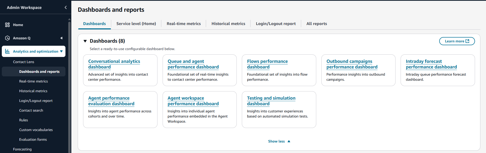
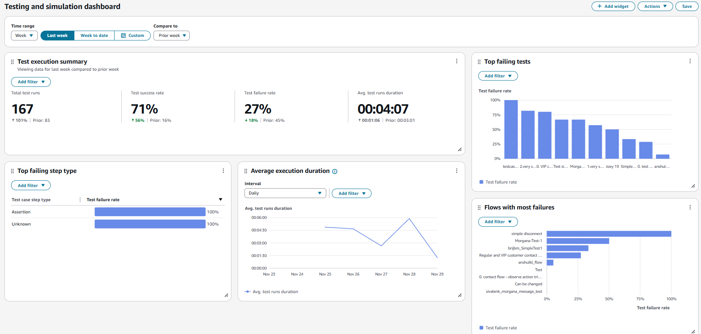

# Analyze test results

Amazon Connect supports testing and simulation dashboards and metrics. To view
these dashboards, you must set the permission in the security profiles page for
Analytics and Optimization for Dashboards to all and set the permission in the
security profiles for Testing and simulation for Test case to view.

The following procedure shows how to view the dashboard.

###### To view the dashboard

1. Open the Amazon Connect console at
   [https://console.aws.amazon.com/connect/](https://console.aws.amazon.com/connect/ "https://console.aws.amazon.com/connect/").
2. In the main navigation pane, choose **Analytics and optimization**, and then choose **Dashboards and reports**.

 3. Choose **Test and simulation dashboard**. The dashboard shows analytics
reports on test execution including summary metrics, breakdown of
various failure metrics, and execution duration metrics.

