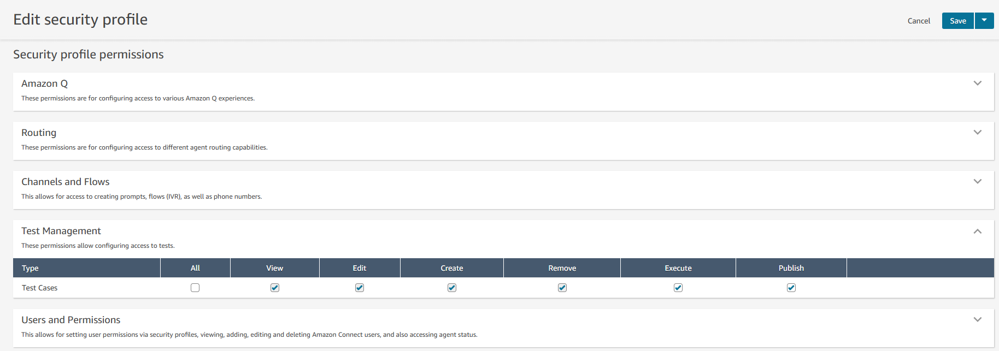
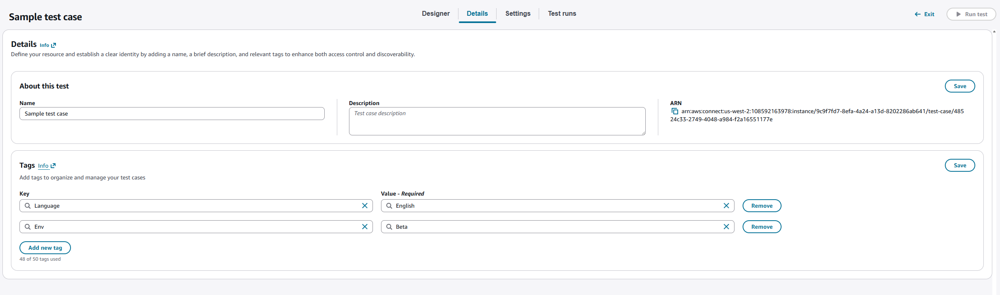
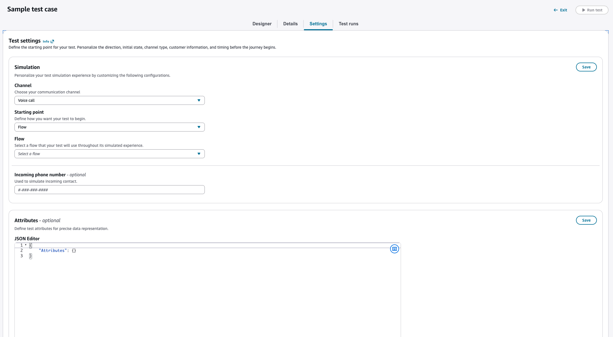
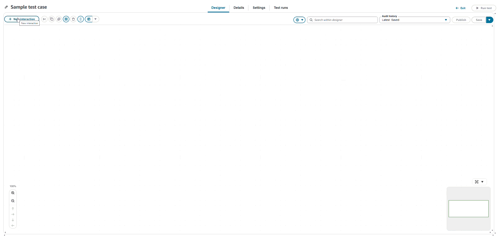
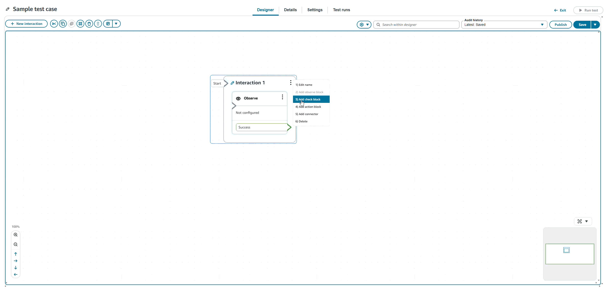
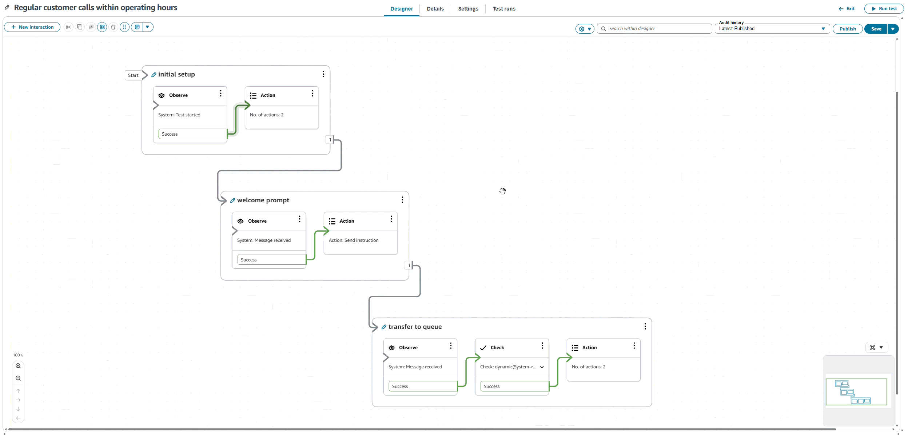
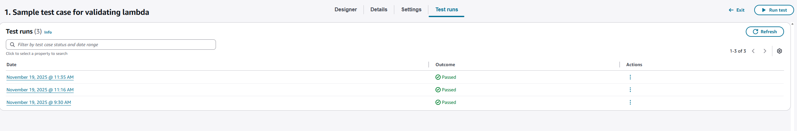
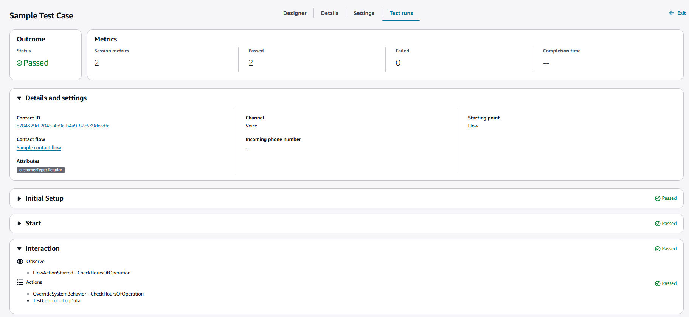
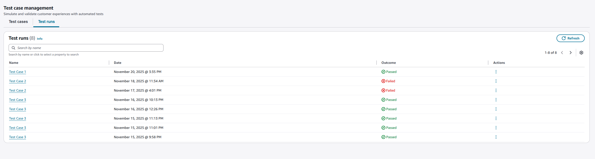

# Create and run test cases

The following section shows how to create and execute test cases. Before you use
Connect's testing and simulation capabilities, you must have access to all test case
permissions. If you use an admin security profile, all testing and simulation
permissions are granted by default. Admin can grant permissions to onboard other user
profiles with the new testing and simulation security profile.

During test execution, please be aware of the following limitations and behaviors:

- **Concurrent Test Limit:** You can run up to 5 concurrent
  tests. Additional tests will remain in Queue state while 5 test cases are
  actively running.
- **Test Execution Queue Capacity:** The system accepts up to 100 test executions in the queue including the two running tests. Any requests exceeding this limit will be rejected.
- **Test Duration Limit:** Each test simulation has a maximum duration of 5 minutes. If a simulation exceeds this time limit, the test execution will automatically timeout and terminate.
- **Automatic Timeout:** Tests that are not manually ended using Action block test commands will automatically timeout after 5 minutes of total execution time.
- **Agent Queue Interaction:** If you do not end the test before the simulated contact is transferred to a queue, the simulated contact may reach the agent queue and connect with a live agent as a contact.
  To prevent simulated contacts from reaching live agents, consider these approaches:

###### Best practice to handle simulated contact in the agent queue

- **Proactive Test Termination:** Use Action blocks to end tests before simulated contacts reach agents, preventing disruption to live operations if applicable.
- **Test Queue Substitution:** Use Action blocks to replace production queues with dedicated test queues in your test case configuration, ensuring real agents are not impacted.

## Create test case

The following procedure shows how to create a test case.

###### To create a test case

1. Open the Amazon Connect console at
   [https://console.aws.amazon.com/connect/](https://console.aws.amazon.com/connect/ "https://console.aws.amazon.com/connect/").
2. In the main navigation pane, choose **Routing**, and then
   **Tests**.
3. Choose **Create Test**.
4. Once a test is saved or published, choose the **Details** tab to enter basic information about this test case including, name, description, and tags.

 5. Choose the **Settings** tab to specify channel, starting point including
contact flow, phone number, contact flow to start, incoming phone
number, simulated contact data or other metadata to be used during test
case execution.

 6. Choose the **Design** tab to design your test. 7. Choose
**New interaction** to create a new interaction. This represents a simulated interaction with a call center.

 8. For each interaction group, specify an observe block to validate the
expected interaction from the system with a matching type (Contains and
Similarity match). Then, add check or actions blocks if necessary. For
more information, see
[Interaction groups](testing-simulation-concepts.md#testing-simulation-concepts-interaction-groups "testing-simulation-concepts.md#testing-simulation-concepts-interaction-groups").

 9. Choose **Run Test** to execute the test case.

 10. Once the test case is running, choose the **Test runs** tab to view a
list of in progress and completed test runs for the tests case.

 11. Choose a test run to see the interaction block execution status, the
simulated contact ID, and the pass or fail status of each step.

You can also view all the test runs across all test cases in the
**Test runs** tab. This page lists all of the test executions
in the same Amazon Connect instance. You will only see the detail test results for the test
cases you created or test cases you have permission to view.

