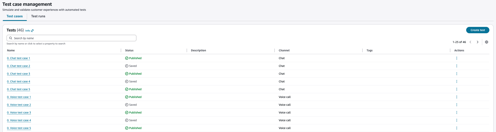

# Create test cases

## Create test case

The following procedure shows how to create a test case.

###### To create a test case

1. Open the Amazon Connect console at
   [https://console.aws.amazon.com/connect/](https://console.aws.amazon.com/connect/ "https://console.aws.amazon.com/connect/").
2. In the main navigation pane, choose **Routing**, and then
   **Tests** to open the Test case management page to view list
   of existing test cases.

 3. Choose **Create Test**. 4. Once a test is saved or published, choose the **Details** tab to enter basic information about this test case including, name, description, and tags.

 5. On the **Settings** tab, specify the channel for your test case. The following channels are supported:

    * **Voice call** – Configure the starting point by specifying the contact flow, incoming phone number, and any contact data to be initialized during test case execution.
    * **Chat** – Configure the starting point by specifying the contact flow and any contact data to be initialized during test case execution.

 6. Choose the **Design** tab to design your test. 7. Choose
**New interaction** to create a new interaction. This represents a simulated interaction with a contact center.

 8. For each interaction group, specify an observe block to validate the
expected interaction from the system with a matching type (Contains and
Similarity match). Then, add check or actions blocks if necessary. For
more information, see
[Interaction groups](testing-simulation-concepts.md#testing-simulation-concepts-interaction-groups "testing-simulation-concepts.md#testing-simulation-concepts-interaction-groups").

