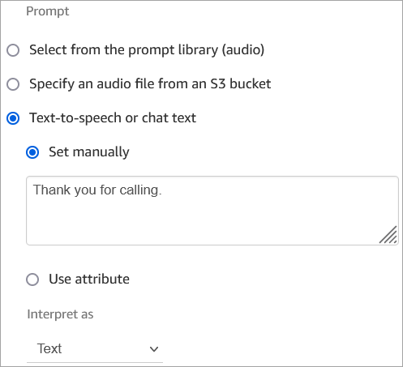
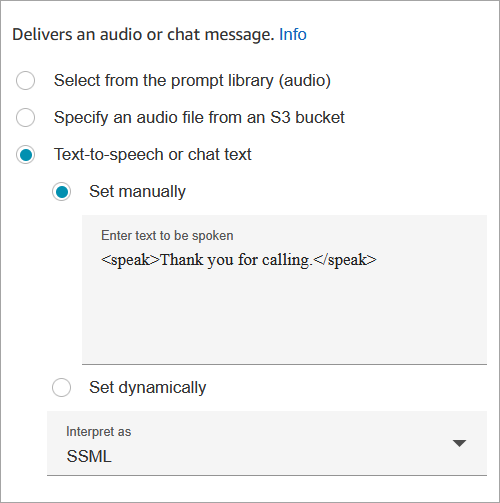

# Add text-to-speech to prompts in flow blocks in

Amazon Polly

You can enter text-to-speech prompts in the following flow blocks:

- [Get customer input](get-customer-input.md "get-customer-input.md")
- [Loop prompts](loop-prompts.md "loop-prompts.md")
- [Play prompt](play.md "play.md")
- [Store customer input](store-customer-input.md "store-customer-input.md")

## Amazon Polly converts

text-to-speech

To convert text-to-speech, Amazon Connect uses Amazon Polly, a service that converts text into
lifelike speech using SSML.

- Amazon Polly default voices such as Amazon Polly Neural and Standard voices are **free**.
- You will be charged for using the Amazon Polly Generative voices. For more
  details on pricing, see the [Amazon Polly Pricing
  Details](https://aws.amazon.com/polly/pricing/ "https://aws.amazon.com/polly/pricing/")
- If you are onboarded to [Next Gen Amazon Connect](enable-nextgeneration-amazonconnect.md "enable-nextgeneration-amazonconnect.md"), the Generative voices are included as
  part of the Next Gen Amazon Connect pricing.
- You are also charged for using custom voices such as unique [Brand Voices](https://aws.amazon.com/blogs/machine-learning/build-a-unique-brand-voice-with-amazon-polly/ "https://aws.amazon.com/blogs/machine-learning/build-a-unique-brand-voice-with-amazon-polly/") that are associated with your account.

## Amazon Polly best sounding voice

Amazon Polly periodically releases improved voices and speaking styles. You can choose to
automatically resolve your text-to-speech to the most lifelike and natural sounding
variant of a voice. For example, if your flows use Joanna, Amazon Connect automatically
resolves to Joanna's conversational speaking style.

###### Note

If no Neural version is available, Amazon Connect defaults to the standard voice.

###### To automatically use the best sounding voice

1. Open the Amazon Connect console at
   [https://console.aws.amazon.com/connect/](https://console.aws.amazon.com/connect/ "https://console.aws.amazon.com/connect/").
2. If prompted to login, enter your AWS account credentials.
3. Choose the name of the instance from the **Instance
   alias** column.

 4. In the navigation pane, choose **Flows**. 5. In the Amazon Polly section, choose **Use the best available
voice**.

## How to add text-to-speech

1. In a flow, add the block that will play the prompt. For example, add a
   [Play prompt](play.md "play.md") block.
2. In the **Properties**, choose
   **Text-to-speech**.
3. Enter plain text. For example, the following image shows _Thank
   you for calling_.

Or enter SSML, as shown in the following image:

SSML-enhanced input text gives you more control over how Amazon Connect generates speech
from the text you provide. You can customize and control aspects of speech such as
pronunciation, volume, and speed.

For a list of SSML tags you can use with Amazon Connect, see [SSML tags supported by Amazon Connect](supported-ssml-tags.md "supported-ssml-tags.md").

For more information about Amazon Polly, see [Using SSML](../../../polly/latest/dg/ssml.md "../../../polly/latest/dg/ssml.md") in the Amazon Polly Developer Guide.
