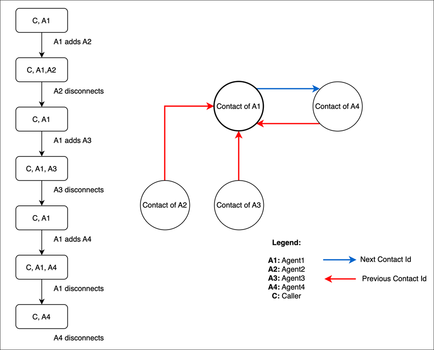
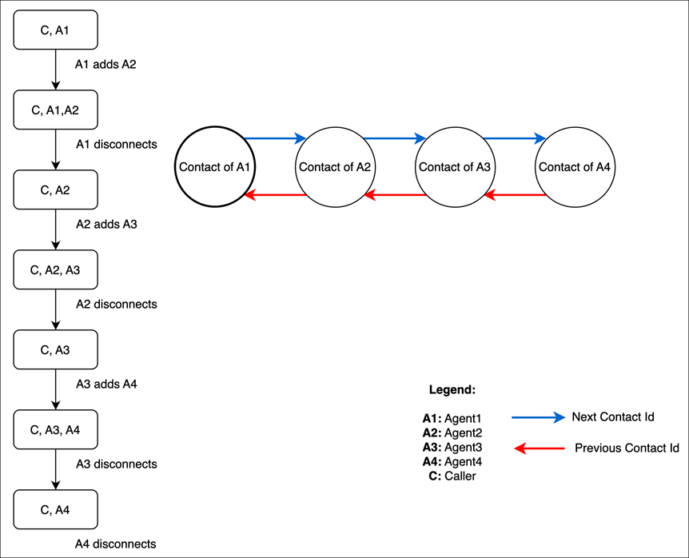
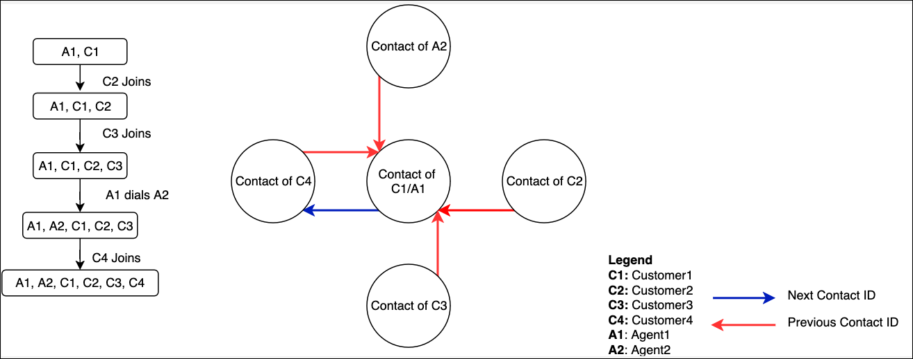

# Comparison of enhanced contact

monitoring (multi-party) and three-party functionality in Amazon Connect

This topic describes how the agent's experience differs when [enhanced contact monitoring](monitor-conversations.md "monitor-conversations.md") (multi-party) is
enabled instead of the default three-party capability.

For information about new functionality in the existing Connection and Contact API in
Amazon Connect Streams, see the [Amazon Connect Streams Readme](https://github.com/amazon-connect/amazon-connect-streams/blob/master/README.md "https://github.com/amazon-connect/amazon-connect-streams/blob/master/README.md").

Following are key features for agents who use multi-party monitoring:

- All agents see all of the connections in a call.
- All agents have exactly the same capabilities as any other agent on the call.
  This takes into affect the moment an agent accepts the invitation to join the
  call.
- Before a warm transfer is complete, an agent can start talking to the caller
  as well as disconnect any other agent on the call.

###### Note

When calls have three or more participants, agents can add participants to the
call even after a caller drops.

The following example illustrates how previous and next contact IDs are mapped
when an agent performs series of consults followed by a transfer.

The following example illustrates how previous and next contact IDs are mapped in
a scenario where agents perform a series of transfers.

The following example illustrates how previous and next contact IDs are mapped in
a scenario where additional web, in-app, and video calling users are added

The following table summarizes the differences between the agent's experience using
the Contact Control Panel (CCP) for three-party calls and multi-party calls. For more
information about the agent's experience with multi-party conversations, see [Host multi-party calls](multi-party-calls.md "multi-party-calls.md") and [Host multi-party chats](multi-party-chat.md "multi-party-chat.md").

- Primary agent: the first agent on the call.
- Secondary agent: any agent other than the first agent on the call.

| Three-party calls                                                                                                                                          | Multi-party calls                                                                                                                                                                                                                                                                         |
| ---------------------------------------------------------------------------------------------------------------------------------------------------------- | ----------------------------------------------------------------------------------------------------------------------------------------------------------------------------------------------------------------------------------------------------------------------------------------- |
| Agent can control hold, resume, and disconnect only the parties they add.                                                                               | All agents are have the same call control capabilities.                                                                                                                                                                                                                                   |
| Agent can add one other participant to an existing call, for a total of three participants (the agent, the caller, and another participant).         | Any agent on the call can add additional participants, as long as the total number of participants on the call, including themselves, does not exceed six. NoteWhen calls have three or more participants, agents can add participants to the call even after a caller drops. |
| Agent can put only the party they added on hold.                                                                                                           | Any agent on the call can put any party on hold.                                                                                                                                                                                                                                          |
| When a primary agent places a secondary agent on hold, the secondary agent can't take themselves off hold.                                              | Any agent on the call can take themselves off hold.                                                                                                                                                                                                                                       |
| Secondary agent can talk to the primary agent during hold.                                                                                                 | Secondary agents cannot talk to each other until they are taken off hold.                                                                                                                                                                                                              |
| Primary agent can only mute themselves. Secondary agent can only mute themselves.                                                                       | Any agent on the call can mute any other participant on the call.                                                                                                                                                                                                                      |
| An agent can only unmute themselves, not another agent.                                                                                                    | An agent can only unmute themselves, not another agent. NoteHowever, an agent can unmute participants who are not agents.                                                                                                                                                           |
| When an agent disconnects (leaves or is disconnected), call control continues to be available to the remaining agent(s) on the call.                 | When an agent disconnects, control of the call is transferred to the remaining agents.                                                                                                                                                                                                 |
| Only the primary agent can disconnect a party on the call. The secondary agent can disconnect the caller only if the primary agent has disconnected. | All agents have the capability to disconnect any other party.                                                                                                                                                                                                                          |
| The primary agent can see two connections (caller and another party), while a secondary agent sees only the transfer connection.                     | All agents can see all connections.                                                                                                                                                                                                                                                       |
| An agent only sees \*_internal transfer_ • for another agent on the call.                                                                            | An agent sees the quick connect ID for other agents, instead of just **internal transfer**.                                                                                                                                                                                            |
| Not applicable.                                                                                                                                            | When an party is being dialed, an agent on a multi-party call cannot add another party until the prior dial operation is completed (party added or call leg terminated).                                                                                                            |
| Additional WebRTC users cannot be added.                                                                                                                   | [Additional WebRTC users can be added](enable-multiuser-inapp.md "enable-multiuser-inapp.md").                                                                                                                                                                                         |
