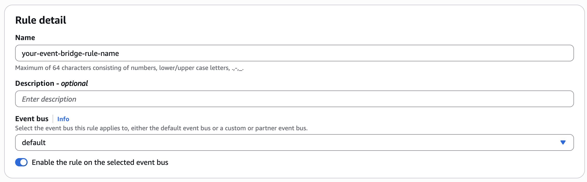
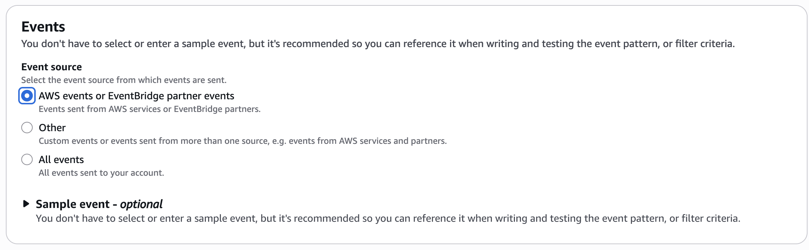
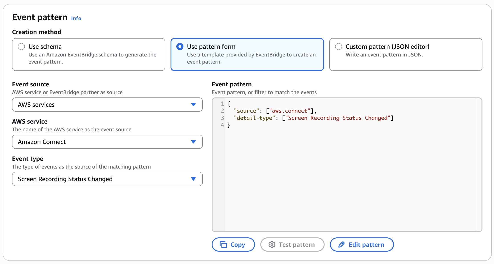
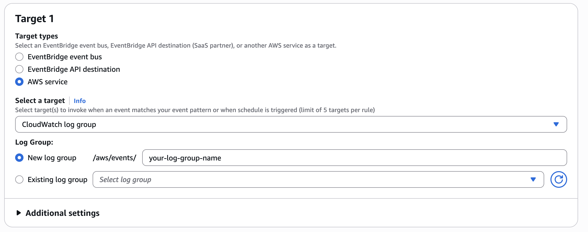

# Use Amazon EventBridge events to track screen recording status

With Amazon EventBridge, you can view the status of [agent screen recordings](agent-screen-recording.md "agent-screen-recording.md") in near real-time. The event for each agent screen recording includes success/failure status, failure codes with descriptions, recording location, recording size, installed client version, and screen recording start and end times.

You can integrate with other AWS services to get analytical or monitoring insights of agent screen recordings:

- Query with [Amazon CloudWatch Log Insights](../../../AmazonCloudWatch/latest/logs/AnalyzingLogData.md "../../../AmazonCloudWatch/latest/logs/AnalyzingLogData.md")
- Get near real-time alerts in an [Amazon Quick Suite](https://aws.amazon.com/quicksight/ "https://aws.amazon.com/quicksight/") dashboard
- Create aggregated reports outside of Amazon Connect
- Connect your other customized data pipeline solutions with Amazon EventBridge

###### Contents

- [Amazon EventBridge event payload formats](#eventbridge-payload-formats "#eventbridge-payload-formats")
- [Create a rule to match Amazon EventBridge events](#create-eventbridge-rule "#create-eventbridge-rule")
- [Configure the target of the created Amazon EventBridge rule](#configure-eventbridge-target "#configure-eventbridge-target")

## Amazon EventBridge event payload formats

### Event with screen recording status - INITIATED

This event is emitted when a contact is accepted by the agent, which may be before recording starts, for every contact with agent screen recording enabled.

```
{
  "version": "0",
  "id": "the_event_id_from_eventbridge",
  "detail-type": "Screen Recording Status Changed",
  "source": "aws.connect",
  "account": "your_aws_account_id",
  "time": "2026-01-01T00:00:00Z",
  "region": "us-west-2",
  "resources": [
    "arn:aws:connect:us-west-2:your_aws_account_id:instance/your_instance_id/contact/your_contact_id",
    "arn:aws:connect:us-west-2:your_aws_account_id:instance/your_instance_id"
  ],
  "detail": {
    "version": "1.0",
    "recordingStatus": "INITIATED",
    "eventDeduplicationId": "unique_uuid",
    "instanceArn": "arn:aws:connect:us-west-2:your_aws_account_id:instance/your_instance_id",
    "contactArn": "arn:aws:connect:us-west-2:your_aws_account_id:instance/your_instance_id/contact/your_contact_id",
    "agentArn": "arn:aws:connect:us-west-2:your_aws_account_id:instance/your_instance_id/agent/your_agent_id",
    "clientInfo": {
      "appVersion": "2.0.3.0",
    }
  }
}
```

### Event with screen recording status - COMPLETED

This event is emitted when screen recording ends on the agent desktop. This doesn't mean the screen recording has been successfully uploaded to your Amazon S3 bucket.

```
{
  "version": "0",
  "id": "the_event_id_from_eventbridge",
  "detail-type": "Screen Recording Status Changed",
  "source": "aws.connect",
  "account": "your_aws_account_id",
  "time": "2026-01-01T00:00:00Z",
  "region": "us-west-2",
  "resources": [
    "arn:aws:connect:us-west-2:your_aws_account_id:instance/your_instance_id/contact/your_contact_id",
    "arn:aws:connect:us-west-2:your_aws_account_id:instance/your_instance_id"
  ],
  "detail": {
    "version": "1.0",
    "recordingStatus": "COMPLETED",
    "eventDeduplicationId": "aaaaaaaa-bbbb-cccc-dddd-eeeeeeee",
    "instanceArn": "arn:aws:connect:us-west-2:your_aws_account_id:instance/your_instance_id",
    "contactArn": "arn:aws:connect:us-west-2:your_aws_account_id:instance/your_instance_id/contact/your_contact_id",
    "agentArn": "arn:aws:connect:us-west-2:your_aws_account_id:instance/your_instance_id/agent/your_agent_id",
    "clientInfo": {
      "appVersion": "2.0.3.0",
    },
    "recordingInfo": {
      "startTime": "2026-01-01T00:00:00.000Z",
      "endTime": "2026-01-01T00:00:00.000Z",
    }
  }
}
```

### Event with screen recording status - PUBLISHED

This event is emitted when the screen recording is successfully uploaded to your Amazon S3 bucket. Details include Amazon S3 bucket location, recording size, and recording duration.

```
{
  "version": "0",
  "id": "the_event_id_from_eventbridge",
  "detail-type": "Screen Recording Status Changed",
  "source": "aws.connect",
  "account": "your_aws_account_id",
  "time": "2026-01-01T00:00:00Z",
  "region": "us-west-2",
  "resources": [
    "contactArn",
    "instanceArn"
  ],
  "detail": {
    "version": "1.0",
    "recordingStatus": "PUBLISHED",
    "eventDeduplicationId": "aaaaaaaa-bbbb-cccc-dddd-eeeeeeee",
    "instanceArn": "arn:aws:connect:us-west-2:your_aws_account_id:instance/your_instance_id",
    "contactArn": "arn:aws:connect:us-west-2:your_aws_account_id:instance/your_instance_id/contact/your_contact_id",
    "agentArn": "arn:aws:connect:us-west-2:your_aws_account_id:instance/your_instance_id/agent/your_agent_id",
    "clientInfo": {
      "appVersion": "2.0.3.0",
    },
    "recordingInfo": {
      "startTime": "2026-01-01T00:00:00.000Z",
      "endTime": "2026-01-01T00:00:00.000Z",
      "publishTime": "2026-01-01T00:00:00.000Z",
      "location": "s3://your-bucket-name/object-prefix/object-key",
      "durationInMillis": 100000,
      "sizeInBytes": 1000000
    }
  }
}
```

### Event with screen recording status - FAILED

This event is emitted if screen recording fails. Details on failure information are provided as a best-effort estimation of the possible failure reason that we are able to detect.

```
{
  "version": "0",
  "id": "the_event_id_from_eventbridge",
  "detail-type": "Screen Recording Status Changed",
  "source": "aws.connect",
  "account": "your_aws_account_id",
  "time": "2026-01-01T00:00:00Z",
  "region": "us-west-2",
  "resources": [
    "arn:aws:connect:us-west-2:your_aws_account_id:instance/your_instance_id/contact/cccccccc-cccc-cccc-cccc-ccccccccccccc",
    "arn:aws:connect:us-west-2:your_aws_account_id:instance/your_instance_id"
  ],
  "detail": {
    "version": "1.0",
    "recordingStatus": "FAILED",
    "eventDeduplicationId": "aaaaaaaa-bbbb-cccc-dddd-eeeeeeee",
    "instanceArn": "arn:aws:connect:us-west-2:your_aws_account_id:instance/your_instance_id",
    "contactArn": "arn:aws:connect:us-west-2:your_aws_account_id:instance/your_instance_id/contact/cccccccc-cccc-cccc-cccc-ccccccccccccc",
    "agentArn": "arn:aws:connect:us-west-2:your_aws_account_id:instance/your_instance_id/agent/your_agent_id",
    "clientInfo": {
      "appVersion": "2.0.3.0",
    },
    "failureInfo": {
      "code": "UNKNOWN",
      "message": "UNKNOWN",
      "source": "Unknown failure"
    },
    "recordingInfo": {
      "startTime": "2026-01-01T00:00:00.000Z"
    }
  }
}
```

## Create a rule to match Amazon EventBridge events

To subscribe to Amazon EventBridge events for screen recording status, you need to create an Amazon EventBridge rule that matches the defined event source and event detail-type. This can be achieved through either the AWS Console or AWS CDK libraries.

### Create a rule using the AWS Console

In the AWS Console, create a new rule in Amazon EventBridge → Buses → Rules.

#### Use the default event bus



#### Use a template event pattern

Select the defined event pattern from the dropdown lists.





If the event type is not showing up in the dropdown list, you can alternatively create the same pattern using **Custom pattern (JSON editor)** with:

```
{
  "source": [ "aws.connect" ],
  "detailType": [ "Screen Recording Status Changed" ]
}
```

### Create a rule using AWS CDK

Alternatively, if you manage AWS resources with AWS CDK, here is a sample TypeScript code snippet to construct an Amazon EventBridge rule:

```
import { Rule } from 'aws-cdk-lib/aws-events';

const eventBridgeRule = new Rule(this, 'YourEventBridgeRuleLogicalName', {
    ruleName: 'your-event-bridge-rule-name',
    description: 'your rule description',
    eventPattern: {
        source: [ "aws.connect" ],
        detailType: [ "Screen Recording Status Changed" ]
    }
});
```

## Configure the target of the created Amazon EventBridge rule

Amazon EventBridge supports a number of AWS services as targets. Depending on your needs, it's flexible to build your own event processing pipeline with other AWS services. You can define up to five targets for each rule. For more information, see [Amazon EventBridge targets](../../../eventbridge/latest/userguide/eb-targets.md "../../../eventbridge/latest/userguide/eb-targets.md") in the _Amazon EventBridge User Guide_.

### Amazon CloudWatch log group as an example target

The following example uses an [Amazon CloudWatch log group](../../../AmazonCloudWatch/latest/logs/Working-with-log-groups-and-streams.md "../../../AmazonCloudWatch/latest/logs/Working-with-log-groups-and-streams.md") as a target.



In AWS CDK code, create the resource and add it to the Amazon EventBridge rule:

```
import { LogGroup, RetentionDays } from "aws-cdk-lib/aws-logs";
import { CloudWatchLogGroup } from 'aws-cdk-lib/aws-events-targets';

const logGroup = new LogGroup(this, 'YourLogGroupLogicalName', {
    logGroupName: '"/aws/events/your-log-group-name',
    retention: RetentionDays.ONE_YEAR
});

eventBridgeRule.addTarget(new CloudWatchLogGroup((logGroup)));
```

#### Example Amazon CloudWatch Log Insights queries

Using Amazon CloudWatch Insights query language, here are some example queries:

- **Sample query on success ratio**

```
fields @timestamp, @message, detail
| stats sum(detail.recordingStatus= "PUBLISHED") as Count_Success,
  sum(detail.recordingStatus= "INITIATED") as Count_Total,
  Count_Success / Count_Total as Success_Ratio
```

- **Sample query to get counts of each recording status**

```
fields @timestamp, @message, detail
| stats count(*) as Count group by detail.recordingStatus as recordingStatus
```

- **Sample query on failed contacts with most common failure codes**

```
fields @timestamp, @message, detail
| filter detail.recordingStatus = "FAILED"
| stats count(*) as Count group by detail.failureInfo.code as FailureCode
| sort by Count desc
```

- **Sample query on agents with most failed contacts**

```
fields @timestamp, @message, detail
| filter detail.recordingStatus = "FAILED"
| stats count(*) as Count group by detail.agentArn as AgentArn
| sort by Count desc
```
