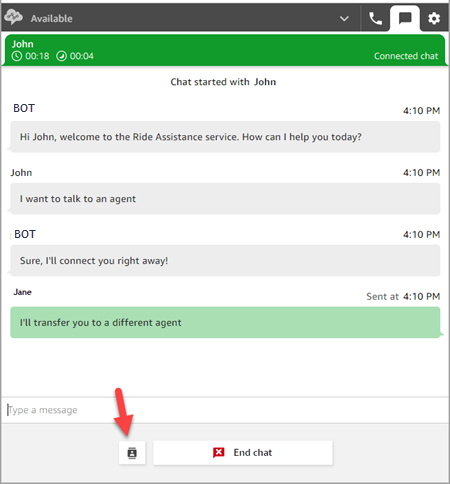
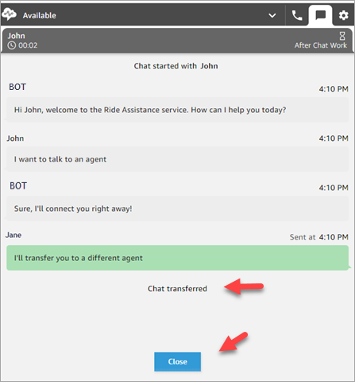

# Transfer a chat to an agent's queue, with all

context preserved

You can transfer a contact from a bot to an agent, or to another agent's queue,
with all context preserved.

###### To transfer a customer to another queue

1. Choose the **Quick Connect** button at the
   bottom of the CCP page.

 2. Choose or search for the queue you want to transfer to, and then choose
the transfer button. 3. You'll see a confirmation message: Chat transferred. You're now doing
After Contact Work (ACW) for the customer. Choose **Close**
to end the contact.

