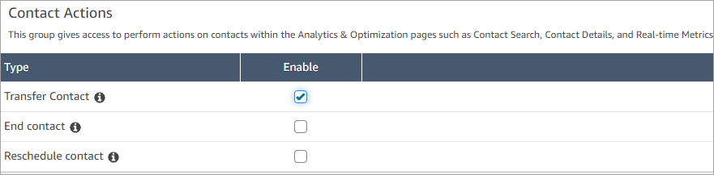
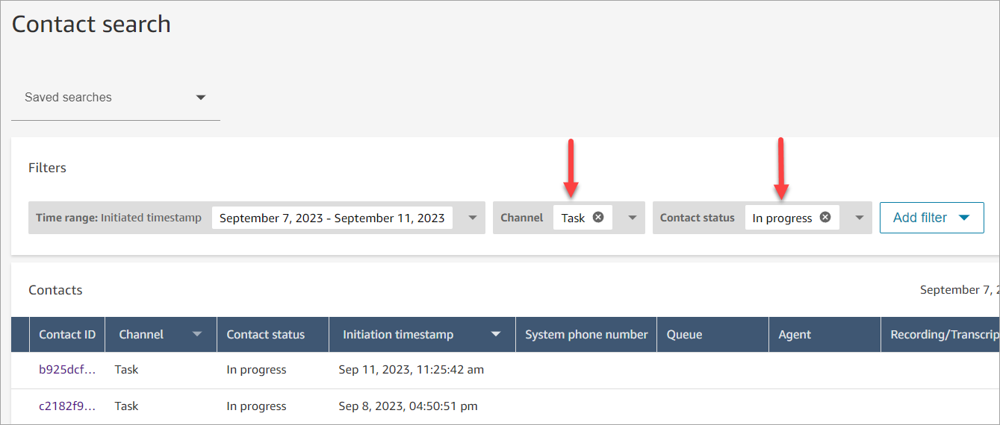
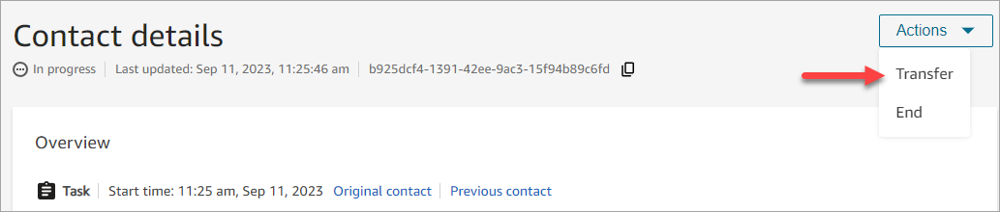
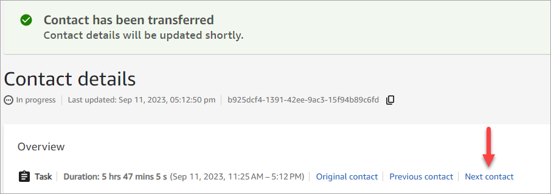

# Transfer in progress contacts to a quick

connect agent or a queue in Amazon Connect

On the **Contact details** page of an in-progress contact, you can
transfer a contact to a quick connect agent or queue. This capability supports task,
email, or chat contacts.

To transfer contacts programmatically, use the [TransferContact](../APIReference/API_TransferContact.md "../APIReference/API_TransferContact.md").

## Required permissions

1. Enable one of the following permissions to view contacts on the
   **Contact search** and **Contact
   details** pages:
   1. **Contact search - View**: Allows a user to view
      all contacts
   2. **View my contacts - View**: Allows agents to
      view contacts that they themselves had handled

2. **Restrict contact access** (Optional): Restrict a user's
   access to contacts on the **Contact search** and
   **Contact details** pages within their own hierarchy
   group or any hierarchy groups below them. For more information about this
   permissions, see [Manage who can search for
   contacts and access detailed information](contact-search.md#required-permissions-search-contacts "contact-search.md#required-permissions-search-contacts").
3. **Transfer Contact**: Enables a user to transfer contacts
   on the **Analytics & Optimization** pages. The
   following image shows the **Contact Actions - Transfer
   Contact** permission.

## How to transfer a task, email,

or chat contact

1. Log in to Amazon Connect with a user account that has [permissions to access
   contact records](contact-search.md#required-permissions-search-contacts "contact-search.md#required-permissions-search-contacts").
2. In Amazon Connect choose **Analytics and optimization**,
   **Contact search**.
3. Search for an in-progress task or email contact to transfer:
   1. Select the **Contact status** filter and set it
      to **In progress**, as shown in the following
      image.

    2. Set the **Channel** filter to
   **Tasks**, **Email**, or
   **Chat** to view only task, email, or chat contacts. 3. Choose the task, email, or chat contact to view its details.

4. On the **Contact details** page for the task, email, or chat
   contact, choose **Actions**,
   **Transfer**.

 5. Select an agent or queue from a list of your quick connects and choose
**Transfer**. 6. When the contact is transferred successfully, the page automatically
refreshes with the **Next contact** link to the contact
created as a result of the transfer. The following image shows the location
of the **Next contact** link.

