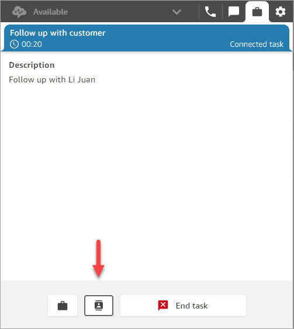
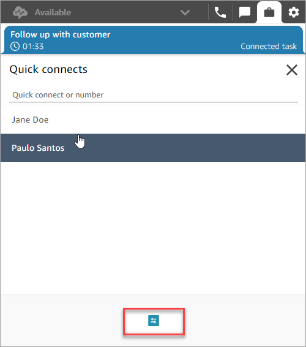

# Transfer a task to another agent or queue in the

Amazon Connect Contact Control Panel (CCP)

You can transfer a task that's assigned to you to another agent or queue.

1. Open the task you want to transfer, and then choose the quick connect
   icon.

 2. Choose from the list of people or destinations listed under
**Quick connects**, and then choose the transfer icon.

