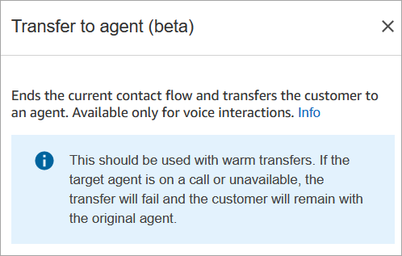
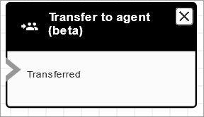

# Flow block in Amazon Connect: Transfer to agent

(beta)

## Description

- Ends the current flow and transfers the customer to an agent.

###### Note

If the agent is already with someone else, the contact is
disconnected.

If the agent is in After Contact Work, they are automatically removed
from ACW at the time of transfer.

- The **Transfer to Agent** block is a beta feature and
  works only for voice interactions.
- We recommend using the [Set working queue](set-working-queue.md "set-working-queue.md") block for agent-to-agent
  transfers instead of using this block. The **Set working
  queue** block supports omnichannel transfers such as voice and
  chat. For instructions, see [Set up agent-to-agent transfers in
  Amazon Connect](setup-agent-to-agent-transfers.md "setup-agent-to-agent-transfers.md").

## Supported channels

The following table lists how this block routes a contact who is using the
specified channel.

| Channel | Supported?        |
| ------- | ----------------- | ------------------------------------------------------------------------------------------------------------------------------------------------------------------------------------------------------------------------------------------------------------------------------------------------------------------------------------------------------------------------------------------------------------------------------------------------------------------------------------------------------------------------------------------------------------------------------------------------------------------------------------------------------------------------------------------------------------------------------------------------------------------------------------------------------------------------------------------------------------------------------------------------------------------------------------------------------------------------------------------------------------------------------------------------------------------------------------------------------------------------------------------------------------------------------------------------------------------------------------------------------------------------------------------------------------------------------------------------------- |
| Voice   | Yes               |
| Chat    | No - Error branch |
| Task    | No - Error branch |
| Email   | No - Error branch | To transfer chats and tasks to agents, use the [Set working queue](set-working-queue.md "set-working-queue.md") block. Because [Set working queue](set-working-queue.md "set-working-queue.md") works for all channels, we recommend using it for voice calls too, instead of using **Transfer to agents (beta)**. For instructions, see [Set up agent-to-agent transfers in Amazon Connect](setup-agent-to-agent-transfers.md "setup-agent-to-agent-transfers.md"). ## Flow types You can use this block in the following [flow types](create-contact-flow.md#contact-flow-types "create-contact-flow.md#contact-flow-types"):  • Transfer to Agent flow  • Transfer to Queue flow ## Properties The following image shows the **Properties** page of the **Transfer to agent** block. It does not have any options on it.  ## Configured block The following image shows an example of what this block looks like when it is configured. It displays the status **Transferred**. It does not have any branches.  ## Scenarios See these topics for scenarios that use this block:  • [Set up contact transfers in Amazon Connect](transfer.md "transfer.md") |
