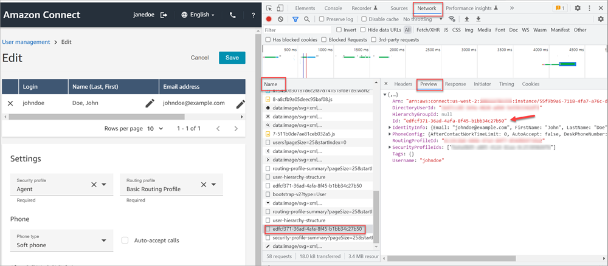

# Transfer contacts to a specific agent in

Amazon Connect

There are two ways to route contacts directly to an agent:

- **Use routing criteria to prefer an agent**. This
  method is better when:

      + You want the ability to target multiple agents simultaneously. For
       example, a four-person support team that is primarily supporting a
       customer.
      + You want the option to fallback to a broader pool of agents in the
       queue if the preferred agent(s) are not available.
      + You want the contact to be reported within the standard queue's
       metrics.

  For this option, use the [Set routing criteria](set-routing-criteria.md "set-routing-criteria.md") block instead of the procedure
  in this topic.

- **Use the agent's queue**. This method is usually
  better when:

      + The contact is intended for **only** that
       specific agent and no one else.
      + You don't want the contact to be reported under a standard queue. For
       information about standard queues and agent queues, see [Queues: standard and
       agent](concepts-queues-standard-and-agent.md "concepts-queues-standard-and-agent.md").

  This topic explains how to route contacts for this second scenario.
  Agent queues enable you to route contacts directly to a specific agent. Following are
  a couple of scenarios where you might want to do this:

- Route contacts to the last agent the customer interacted with. This provides a
  consistent customer experience.
- Route contacts to agents who have specific responsibilities. For example, you
  might route all billing questions to Jane.

###### Note

A queue is created for all users in your Amazon Connect instance, but only users who are
assigned permissions to use the Contact Control Panel (CCP) can use it to receive
contacts. The Agent and Admin security profiles are the only default security
profiles that include permissions to use the CCP. If you route a contact to someone
who doesn't have these permissions, the contact can never be handled.

###### To route a contact directly to a specific agent

1. In Amazon Connect, choose **Routing**, **Contact
   flows**.
2. In the flow designer, open an existing flow, or create a new one.
3. Add a block in which you can select a queue to transfer a contact to, such as
   a **Set working queue** block.
4. Select the title of the block to open the block settings.
5. Select **By agent**.
6. Under **Select an agent**, enter the user name of the agent,
   or select the agent's user name from the drop-down list.
7. Choose **Save**.
8. Connect the **Success** branch to the next block in your
   flow.
   You can also choose to use an attribute to select the queue created for the agent user
   account. To do so, after you choose **By agent**, choose **Use
   attribute**.

## Use contact attributes to route contacts

to a specific agent

When you use contact attributes in a flow to route calls to an agent, the
attribute value must be either the agent's user name, or the agent's user ID.

To determine the user ID for an agent so that you can use the value as an
attribute, use one of these options:

- Use the **Network** tab of the browser debugger to
  retrieve the agent ID. For example:
  1.  In a Chrome browser, press F12 and go to the
      **Network** tab.
  2.  In Amazon Connect, in the navigation menu, choose
      **Users**, **User
      management**, and then select an agent. Monitor the content
      of the **Network** tab. In the
      **Name** list, choose the GUID.
  3.  Choose the **Preview** tab. The agent ID is
      displayed next to the `Id` field. The following image
      shows the location of the agent ID in the
      **Preview** tab.

  

- Use the [ListUsers](../APIReference/API_ListUsers.md "../APIReference/API_ListUsers.md") operation to retrieve the users from your instance.
  The agent's user ID is returned with the results from the operation as the
  value of the `Id` in the [UserSummary](../APIReference/API_UserSummary.md "../APIReference/API_UserSummary.md") object.
- Find the user ID for an agent by using [Amazon Connect agent event streams](agent-event-streams.md "agent-event-streams.md"). The agent events, which are
  included in the agent event data stream, include the agent ARN. The user ID
  is included in the agent ARN after **`agent/`**.

In the following agent event data, the agent ID is **87654321-4321-4321-4321-123456789012**.

```
{
    "AWSAccountId": "123456789012",
    "AgentARN": "arn:aws:connect:us-west-2:123456789012:instance/12345678-1234-1234-1234-123456789012/agent/**87654321-4321-4321-4321-123456789012**",
    "CurrentAgentSnapshot": {
        "AgentStatus": {
            "ARN": "arn:aws:connect:us-west-2:123456789012:instance/12345678-1234-1234-1234-123456789012/agent-state/76543210-7654-6543-8765-765432109876",
            "Name": "Available",
            "StartTimestamp": "2019-01-02T19:16:11.011Z"
        },
        "Configuration": {
            "AgentHierarchyGroups": null,
            "FirstName": "IAM",
            "LastName": "IAM",
            "RoutingProfile": {
                "ARN": "arn:aws:connect:us-west-2:123456789012:instance/12345678-1234-1234-1234-123456789012/routing-profile/aaaaaaaa-bbbb-cccc-dddd-111111111111",
                "DefaultOutboundQueue": {
                    "ARN": "arn:aws:connect:us-west-2:123456789012:instance/12345678-1234-1234-1234-123456789012/queue/aaaaaaaa-bbbb-cccc-dddd-222222222222",
                    "Name": "BasicQueue"
                },
                "InboundQueues": [{
                    "ARN": "arn:aws:connect:us-west-2:123456789012:instance/12345678-1234-1234-1234-123456789012/queue/aaaaaaaa-bbbb-cccc-dddd-222222222222",
                    "Name": "BasicQueue"
                }],
                "Name": "Basic Routing Profile"
            },
            "Username": "agentUserName"
        },
        "Contacts": []
},
```
