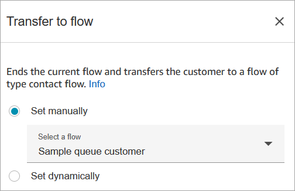
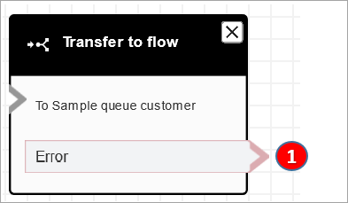

# Flow block in Amazon Connect: Transfer to flow

This topic defines the flow block for ending the current flow and transferring the
customer to a different flow.

## Description

- Ends the current flow and transfers the customer to a different
  flow.

## Supported channels

The following table lists how this block routes a contact who is using the
specified channel.

| Channel | Supported? |
| ------- | ---------- |
| Voice   | Yes        |
| Chat    | Yes        |
| Task    | Yes        |
| Email   | Yes        |

## Flow types

You can use this block in the following [flow
types](create-contact-flow.md#contact-flow-types "create-contact-flow.md#contact-flow-types"):

- Inbound flow
- Transfer to Agent flow
- Transfer to Queue flow

## Properties

The following image shows the **Properties** page of the
**Transfer to flow** block. You choose the flow from the
dropdown box.

Only published flows appear in the dropdown list.

## Configured block

The following image shows an example of what this block looks like when it is
configured. It has the following branch: **Error**.

1. The contact is routed down the **Error** branch if the
   flow you have specified to transfer to isn't a valid flow, or it's not a
   valid flow type (Inbound, Transfer to Agent, or Transfer to Queue).

## Sample flows

Amazon Connect includes a set of sample flows. For instructions that explain how to access the sample flows in the flow designer, see
[Sample flows in Amazon Connect](contact-flow-samples.md "contact-flow-samples.md"). Following are topics
that describe the sample flows which include this block.

- [Sample flow in Amazon Connect for A/B contact distribution
  testing](sample-ab-test.md "sample-ab-test.md")

## Scenarios

See these topics for scenarios that use this block:

- [Set up contact transfers in Amazon Connect](transfer.md "transfer.md")
