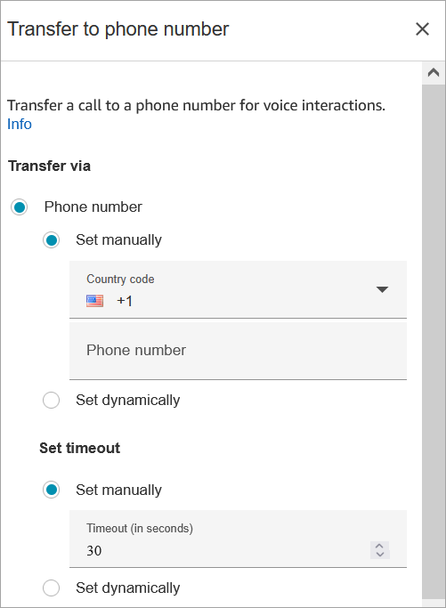
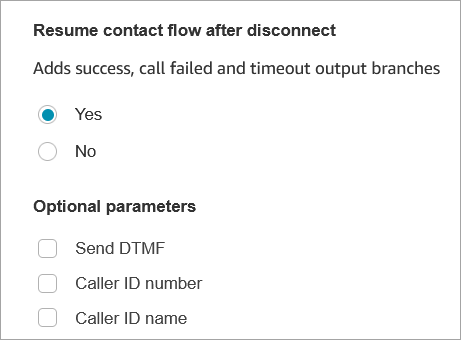
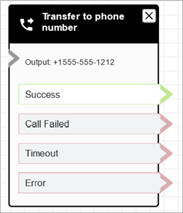

# Flow block in Amazon Connect: Transfer to phone

number

This topic defines the flow block for transferring the customer to an external phone
number outside of your Amazon Connect instance.

###### Important

For a list of the telephony capabilities that Amazon Connect provides, such as whether
Amazon Connect provides outbound calling within your country using a local Caller ID (CLID),
see the [Amazon Connect Telecoms Country Coverage Guide](https://d1v2gagwb6hfe1.cloudfront.net/Amazon_Connect_Telecoms_Coverage.pdf "https://d1v2gagwb6hfe1.cloudfront.net/Amazon_Connect_Telecoms_Coverage.pdf").

## Description

- Transfers the customer to a phone number external to your instance.

## Supported channels

The following table lists how this block routes a contact who is using the
specified channel.

| Channel | Supported?        |
| ------- | ----------------- | --------------------------------------------------------------------------------------------------------------------------------------------------------------------------------------------------------------------------------------------------------------------------------------------------------------------------------------------------------------------------------------------------------------------------------------------------------------------------------------------------------------------------------------------------------------------------------------------------------------------------------------------------------------------------------------------------------------------------------------------------------------------------------------------------------------------------------------------------------------------------------------------------------------------------------------------------------------------------------------------------------------------------------------------------------------------------------------------------------------------------------------------------------------------------------------------------------------------------------------------------------------------------------------------------------------------------------------------------------------------------------------------------------------------------------------------------------------------------------------------------------------------------------------------------------------------------------------------------------------------------------------------------------------------------------------------------------------------------------------------------------------------------------------------------------------------------------------------------------------------------------------------------------------------------------------------------------------------------------------------------------------------------------------------------------------------------------------------------------------------------------------------------------------------------------------------------------------------------------------------------------------------------------------------------------------------------------------------------------------------------------------------------------------------------------------------------------------------------------------------------------------------------------------------------------------------------------------------------------------------------------------------------------------------------------------------------------------------------------------------------------------------------------------------------------------------------------------------------------------------------------------------------------------------------------------------------------------------------------------------------------------------------------------------------------------------------------------------------------------------------------------------------------------------------------------------------------------------------------------------------------------------------------------------------------------------------------------------------------------------------------------------------------------------------------------------------------------------------------------------------------------------------------------------------------------------------------------------------------------------------------------------------------------------------------------------------------------------------------------------------------------------------------------------------------------------------------------------------------------------------------------------------------------------------------------------------------------------------------------------------------------------------------------------------------------------------------------------------------------------------------------------------------------------------------------------------------------------------------------------------------------------------------------------------------------------------------------------------------------------------------------------------------------------------------------------------------------------------------------------------------------------------------------------------------------------------------------------------------------------------------------------------------------------------------------------------------------------------------------------------------------------------------------------------------------------------------------------------------------------------------------------------------------------------------------------------------------------------------------------------------------------------------------------------------------------------------------------------------------------------------------------------------------------------------------------------------------------------------------------------------------------------------------------------------------------------------------------------------------------------------------------------------------------------------------------------------------------------------------------------------------------------------------------------------------------------------------- |
| Voice   | Yes               |
| Chat    | No - Error branch |
| Task    | No - Error branch |
| Email   | No - Error branch | ## Flow types You can use this block in the following [flow types](create-contact-flow.md#contact-flow-types "create-contact-flow.md#contact-flow-types"):  • Inbound flow  • Customer Queue flow  • Transfer to Agent flow  • Transfer to Queue flow ## Properties The following image shows the **Properties** page of the **Transfer to phone number** block. It shows the **Transfer via** section. The **Country code** is set to +1 (US). **Set timeout** = 30 seconds.  The following image shows the **Resume flow after disconnect** section is set to **Yes**.  Note the following properties:  • **Resume flow after disconnect**: This works only if the external party disconnects, and the customer doesn't disconnect. (If the customer disconnects, the whole call disconnects.)  • **Send DTMF**: This property is useful to bypass some of the DTMF of the external party. For example, if you know you'll need to press 1, 1, 362 to reach the external party, you can enter that here. If you specify a comma in **Send DTMF** it pauses for 750ms.  • **Caller ID number**: You can choose a number from your instance to appear as the caller ID. This is useful in cases where you want to use a number that's different from the one the flow is actually using to make the call. ###### Important If you are using Amazon Connect outside of the United States, we recommend choosing **Caller ID number** and then selecting an Amazon Connect number. Otherwise, local regulations may cause telephony providers to block or redirect non-Amazon Connect phone numbers. This will result in service-related events, such as rejected calls, poor audio quality, delay, latency, and displaying the incorrect caller ID. **In Australia**: The caller ID must be an Amazon Connect provided DID (Direct Inward Dialing) phone number. If a toll free number or a number not provided by Amazon Connect is used in the caller ID, local telephony suppliers may reject outbound calls due to local anti-fraud requirements. **In the UK**: The caller ID must be a valid E164 phone number. If the phone number is not provided in the caller ID, local telephony suppliers may reject outbound calls due to local anti-fraud requirements.  • **Caller ID name**: You can set a caller ID name, but there's no guarantee it will appear correctly to the customer. For more information, see [Outbound caller ID number](queues-callerid.md#using-call-number-block "queues-callerid.md#using-call-number-block"). ###### Note + Per SIP protocol RFC3261, the following characters are reserved: **; / ? : @ & = + $ ,**. Do not use these characters in the caller ID name. When these characters are included, outbound calls may fail or the caller ID name may display inaccurately. + When [Transfer to phone number](transfer-to-phone-number.md "transfer-to-phone-number.md") block is used without specifying a custom caller ID, the caller ID of the caller is passed as the caller ID. For example, if you transfer to an external number and no custom caller ID is used to specify that the call is coming from your organization, then the contact's caller ID is displayed to the external party. ## Configuration tips  • [Submit a service quota increase request](https://console.aws.amazon.com/support/home#/case/create?issueType=service-limit-increase&limitType=service-code-connect "https://console.aws.amazon.com/support/home#/case/create?issueType=service-limit-increase&limitType=service-code-connect") requesting that your business be allowed to make outbound calls to the country you specified. If your business is not on the allowlist for making the call, it will fail. For more information, see [Countries that call centers using Amazon Connect can call by default](country-code-allow-list.md "country-code-allow-list.md").  • If the country you want to select is not listed, you can submit a request to add countries you want to transfer calls to using the [Amazon Connect service quotas increase form](https://console.aws.amazon.com/support/home#/case/create?issueType=service-limit-increase&limitType=service-code-connect "https://console.aws.amazon.com/support/home#/case/create?issueType=service-limit-increase&limitType=service-code-connect").  • You can choose to end the flow when the call is transferred, or choose to **Resume flow after disconnect**, which returns the caller to your instance and resumes the flow after the transferred call ends. ## Configured block The following image shows an example of what this block looks like when it is configured. It shows the number you are transferring to. It has the following branches: **Success**, **Call Failed**, **Timeout**, **Error**.  ## Scenarios See these topics for scenarios that use this block:  • [Set up contact transfers in Amazon Connect](transfer.md "transfer.md")  • [Set up outbound caller ID in Amazon Connect](queues-callerid.md "queues-callerid.md")  • [Set up Amazon Connect external voice transfer to an on-premise voice system](external-voice-transfer.md "external-voice-transfer.md") |
