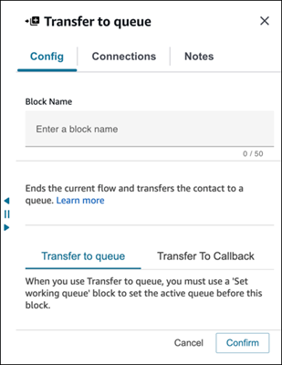
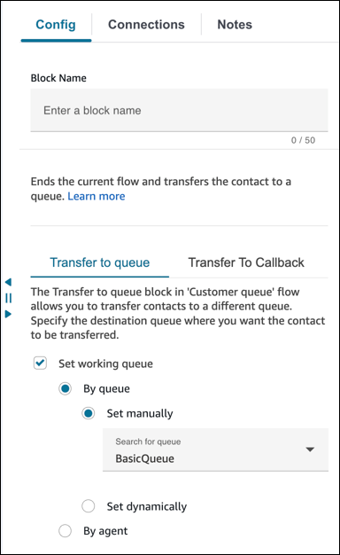
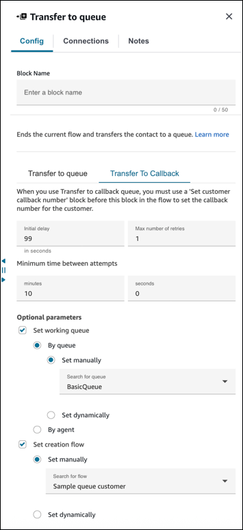
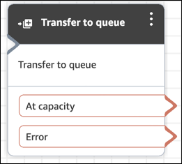
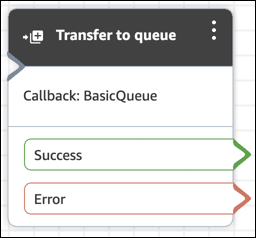

# Flow block in Amazon Connect: Transfer to queue

This topic defines the flow block for transferring a current contact to the
destination queue.

## Description

Use this block to transfer a current contact to the destination queue.

The functionality of this block depends on where it is used:

- When used in a Customer Queue flow, this block transfers a contact already
  in a queue to another queue.
- When used in a callback scenario, Amazon Connect calls the agent first. After the
  agent accepts the call in the CCP, Amazon Connect calls the customer.
- In all other cases, this block places the current contact in a queue and
  ends current flow.
- This block cannot be used in a callback scenario when using the chat
  channel. If you attempt to do so, an error branch is followed. In addition,
  an error is created in the CloudWatch log.

## Use cases for this block

This block is designed to be used in the following scenarios:

- Place the contact in a queue to be connected to an agent.
- You want to move the current customer from a generic queue to a
  specialized queue. You may want to do this when customers have waited too
  long in the queue, for example, or you have other business
  requirements.
- Offer callback options to the customer instead of having them wait to be
  connected to an agent.

## Contact types

The following table lists how this block routes a contact who is using the
specified channel.

| Contact type | Supported? |
| ------------ | ---------- |
| Voice        | Yes        |
| Chat         | Yes        |
| Task         | Yes        |
| Email        | Yes        |

## Flow types

You can use this block in the following [flow
types](create-contact-flow.md#contact-flow-types "create-contact-flow.md#contact-flow-types"):

| Flow type              | Supported? |
| ---------------------- | ---------- |
| Inbound flow           | Yes        |
| Customer queue flow    | Yes        |
| Customer hold flow     | No         |
| Customer whisper flow  | No         |
| Outbound whisper flow  | No         |
| Agent hold flow        | No         |
| Agent whisper flow     | No         |
| Transfer to agent flow | Yes        |
| Transfer to queue flow | Yes        |

## How to configure this block

You can configure the **Transfer to queue** block using the
Amazon Connect admin website. Or you can use the Amazon Connect Flow language. Depending on the use case you use one
of the following actions:

- If the flow block is used in CustomerQueue flow type, it is represented as
  [DequeueContactAndTransferToQueue](../APIReference/contact-actions-dequeuecontactandtransfertoqueue.md "../APIReference/contact-actions-dequeuecontactandtransfertoqueue.md") action in the Flow
  Language.
- If the flow block is used to configure callbacks, it is represented as
  [CreateCallbackContact](../APIReference/interactions-createcallbackcontact.md "../APIReference/interactions-createcallbackcontact.md") action.
- If the flow block is used to configure callbacks, it is represented as
  [TransferContactToQueue](../APIReference/contact-actions-transfercontacttoqueue.md "../APIReference/contact-actions-transfercontacttoqueue.md") action.

###### Configuration sections

- [Transfer to queue](#transfer-to-queue-tab "#transfer-to-queue-tab")
- [Transfer to Callback (scheduling
  callbacks)](#transfer-to-queue-callback "#transfer-to-queue-callback")
- [Flow block branches](#transfer-to-queue-branches "#transfer-to-queue-branches")
- [Additional configuration tips](#transfer-to-queue-tips "#transfer-to-queue-tips")
- [Data generated by the block](#transfer-to-queue-data "#transfer-to-queue-data")

### Transfer to queue

Use this configuration tab to transfer the contact to a queue. There are two
possible scenarios:

- **Contacts are not in any queue yet**: If
  contacts are not in a queue yet, this configuration simply puts the
  contacts in the destination queue that you've specified. For contacts
  not in a queue yet, you must use a [Set working queue](set-working-queue.md "set-working-queue.md") block before a
  **Transfer to queue** block.

The following image shows the **Transfer to queue**
tab on the **Properties** page for transferring
contacts to queue. You don't need to choose any options.



The following code sample shows how this same configuration would be
represented by the [TransferContactToQueue](../APIReference/contact-actions-transfercontacttoqueue.md "../APIReference/contact-actions-transfercontacttoqueue.md") action in the Flow language:

```
{
         "Parameters": {},
         "Identifier": "a12c905c-84dd-45c1-8f53-4287d1752d59",
         "Type": "TransferContactToQueue",
         "Transitions": {
             "NextAction": "",
             "Errors": [
                 {
                     "NextAction": "0a1dc9a4-8657-4941-a980-772046b94f1e",
                     "ErrorType": "QueueAtCapacity"
                 },
                 {
                     "NextAction": "6e84a9b5-1ed0-40b1-815d-a3bdd4b2dc8a",
                     "ErrorType": "NoMatchingError"
                 }
             ]
         }
     }
```

There are two possible outcomes in this case:

    + **At capacity**: If the destination queue
     cannot accept additional contacts when number of contacts
     currently in a queue exceeds the maximum contacts allowed for
     queue, then the contact is routed down the **At
     Capacity** branch.
    + **Error**: If transfer to queue fails for any
     other reason apart from capacity constraint (for example, the
     queue ARN that is specified for the transfer is not valid, the
     queue does not exist in the current instance, or queue is
     disabled for routing), then the contact is routed down the
     **Error** branch.

- **Contact already in a queue**: If contacts are
  already waiting in a queue, then running the **Transfer to
  queue** block would move contacts from one queue to
  another. The following image shows how to configure the block to
  transfer contacts to queue. In this case, the
  **BasicQueue** is set manually.



The following code sample shows how this same configuration would be
represented by the [DequeueContactAndTransferToQueue](../APIReference/contact-actions-dequeuecontactandtransfertoqueue.md "../APIReference/contact-actions-dequeuecontactandtransfertoqueue.md") action in the Flow
language:

```
{
         "Parameters": {
             "QueueId": "arn:aws:connect:us-west-2:1111111111:instance/aaaaaaa-bbbb-cccc-dddd-eeeeeeeeeeee/queue/abcdef-abcd-abcd-abcd-abcdefghijkl"
         },
         "Identifier": "180c3ae1-3ae6-43ee-b293-546e5df0286a",
         "Type": "DequeueContactAndTransferToQueue",
         "Transitions": {
             "NextAction": "",
             "Errors": [
                 {
                     "NextAction": "0a1dc9a4-8657-4941-a980-772046b94f1e",
                     "ErrorType": "QueueAtCapacity"
                 },
                 {
                     "NextAction": "6e84a9b5-1ed0-40b1-815d-a3bdd4b2dc8a",
                     "ErrorType": "NoMatchingError"
                 }
             ]
         }
     }
```

There are three possible outcomes in this case:

    + **Success**: Indicates the contact
     successfully transferred to the destination queue.
    + **At capacity**: If the destination queue
     cannot accept additional contacts when the number of contacts
     currently in a queue exceeds maximum contacts allowed for queue,
     then the contact is routed down the **At
     Capacity** branch. The contact remains in the
     current working queue.
    + **Error**: If transfer to queue fails for any
     other reason apart from capacity constraint (for example, the
     queue ARN that is specified for the transfer is not valid, the
     queue does not exist in the current instance, or queue is
     disabled for routing), then the contact is routed down the
     **Error** branch. The contact remains in
     the current working queue.

### Transfer to Callback (scheduling

callbacks)

Use this configuration tab to schedule callbacks for contacts at later time.
The following image shows a **Properties** page that is
configured for scheduling callbacks.



The following properties are available under the **Transfer to
Callback** tab:

- **Initial delay**: Specify how much time has to pass
  between a callback contact being initiated in the flow, and the customer
  is put in queue for the next available agent.
- **Maximum number of retries**: If this were set to 1,
  then Amazon Connect would try to callback the customer at most two times: the
  initial callback, and 1 retry.

###### Tip

We strongly recommend that you double-check the number entered in
**Maximum number of retries**. If you
accidentally enter a high number, such as 20, it's going to result
in unnecessary work for the agent and too many calls for the
customer.

- **Minimum time between attempts**: If the customer
  doesn't answer the phone, this is how long to wait until trying
  again.
- **Set working queue**: You can transfer a callback
  queue to a different queue. This is useful if you set up a special queue
  just for callbacks. You can then view that queue to see how many
  customers are waiting for callbacks.

###### Tip

If you want to specify the **Set working queue**
property, you need to add a **Set customer callback
number** block before this block.

If you don't set a working queue, Amazon Connect uses the queue that was set
previously in the flow.

- **Set creation flow**: Use the dropdown menu to
  select the flow to be run when a callback contact is created.

The callback creation flow that you select must meet the following
requirements:

    + The flow type must be the default flow type, **Contact
     flow (inbound)**. For information about flow types,
     see [Choose a flow type](create-contact-flow.md#contact-flow-types "create-contact-flow.md#contact-flow-types").
    + You need to configure a [Transfer to queue](transfer-to-queue.md "transfer-to-queue.md") block to queue the
     contact in the queue of your choice.

Following are additional options for how you can configure your
callback creation flow:

    + You can evaluate contact attributes (including customer
     profiles) by using a [Check contact
     attributes](check-contact-attributes.md "check-contact-attributes.md") block to
     see if the callback should be terminated because it is a
     duplicate or the customer issue has already been
     resolved.
    + You can add a [Set customer queue
     flow](set-customer-queue-flow.md "set-customer-queue-flow.md") block and
     use it to specify the flow to run when a customer is transferred
     to a queue. This flow is called a customer queue flow.


    	- In the customer queue flow, you can evaluate the
    	 contact's wait time in queue by using a combination of
    	 the [Get queue metrics](get-queue-metrics.md "get-queue-metrics.md") block and
    	 [GetCurrentMetricData](../APIReference/API_GetCurrentMetricData.md "../APIReference/API_GetCurrentMetricData.md") to send an advance SMS
    	 to customers, notifying them to expect a callback in the
    	 near future from the specific contact center
    	 number.

### Flow block branches

When this block is configured to **transfer to
queue**, it looks similar to the following image. It has two
branches: **At capacity** and **Error**. If a
contact is routed down the **At capacity** branch, it remains
in the current working queue.



When this block is configured to **transfer to callback
queue**, it looks similar to the following image. It has two
branches: **Success** and **Error**. If a
contact is routed down the **Success** branch, it's transferred
to the specified queue.



### Additional configuration tips

- When you use this block in a Customer Queue flow, you must add a
  **Loop prompts** block before this one.
- To use this block in most flows, you must add a **Set working
  queue** block first. There are two exceptions:
  - When this block is used in a Customer Queue flow.
  - When making an outbound campaign that points to a Contact
    (Inbound) flow. The **Set working queue** block
    isn't necessary because the queue is already set using the
    campaign configuration. It can simply transfer to the queue.

- Queue-to-queue transfers can be done only 11 times because there is a
  maximum limit of 12 contacts in a contact chain. Every transfer adds a
  new contact to the chain.

### Data generated by the block

This block does not generate any data.

## Error scenarios

A contact is routed down the **Error** branch in the following
situations:

When the Transfer to queue block runs, it checks the queue capacity to determine
whether the queue is at capacity (full). This check for queue capacity compares the
current number of contacts in the queue to the Maximum contacts in queue limit, if
one is set for the queue. If no limit is set, the queue is limited to the number of
concurrent contacts set in the service quota for the instance.

## Sample flows

Amazon Connect includes a set of sample flows. For instructions that explain how to access the sample flows in the flow designer, see
[Sample flows in Amazon Connect](contact-flow-samples.md "contact-flow-samples.md"). Following are topics
that describe the sample flows which include this block.

- [Sample queue configurations flow in
  Amazon Connect](sample-queue-configurations.md "sample-queue-configurations.md")
- [Sample customer queue priority flow in
  Amazon Connect](sample-customer-queue-priority.md "sample-customer-queue-priority.md")
- [Sample queued callback flow in Amazon Connect](sample-queued-callback.md "sample-queued-callback.md")

## More resources

See the following topics to learn more about the transferring contacts to a queue
and queued callback.

- [Set up a flow to manage contacts in a queue in
  Amazon Connect](queue-to-queue-transfer.md "queue-to-queue-transfer.md")
- [Set up queued callback by creating flows, queues, and
  routing profiles in Amazon Connect](setup-queued-cb.md "setup-queued-cb.md")
- [Queued callbacks in real-time metrics in
  Amazon Connect](about-queued-callbacks.md "about-queued-callbacks.md")
