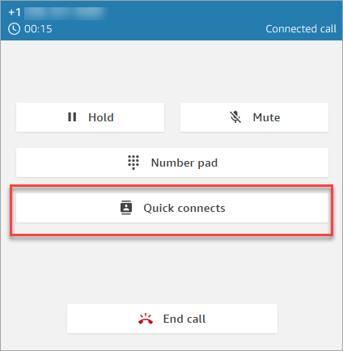
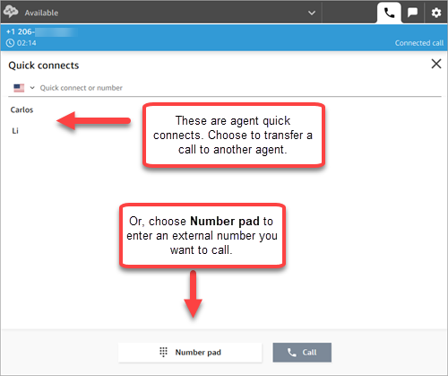
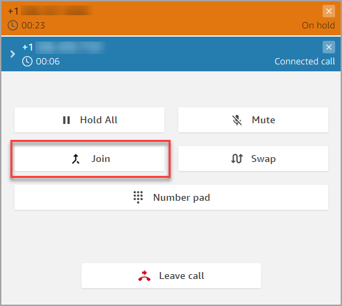
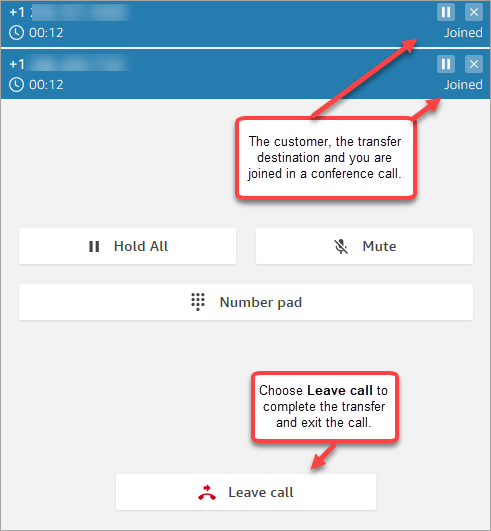
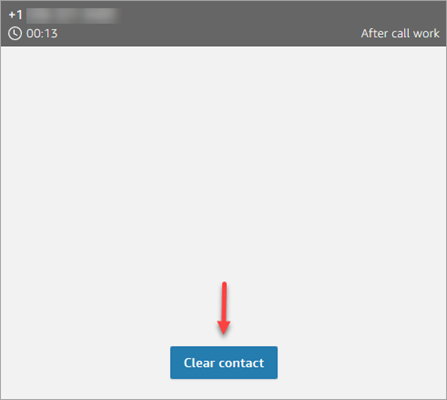
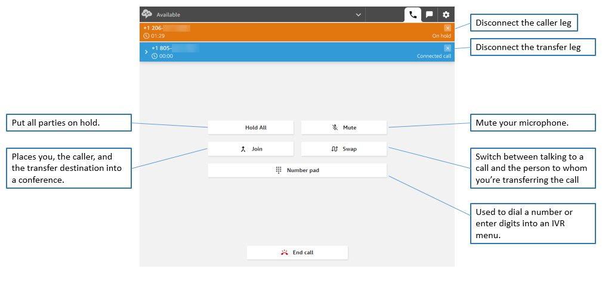
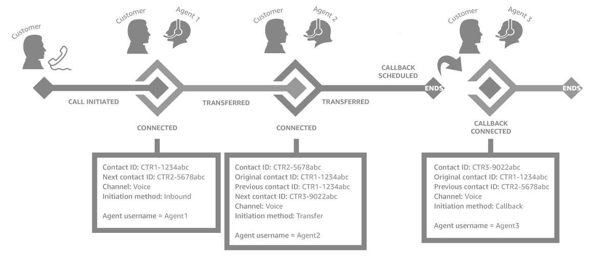

# Transfer calls to a quick connect or external phone

number using the Contact Control Panel (CCP)

You can transfer calls to people in a predefined list, called quick connects. You
can also transfer calls to external phone numbers that you enter.

###### To transfer to a quick connect or to an external number

1. While you're connected to the contact, choose **Quick
   connects** on the CCP.

 2. From the list of quick connects, choose the name of another agent to
transfer the call to. (Your Amazon Connect administrator adds the names of agents to
the list of quick connects.)

###### Tip

Agents see the quick connects of the queues in their routing profile,
including the Default outbound queue.

Or, to call an external number, choose **Number pad**,
enter the number you want to call, and then choose
**Call**.

 3. After the call is connected to the transfer destination, you can choose
**Join** so the caller, the transfer destination, and
you are in a conference call.

 4. When the call is joined, the three of you can talk. Choose
**Leave** to complete the transfer and exit the
call.

 5. Complete the after contact work and then choose **Clear
contact**.

## Manage a transferred call

After you initiate a transfer, the customer is placed on hold and you are
connected to the transfer destination. The following image shows what actions
you can take at this point.

## Transfers create multiple contact

records

A contact record is opened for a customer when they are connected to your
contact center. The contact record is completed when the interaction with the
flow or agent ends (that is, the agent has completed the ACW and cleared the
contact). This means it's possible for a customer to have multiple contact
records.

The following diagram shows when a contact record is created for a contact. It
shows three contact records for a contact:

- The first record is created when the contact is connected to Agent

1.

- The second record is created when the contact is transferred to Agent

2.

- The third record is created when the contact is connected to Agent 3
  during a callback.

Each time a contact is connected to an agent, a new contact record is created.
The contact records for a contact are linked together through the contactId
fields: initial, next, and previous.

For more information, see [About contact states in Amazon Connect](about-contact-states.md "about-contact-states.md").
