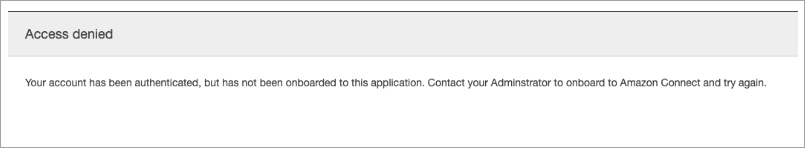
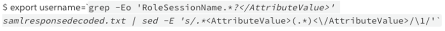
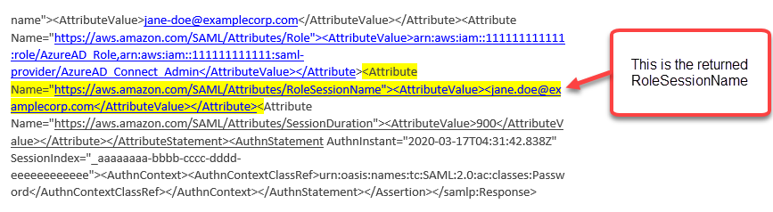
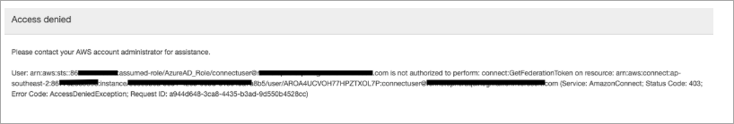

# Troubleshoot SAML with Amazon Connect

This article explains how to troubleshoot and resolve some of the most common issues
customers encounter when using SAML with Amazon Connect.

If you're troubleshooting your integration with other identity providers such as Okta, PingIdentify, Azure AD, and more, see
[Amazon Connect SSO Setup Workshop](https://catalog.workshops.aws/workshops/33e6d0e7-f927-4531-abb1-f28a86ba0872/en-US "https://catalog.workshops.aws/workshops/33e6d0e7-f927-4531-abb1-f28a86ba0872/en-US").

## Error Message: Access Denied. Your

account has been authenticated, but has not been onboarded to this
application.



### What does this mean?

This error means that the user has successfully authenticated using SAML into the
AWS SAML login endpoint. However, the user could not be matched/found inside
Amazon Connect. This usually indicates one of the following:

- The username in Amazon Connect doesn't match the `RoleSessionName` SAML
  attribute specified in the SAML response returned by the identity
  provider.
- The user doesn't exist in Amazon Connect.
- The user has two separate profiles assigned to them with SSO.

### Resolution

Use the following steps to check the RoleSessionName SAML attribute specified in
the SAML response returned by the identity provider, and then retrieve and compare
with the login name in Amazon Connect.

1. Perform a HAR capture (**H**TTP **AR**chive) for the end-to-end login process. This
   captures the network requests from the browser side. Save the HAR file with
   your preferred file name, for example, **saml.har**.

For instructions, see [How do I create a HAR file from my browser for an AWS Support
case?](https://aws.amazon.com/premiumsupport/knowledge-center/support-case-browser-har-file/ "https://aws.amazon.com/premiumsupport/knowledge-center/support-case-browser-har-file/") 2. Use a text editor to find the SAMLResponse in the HAR file. Or, run the
following commands:

`$ grep -o "SAMLResponse=.*&" azuresaml.har | sed -E
 's/SAMLResponse=(.*)&/\1/' > samlresponse.txt`

    * This searches for the SAMLresponse in the HAR file and saves it to
     a **samlresponse.txt** file.
    * The response is URL encoded and the contents are Base64
     encoded.

3. Decode the URL response and then decode the Base64 contents using a
   third-party tool or a simple script. For example:

`$ cat samlresponse.txt | python3 -c "import sys; from urllib.parse
 import unquote; print(unquote(sys.stdin.read()));" | base64 --decode >
 samlresponsedecoded.txt`

This script uses a simple python command to decode the SAMLResponse from
its original URL encoded format. Then it decodes the response from Base64
and outputs the SAML Response in plain text format. 4. Check the decoded response for the needed attribute. For example, the
following image shows how to check `RoleSessionName`:

 5. Check whether the username returned in from the previous step exists as a
user in your Amazon Connect instance:

$ aws connect list-users --instance-id [INSTANCE\_ID] | grep
$username

    * If the final grep does not return a result then this means that
     the user does not exist in your Amazon Connect instance or it has been
     created with a different case/capitalization.
    * If your Amazon Connect instance has many users, the response from the
     ListUsers API call maybe paginated. Use the `NextToken`
     returned by the API to fetch the rest of the users. For more
     information, see [ListUsers](../APIReference/API_ListUsers.md "../APIReference/API_ListUsers.md").

### Example SAML Response

Following is an image from a sample SAML Response. In this case, the identity
provider (IdP) is Azure Active Directory (Azure AD).



## Error Message: Access denied, Please

contact your AWS account administrator for assistance.



### What does this mean?

The role that the user has assumed has successfully authenticated using SAML.
However, the role doesn't have permission to call the GetFederationToken API for
Amazon Connect. This call is required so the user can log in to your Amazon Connect instance using
SAML.

### Resolution

1. Attach a policy that has the permissions for
   `connect:GetFederationToken` to the role found in the error
   message. Following is a sample policy:

JSON

```
`{
 "Version":"2012-10-17",
 "Statement": [
 {
 "Sid": "Statement1",
 "Effect": "Allow",
 "Action": "connect:GetFederationToken",
 "Resource": [
 "arn:aws:connect:ap-southeast-2:`111122223333`:instance/aaaaaaaa-bbbb-cccc-dddd-eeeeeeeeeeee/user/${aws:userid}"
 ]
 }
 ]
}`

```

2. Use the IAM console to attach the policy. Or, use the attach-role-policy
   API, for example:

`$ aws iam attach-role-policy —role-name
 [`ASSUMED_ROLE`] —policy_arn
 [`POLICY_WITH_GETFEDERATIONTOKEN`]`

## Error Message: Session Expired

If you see the **Session expired** message while logging in, you probably just need to
refresh the session token. Go to your identity provider and log in. Refresh the
Amazon Connect page. If you still get this message, contact your IT team.
