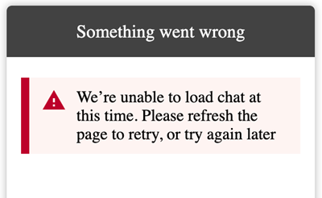
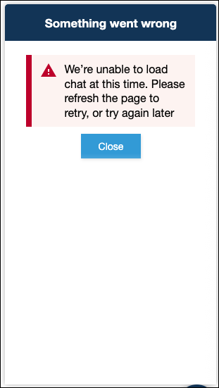
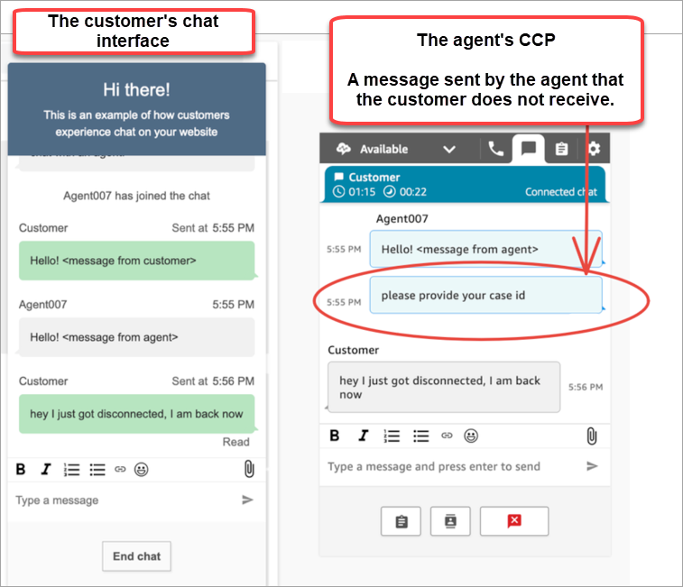

# Troubleshoot issues with your Amazon Connect communications widget

This topic is for developers who need to investigate issues that may occur when
configuring a communications widget in the Amazon Connect admin website.

###### Contents

- ["Something went wrong"](#sww "#sww")
- [Customers not receiving agent messages: Network or WebSocket
  disconnected](#mam "#mam")
- [Bypassing CORS when opening third-party links](#bcwotpl "#bcwotpl")

## "Something went wrong"

If you see the following **Something went wrong** error message
when loading your communications widget, open the browser tools to view the error logs.



Following are common issues that cause this error.

### 400 Invalid request

If the logs mention a 400 invalid request, there are a few possible
causes:

- Your communications widget is not being served on an allowed domain. You must
  specifically state the domains where you will host your widget.
- The request to the endpoint is not properly formatted. This usually
  occurs only if the contents of the embed snippet have been
  modified.

### 401 Unauthorized



If the logs mention a 401 unauthorized, this is a problem with the JSON Web
Token (JWT) authentication. It displays the above error page.

After you have the JWT, you need to implement it in the
`authenticate` callback function. The following example shows how
to implement it if you're trying to fetch your token and then use it:

```

amazon_connect('authenticate', function(callback) {
  window.fetch('/token').then(res => {
    res.json().then(data => {
      callback(data.data);
    });
  });
});
```

Here is a more basic version of what needs to be implemented:

```
amazon_connect('authenticate', function(callback) {
   callback(token);
});
```

For instructions on implementing JWT, see [Step 3: Confirm and copy
communications widget code and security keys](add-chat-to-website.md#confirm-and-copy-chat-widget-script "add-chat-to-website.md#confirm-and-copy-chat-widget-script").

If you have implemented the callback already, the following scenarios may
still cause a 401:

- Invalid signature
- Expired token

### 404 Not found

A 404 status code is typically caused when the requested resource doesn't
exist:

- An invalid widgetId is specified in the API request
- The widgetId is valid but the associated flow has been deleted or
  archived
- The widget hasn't been published, or it has been deleted

Verify that your snippet is exactly how it was copied from the Amazon Connect admin website, and none
of the identifiers have changed.

If the identifiers have not changed and you are seeing a 404, contact AWS
Support.

### 500 Internal server error

This can be caused by your service-linked role not having the required
permissions to start chat. This happens if your Amazon Connect instance was created
before October 2018 because you don’t have service-linked roles set up.

**Solution**: Add the `connect:*`
policy on the role that is associated with your Amazon Connect instance. For more
information, see [Use service-linked roles and role permissions for Amazon Connect](connect-slr.md "connect-slr.md").

If your service-linked role has the correct permissions, contact AWS
Support.

## Customers not receiving agent messages: Network or WebSocket

disconnected

During a chat session, a customer who is using a chat application loses their
network/WebSocket connection. They quickly re-gain connection, but messages that
were sent by the agent during that time aren't rendered in the customer's chat
interface.

The following image shows an example of the customer's chat interface and agent's
Contact Control Panel side-by-side. A message the agent sent is not rendered in the
customer's chat session. However, it appears to the agent as though the customer has
received it.



If the customer's chat application loses it's network/WebSocket connection, the
chat user interface must do the following to retrieve future messages as well as
messages that were sent to it while disconnected:

- Re-establish the WebSocket connection to receive future incoming messages
  again.
- Make a [chatSession.getTranscript](https://github.com/amazon-connect/amazon-connect-chatjs?tab=readme-ov-file#chatsessiongettranscript "https://github.com/amazon-connect/amazon-connect-chatjs?tab=readme-ov-file#chatsessiongettranscript") ([getTranscripts](../../../connect-participant/latest/APIReference/API_GetTranscript.md "../../../connect-participant/latest/APIReference/API_GetTranscript.md") API) request to retrieve all missing messages
  that were sent while the customer was disconnected.

If the agent sends a message while the customer's chat user interface is
disconnected, the message is successfully stored in the Amazon Connect back end: the CCP is
working as expected and messages are all recorded in transcript, but the customer's
device is unable to receive messages. When the client reconnects to the WebSocket,
there is a gap in messages. Future incoming messages will appear again from the
WebSocket, but the gap messages are still missing unless the code explicitly makes a
call to the [GetTranscript](../../../connect-participant/latest/APIReference/API_GetTranscript.md "../../../connect-participant/latest/APIReference/API_GetTranscript.md") API.

### Solution

Use the [chatSession.onConnectionEstablished](https://github.com/amazon-connect/amazon-connect-chatjs?tab=readme-ov-file#chatsessiononconnectionestablished "https://github.com/amazon-connect/amazon-connect-chatjs?tab=readme-ov-file#chatsessiononconnectionestablished") event handler to call the
[GetTranscript](../../../connect-participant/latest/APIReference/API_GetTranscript.md "../../../connect-participant/latest/APIReference/API_GetTranscript.md") API. The
`chatSession.onConnectionEstablished` event handler is triggered
when the WebSocket re-connects. ChatJS has built-in heartbeat and retry logic
for the WebSocket connection. Because ChatJS is not storing the transcript,
however, you must add custom code to the chat user interface to manually fetch
the transcript again.

The following code sample shows how to implement
`onConnectionEstablished` to call
`GetTranscript`.

```
import "amazon-connect-chatjs";

const chatSession = connect.ChatSession.create({
  chatDetails: {
    ContactId: "`the ID of the contact`",
    ParticipantId: "`the ID of the chat participant`",
    ParticipantToken: "`the participant token`",
  },
  type: "CUSTOMER",
  options: { region: "us-west-2" },
});

// Triggered when the websocket reconnects
chatSession.onConnectionEstablished(() => {
  chatSession.getTranscript({
    scanDirection: "BACKWARD",
    sortOrder: "ASCENDING",
    maxResults: 15,
    // nextToken?: nextToken - OPTIONAL, for pagination
  })
    .then((response) => {
      const { initialContactId, nextToken, transcript } = response.data;
      // ...
    })
    .catch(() => {})
});
```

```
function loadLatestTranscript(args) {
    // Documentation: https://github.com/amazon-connect/amazon-connect-chatjs?tab=readme-ov-file#chatsessiongettranscript
    return chatSession.getTranscript({
        scanDirection: "BACKWARD",
        sortOrder: "ASCENDING",
        maxResults: 15,
        // nextToken?: nextToken - OPTIONAL, for pagination
      })
      .then((response) => {
        const { initialContactId, nextToken, transcript } = response.data;

        const exampleMessageObj = transcript[0];
        const {
          DisplayName,
          ParticipantId,
          ParticipantRole, // CUSTOMER, AGENT, SUPERVISOR, SYSTEM
          Content,
          ContentType,
          Id,
          Type,
          AbsoluteTime, // sentTime = new Date(item.AbsoluteTime).getTime() / 1000
          MessageMetadata, // { Receipts: [{ RecipientParticipantId: "asdf" }] }
          Attachments,
          RelatedContactid,
        } = exampleMessageObj;

        return transcript // TODO - store the new transcript somewhere
      })
      .catch((err) => {
        console.log("CustomerUI", "ChatSession", "transcript fetch error: ", err);
      });
}
```

For another example, see this [open source implementation on GitHub](https://github.com/amazon-connect/amazon-connect-chat-interface/blob/c88f854073fe6dd45546585c3bfa363d3659d73f/src/components/Chat/ChatSession.js#L408 "https://github.com/amazon-connect/amazon-connect-chat-interface/blob/c88f854073fe6dd45546585c3bfa363d3659d73f/src/components/Chat/ChatSession.js#L408").

## Bypassing CORS when opening third-party links

To enhance security, the communications widget operates within a sandbox
environment. As a result, third-party links shared within the widget cannot be
opened.

**Solution**

There are two options for bypassing CORS to allow third-party links to be
opened.

- **(Recommended)**

Update the sandbox attribute to allow opening links in new tab which can
be done by adding the following attribute to the code snippet:

```

amazon_connect('updateSandboxAttributes', 'allow-scripts allow-same-origin allow-popups allow-downloads allow-top-navigation-by-user-activation allow-popups-to-escape-sandbox')

```

###### Note

The attribute value can be updated as needed to allow for specific
actions. This is an example for how to allow opening links in new
tab.

- Remove the sandbox attribute which can be done by adding the following
  attribute to the code snippet:

```

amazon_connect('removeSandboxAttribute', true)

```
