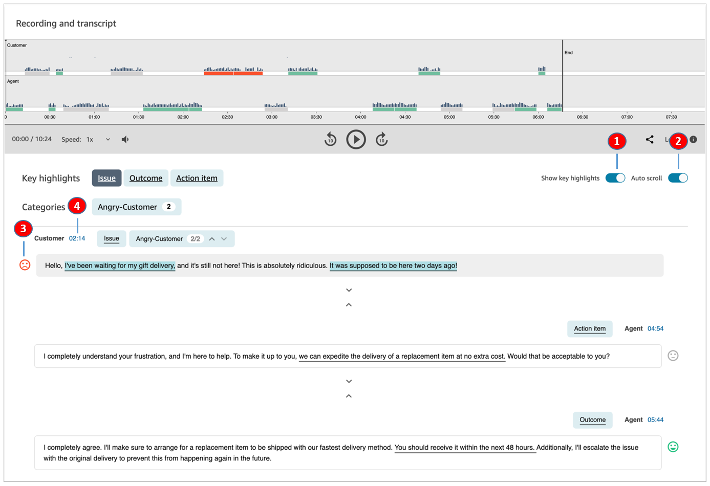
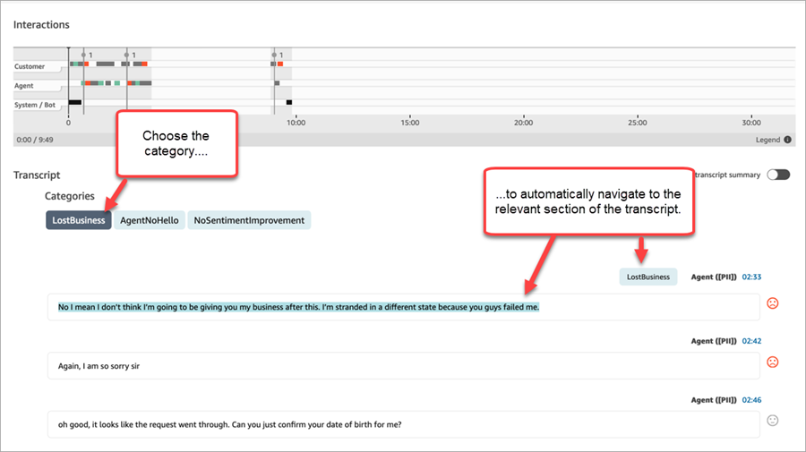

# Navigate transcripts and audio in Amazon Connect

Contact Lens

Supervisors are often required to review the contacts for many agents, for quality
assurance purposes. The turn-by-turn transcript and sentiment data helps you quickly
identify and navigate to the portion of the recording that is of interest to you.

The following image of a contact record shows features that enable you to quickly
navigate transcripts and audio to find areas that need your attention. While the
image shows a voice contact, the same features apply to chat contacts.

1. Use [Show key
   highlights](#contact-lens-contact-summarization "#contact-lens-contact-summarization") to review only the issue, outcome, and/or action
   item.
2. Use [Autoscroll](#autoscroll "#autoscroll") for voice contacts, to
   jump around the audio or transcript. The two always stay in sync.
3. Scan for [sentiment emojis](#sentiment-emojis "#sentiment-emojis") to
   quickly identify a part for the transcript you want to read or listen
   to.
4. Choose the timestamp to jump to that part of the audio recording or
   transcript. The timestamp is calculated from the start of the customer
   interaction within the contact.

## Show key highlights

It can be time-consuming to review contact transcripts that are hundreds of
lines long. To make this process faster and more efficient, Contact Lens
provides the option for you to view key highlights. The highlights show only
those lines where Contact Lens has identified an issue, outcome, or
action item in the transcript.

- **Issue** represents the call driver. For example,
  "I'm thinking of upgrading to your online subscription plan."
- **Outcome** represents the likely conclusion or
  outcome of the contact. For example, "Based on your current plan I would
  recommend the online essentials plans that we have."
- **Action item** represents the action item the agent
  takes. For example, "Please keep an eye out for an email with a price
  quote. I will send it to you shortly."

Each contact has no more than one issue, one outcome, and one action item. Not
all contacts will have all three.

###### Note

If Contact Lens displays the message **There are no key
highlights for this transcript**, it means no issue, outcome,
or action item was identified.

You don't need to configure key highlights. It works out-of-the-box without
any training of the machine learning model.

## Turn on autoscroll to synchronize the transcript

and audio

For voice contacts, use **Autoscroll** to jump around the
audio or transcript, and the two always stay in sync. For example:

- When you listen to a conversation, the transcript moves along with it,
  showing you sentiment emojis and any detected issue.
- You can scroll through the transcript, and choose the timestamp for
  the turn to listen to that specific point in the recording.

Because the audio and transcript are aligned, the transcript can help you
understand what the agent and customer are saying. This is especially useful
when:

- The audio is bad, maybe due to a connection issue. The transcript can
  help you understand what's being said.
- There's a dialect or language variant. Our models are trained on
  different accents so the transcript can help you understand what's being
  said.

## Scan for sentiment emojis

Sentiment emojis help you quickly scan a transcript so you can listen to that
part of the conversation.

For example, where you see red emojis for customer turns and then a green
emoji, you might choose the timestamp to jump to that specific point of the
conversation to check how that agent helped the customer.

## Tap or click category tags to navigate

through transcript

When you tap or click on the category tags, Contact Lens auto-navigates
to the corresponding point-of-interests in the transcript. There are also
category markers in the visualization of the interaction to indicate which part
of the recording file has utterances related to the category.

The following image shows part of a **Contact details** page
for a chat.

