# Create an IT help desk in Amazon Connect

This tutorial shows you how to create an IT Help Desk. It shows how to create an Amazon Lex
bot that finds out why the customer is calling. You next create a flow to use the
customer's input to route them to the right queue.

**Prerequisite**

This tutorial is part of a series. If you performed Tutorial 1, you're ready to go. If
not, here's what you need:

- An AWS account
- A configured Amazon Connect instance
- An Amazon Connect administrative account
- A claimed phone number

###### Contents

- [Step 1: Create an Amazon Lex
  bot](#tutorial1-create-amazon-lex-bot "#tutorial1-create-amazon-lex-bot")
- [Step 2: Add permissions to
  Amazon Lex bot](#tutorial1-add-permissions-for-bot "#tutorial1-add-permissions-for-bot")
- [Step 3: Set up
  routing](#tutorial1-set-up-routing "#tutorial1-set-up-routing")
- [Step 4: Create a contact
  flow](#tutorial1-create-contact-flow "#tutorial1-create-contact-flow")
- [Step 5: Assign the contact
  flow to the phone number](#tutorial1-assign-contact-flow-to-number "#tutorial1-assign-contact-flow-to-number")
- [Step 6: Test a custom voice and chat
  experience](#tutorial1-try-it "#tutorial1-try-it")

## Step 1: Create an Amazon Lex

bot

Bots provide an efficient way to offload repetitive tasks from your agents. This
tutorial shows how to use the bot to find out why customers are calling the IT Help
Desk. Later, we use the customer's response to route them to the right queue.

In previous tutorials, you used the Amazon Connect console. In this tutorial to set up a
bot, you use the Amazon Lex console.

This step has five parts to it.

###### Contents

- [Part 1:
  Create an Amazon Lex bot](#tutorial1-create-amazon-lex-bot-step1 "#tutorial1-create-amazon-lex-bot-step1")
- [Part 2: Add
  intents](#tutorial-lex-bot-intents "#tutorial-lex-bot-intents")
- [Part 3: Build and test](#tutorial-lex-bot-build "#tutorial-lex-bot-build")

### Part 1: Create an Amazon Lex

bot

This step assumes it's the first time you've opened the Amazon Lex console. If
you've created a Amazon Lex bot before, your steps differ slightly from the ones in
this section.

1. Choose the following link to open the Amazon Lex console, or enter the URL
   in your web browser: **[https://console.aws.amazon.com/lex/](https://console.aws.amazon.com/lex/ "https://console.aws.amazon.com/lex/")**.
2. If this is the first time you've created Amazon Lex bot, choose
   **Get Started**. Otherwise, you're already in the
   Amazon Lex dashboard.

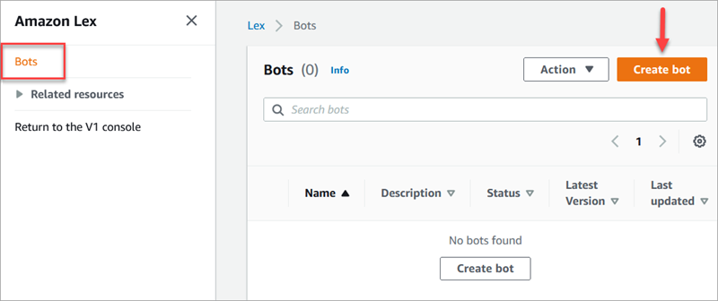 3. Choose **Create a blank bot**.

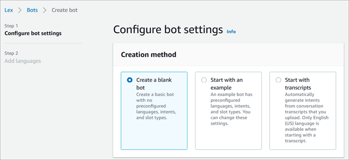 4. Enter the following information:

    * **Bot name** — For this tutorial, name
     the bot **HelpDesk**.

    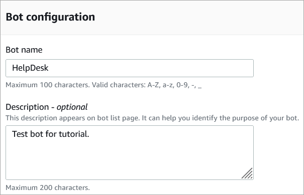
    * IAM permissions: Choose **Create a role with basic
     Amazon Lex permissions**.

    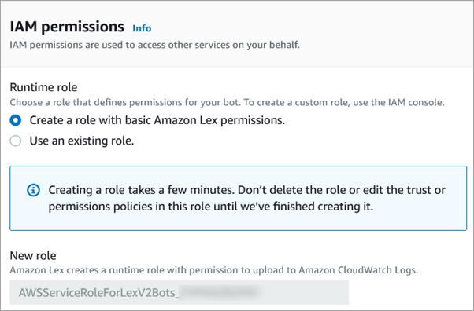
    * **COPPA**— Choose whether the bot is
     subject to the [Children's Online Privacy Protection Act](https://www.ftc.gov/enforcement/rules/rulemaking-regulatory-reform-proceedings/childrens-online-privacy-protection-rule "https://www.ftc.gov/enforcement/rules/rulemaking-regulatory-reform-proceedings/childrens-online-privacy-protection-rule").
    * **Idle session timeout**— Choose how
     long the bot should wait to get input from a caller before
     ending the session.

5. Choose **Next**.
6. On the **Add language to bot** page, choose the
   language and voice for your bot to use when speaking to callers. The
   default voice for Amazon Connect is Joanna.

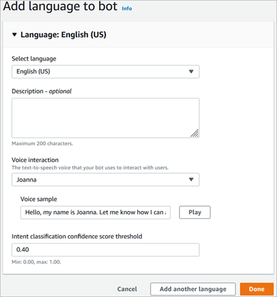 7. Choose **Done**.

Go to [Part 2: Add intents to your Amazon Lex
bot](#tutorial-lex-bot-intents "#tutorial-lex-bot-intents").

### Part 2: Add intents to your Amazon Lex

bot

An intent is the action the user wants to perform. In this part, add two
intents to the bot. Each intent represents a reason that users call the Help
Desk: password reset and network issues.

1. In the Amazon Lex console, in the **Intent details**
   section, enter **PasswordReset** as the name of your
   intent.

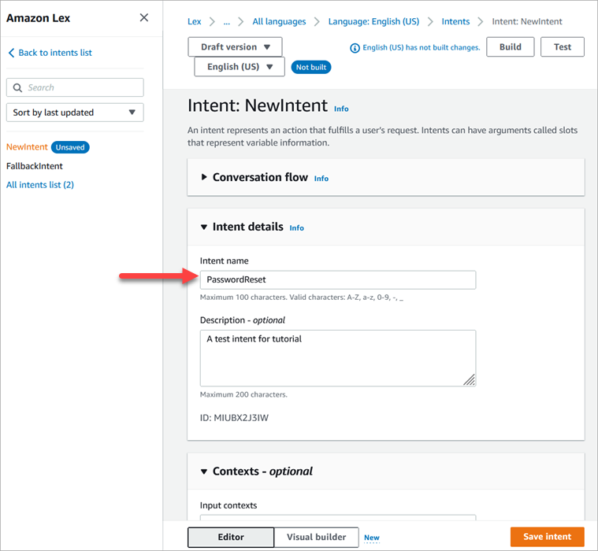 2. Scroll to the **Sample utterances** section.

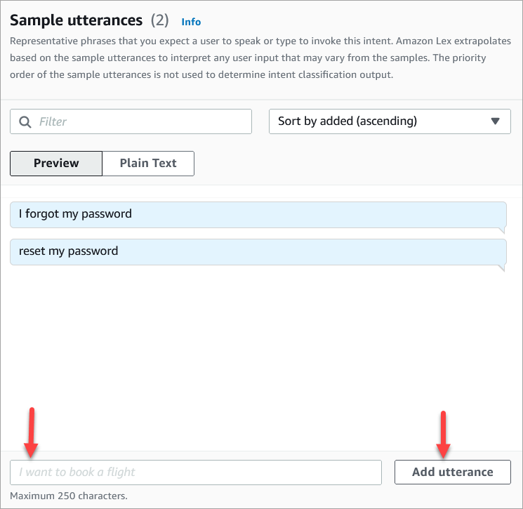 3. Type **I forgot my password**, and then choose
**Add utterance**. Then add **reset my
password** and choose **Add utterance**
again. 4. Choose **Save intent**. 5. On the left navigation menu, choose **All intents
list**. 6. On the left navigation menu, choose **Back to intents
list**.

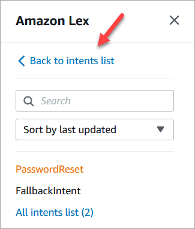 7. Choose **Add intent**, **Add empty
intent**, and assign the name
**NetworkIssue**. Scroll down the page and add the
following sample utterances:

    * **I can't access the internet**
    * **my email is down**

When you're done, go to [Part 3: Build and test the Amazon Lex
bot](#tutorial-lex-bot-build "#tutorial-lex-bot-build").

### Part 3: Build and test the Amazon Lex

bot

Build and test your bot to make sure that it works as intended before you
publish it.

1. In the Amazon Lex console, choose **Build**. The build may
   take a minute or two.

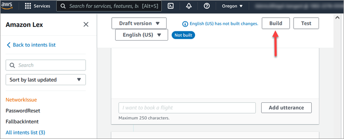 2. When it's finished building, choose **Test**. 3. Test the **PasswordReset** intent. In the
**Test Draft version** pane, type **I
forgot my password**, and press **Enter**.

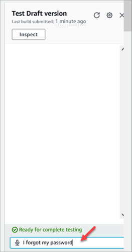 4. The verification looks like what's shown in the following image.

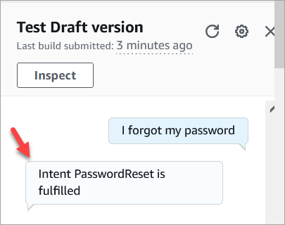 5. To confirm that the **NetworkIssue** intent is
working, type **my email is down**. The verification
looks like what's shown in the following image.

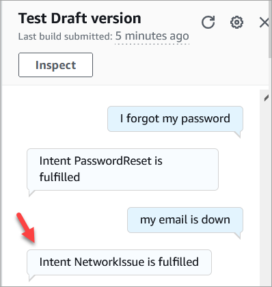

Go to [Step 2: Add permissions to Amazon Lex
bot](#tutorial1-add-permissions-for-bot "#tutorial1-add-permissions-for-bot").

## Step 2: Add permissions to Amazon Lex

bot

To use a bot in your flow, add it to your Amazon Connect instance.

1. Open the [Amazon Connect
   console (https://console.aws.amazon.com/connect/).](https://console.aws.amazon.com/connect/ "https://console.aws.amazon.com/connect/")
2. Choose the name of the instance that you created.

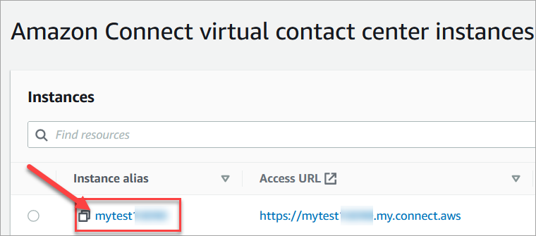 3. Do not log in on the name page (this method of logging in is for emergency
access only). Rather, choose **Flows**.

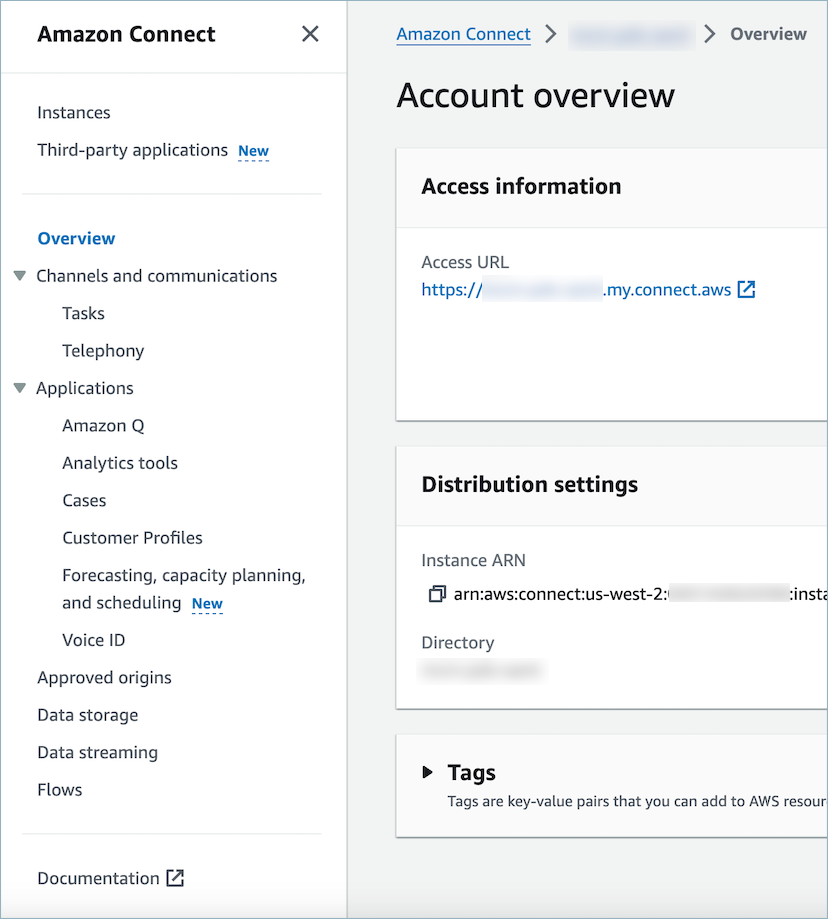 4. Under **Amazon Lex**, use the drop-down arrow to choose
**HelpDesk**. Under **Alias**, choose
**TestBotAlias**, and then choose **+ Add Lex
Bot**, and then choose **Add Amazon Lex
Bot**.

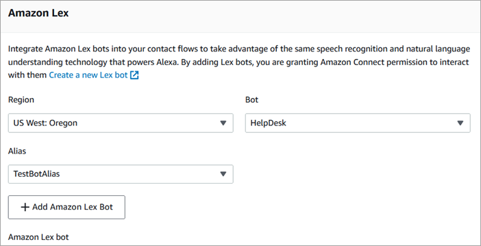 5. When you're done, choose Amazon Connect to navigate back to instances page.

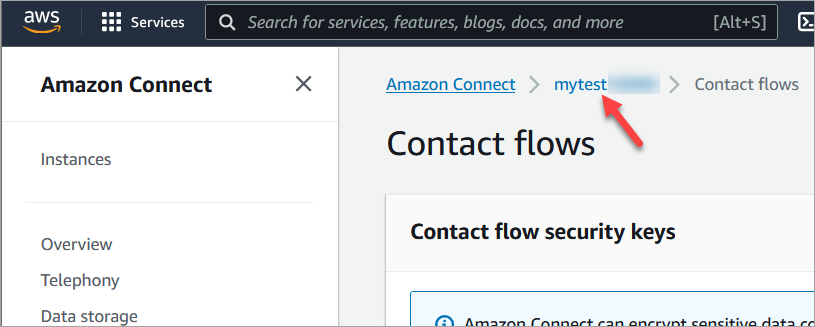 6. Choose the access URL of your instance.

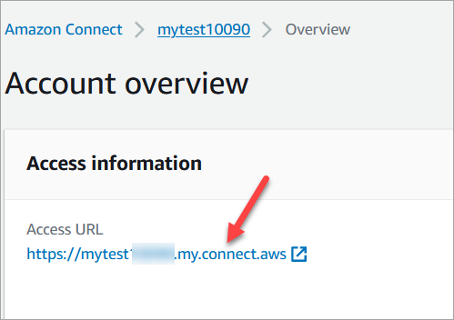

The **Access URL** takes you back to the Amazon Connect
dashboard.

## Step 3: Set up routing

In this step, you start at the Amazon Connect console for your instance. This step shows
how to set up your queues, create a routing profile, and then assign your user
account to the profile.

1. On the navigation menu, go to **Routing**,
   **Queues**.

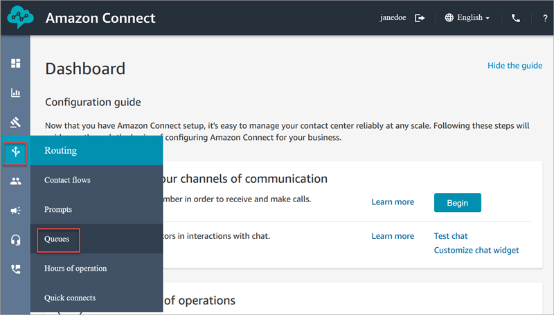 2. Choose **Add queue**.

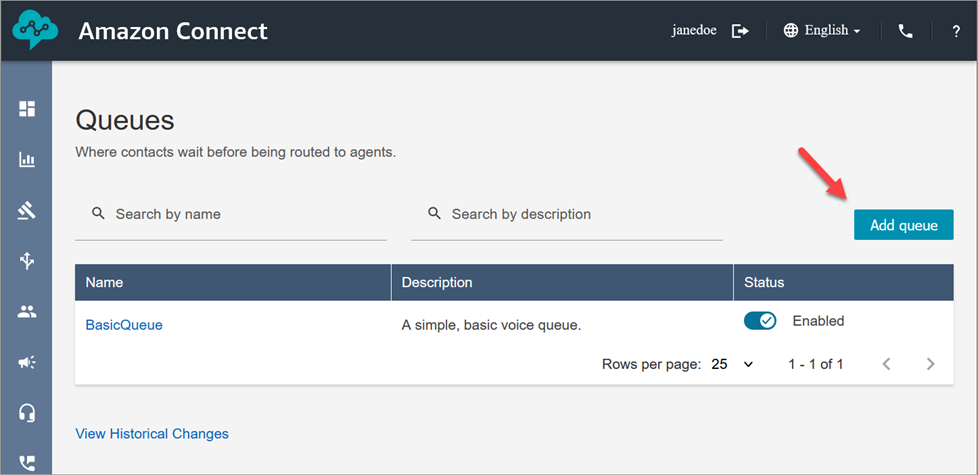 3. Complete the **Add queue** page, as shown in the
following image, to add a queue named **PasswordReset**.
When done, choose **Save**.

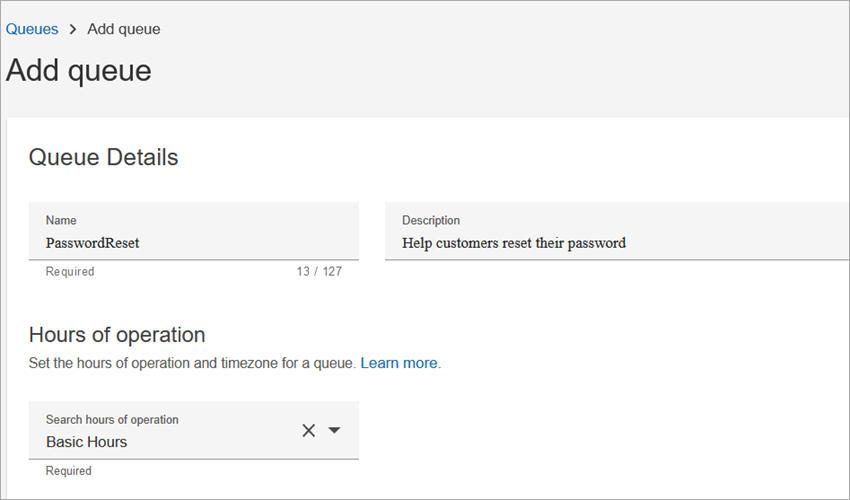

The following image shows the **Settings** section of the
**Add queue** page. Add your default caller ID name and
outbound caller ID number.

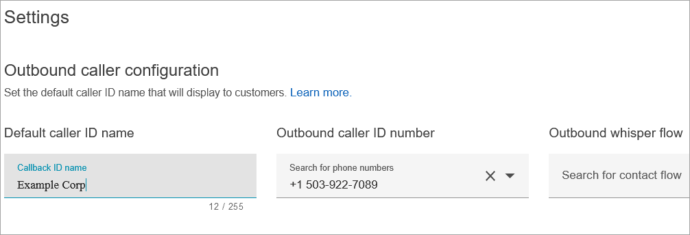

For the purposes of this tutorial, leave the following empty: Outbound
whisper flow, Quick connect, and Maximum contact in queue. 4. Add a queue named **NetworkIssue**. Complete the
**Add queue** page like you did for the
**PasswordReset** queue.

When done, you'll have three queues.

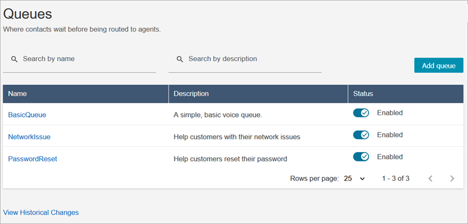 5. On the navigation menu, go to **Users**,
**Routing Profiles**.

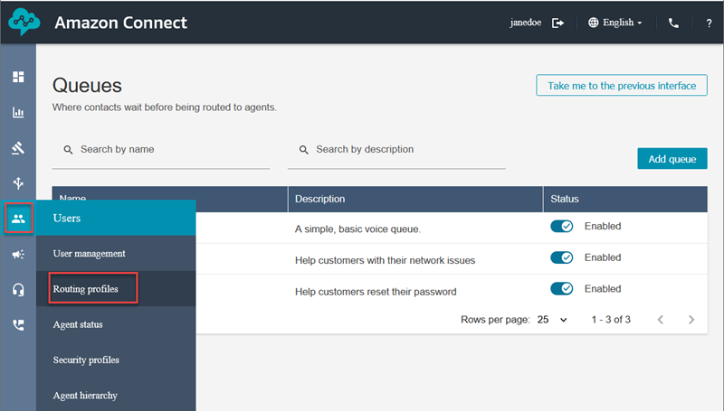 6. Choose **Add routing profile**.

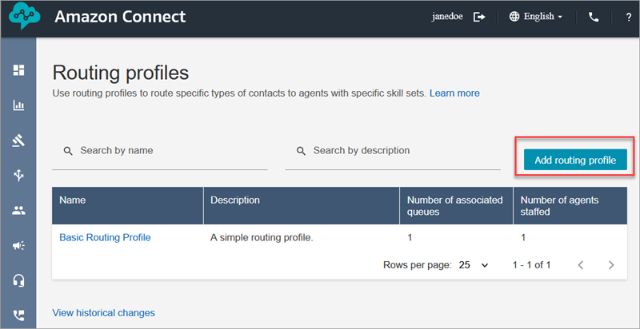 7. Assign a name to the new profile (for example, **Test routing
profile**). Enter a description, select
**Voice**, **Chat**, and set
**Maximum chats** to **1.**

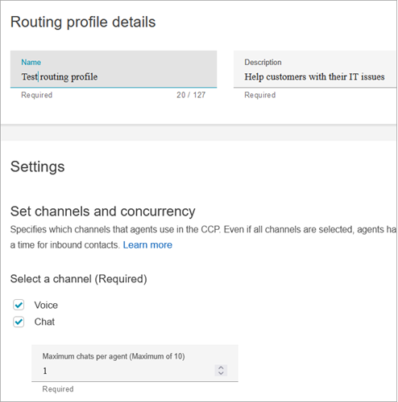 8. In the **Queues** section, use the drop-down arrow to
search for the queues you just created. Choose
**NetworkIssue**, select **Voice** and
**Chat**. Choose **Add Queue**.

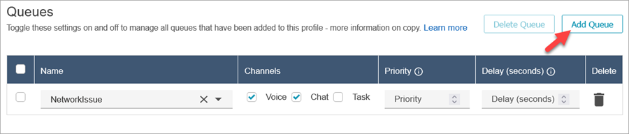 9. Add the **PasswordReset** queue. Select
**Voice** and **Chat**, and then
choose **Save**. 10. Under **Default outbound queue**, use the drop-down arrow
to choose **BasicQueue**.

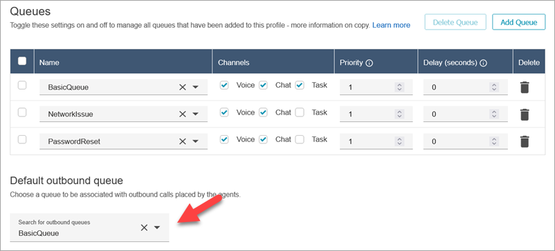 11. When done, scroll to the top of the page, and choose
**Save** to save the profile. 12. On the navigation menu, go to **Users**, **User
management**.

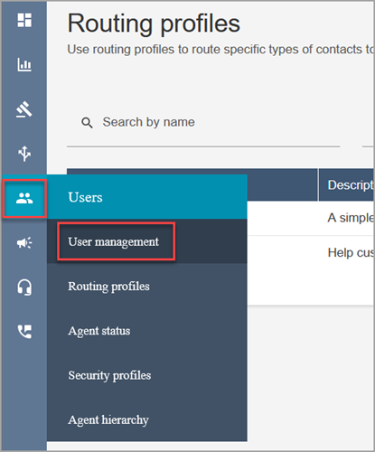 13. On the **User management** page, select your login
name. 14. On the **Edit** page, in the
**Settings** section, in the **Routing
profile** dropdown menu, choose the routing profile you
created, for example, **Test routing profile**. Choose
**Save**.

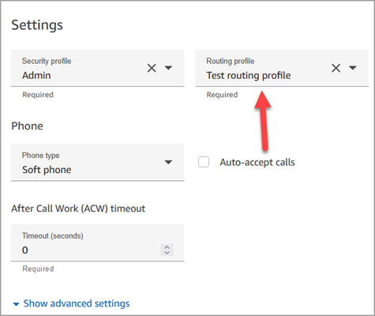

Routing is all set up and ready to go.

## Step 4: Create a contact flow

Although Amazon Connect comes with a set of [built-in
flows](contact-flow-default.md "contact-flow-default.md"), you can create your own flows to determine how a customer
experiences your contact center. The flows contain the prompts that customers hear
or see, and they transfer them to the right queue or agent, among other
things.

In this step, create a flow that's specific to the IT Help Desk experience that
you're creating.

1. On the Amazon Connect navigation menu, go to **Routing**,
   **Flows**.

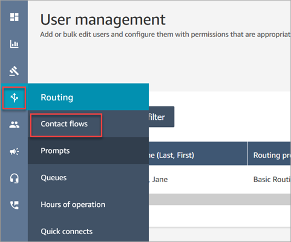 2. Choose **Create flow**.

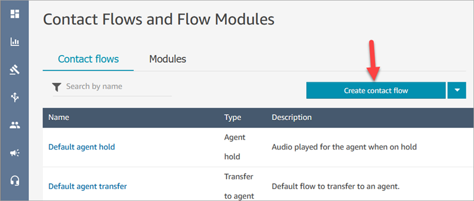 3. The flow designer opens. Enter a name for the flow, such as **Test
flow**.

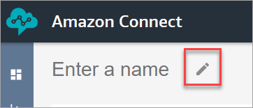 4. Use the search box to search for the following block, and drag them onto
the grid: [Set logging behavior](set-logging-behavior.md "set-logging-behavior.md"), [Set voice](set-voice.md "set-voice.md"), and [Play prompt](play.md "play.md").

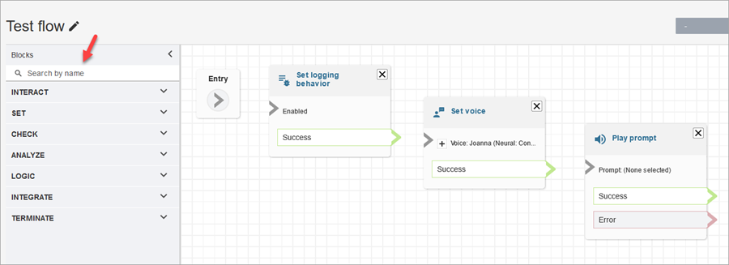 5. Use your mouse to drag an arrow from the **Entry** block
to the **Set logging behavior** block.

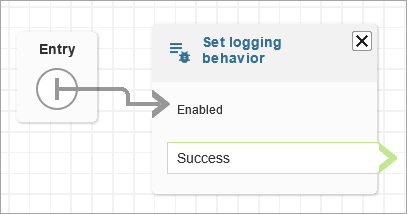 6. Connect the remaining blocks, as shown in the following image.

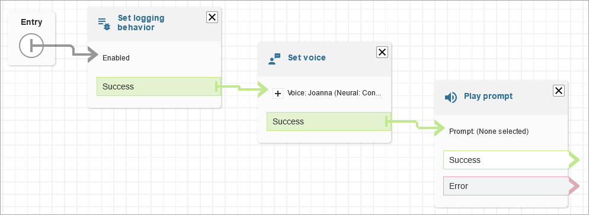 7. Choose the **Play prompt** title to open its properties
page.

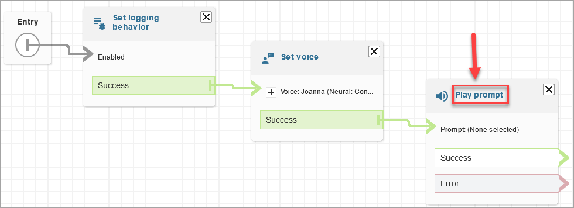 8. Configure the **Play prompt** block, as shown in the
following image, and then choose **Save**. Choose
**Text-to-speech or chat text**, choose **Set manually**, enter _Welcome to the IT
Help desk_.

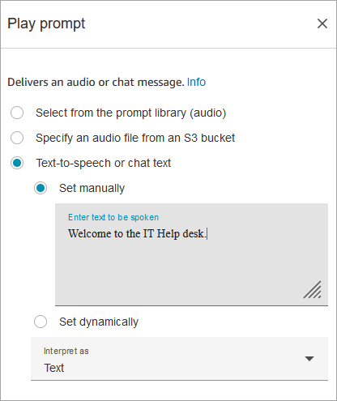 9. Add a [Get customer input](get-customer-input.md "get-customer-input.md") block and connect to the
**Play prompt** block.

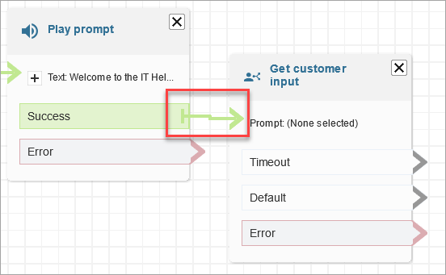 10. Choose the title of the [Get customer input](get-customer-input.md "get-customer-input.md") block to open the properties
page.

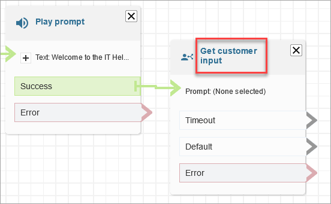 11. Configure the **Get customer input** block, as shown in
the following images. Choose **Text-to-speech or chat
text**, **Set manually**, and enter
_How can I help_ in the text box. Set the
**Interpret as** dropdown box to
**Text**.

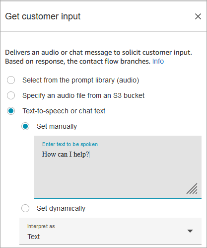

The following image shows the Amazon Lex tab. Choose the name of your Amazon Lex
bot from the dropdown list. For **Alias** enter
**$LATEST**.

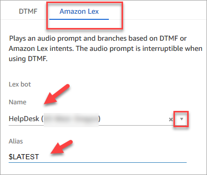 12. While still in the **Get customer input** block, choose
**Add an intent**.

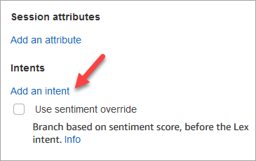 13. Enter the names of the intents that you created in the Amazon Lex bot, such as
PasswordReset and NetworkIssue. They are case sensitive!

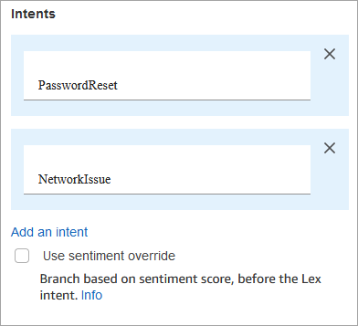 14. Choose **Save**. 15. Add a **Play prompt** block and connect it to the
**PasswordReset** branch. 16. Choose the **Play prompt** title to open its properties
page. Configure the **Play prompt** block with the message
_We're putting you in a queue to help you with password
reset._ Choose **Save**. 17. Add a second **Play prompt** block and connect it to the
**NetworkIssue** branch. 18. Choose the **Play prompt** title to open its properties
page. Configure the **Play prompt** block with the message
_We're putting you in a queue to help you with your network
issues._ Choose **Save**. 19. Add a [Disconnect / hang up](disconnect-hang-up.md "disconnect-hang-up.md") block to the grid. Connect
the **Default** and **Error** branches to
it. 20. Add a [Set working queue](set-working-queue.md "set-working-queue.md") block to the grid. Connect the
**Play prompt** block for PasswordReset.

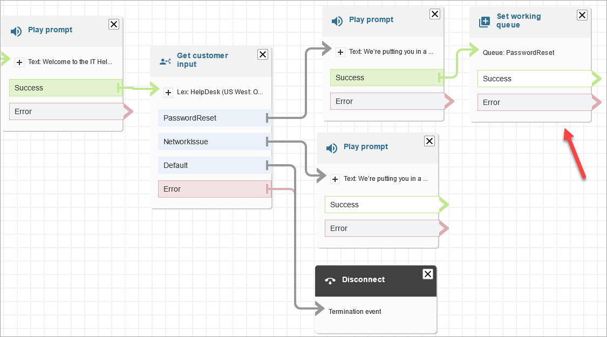 21. Choose the **Set working queue** title to open its
properties page. Configure the **Set working queue** block
by using the drop-down arrow to choose the
**PasswordReset** queue. Choose
**Save**

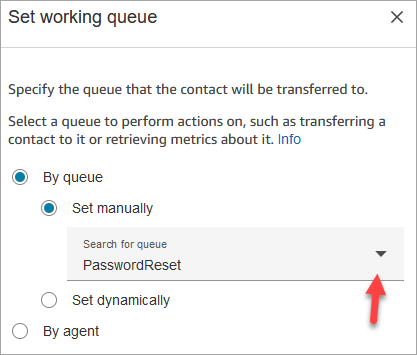 22. Add a **Set working queue** block for NetworkIssue, and
configure it with the NetworkIssue queue.

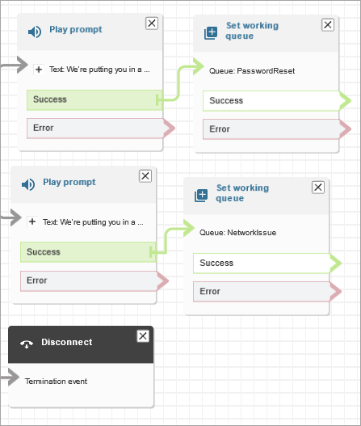 23. Drag two **Transfer to queue** blocks (from the
**Terminate/Transfer** group) onto the grid. 24. Connect each of the **Set working queue** blocks to a
**Transfer to queue** block. 25. Drag another **Disconnect/hang up** block onto the grid.
Connect all of the remaining **Error** and **At
capacity** branches to it. 26. The completed flow looks similar to the following image.

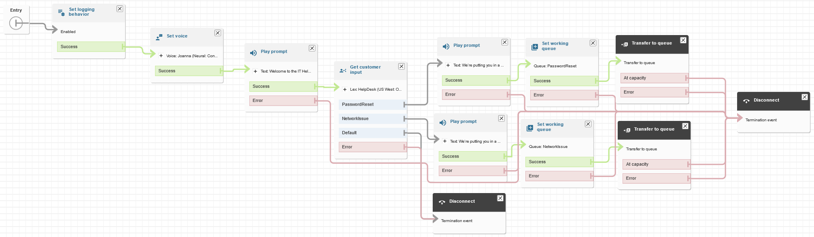 27. Choose **Save**, and then choose
**Publish**.

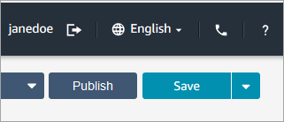

###### Tip

Any blocks that aren't connected or configured correctly generate an
error. If this happens, double-check that all branches are
connected. 28. When the flow publishes, it displays the message that it saved
successfully.

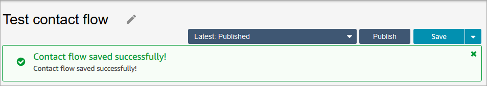

If the flow doesn't save, double-check that all the branches are connected
to blocks. That's the most common reason flows don't publish.

## Step 5: Assign the contact

flow to the phone number

1. On the navigation menu, go to **Channels**,
   **Phone Numbers**.
2. On the **Manage Phone numbers** page, choose your phone
   number.

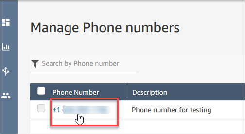 3. Use the drop-down box to choose the flow you just created, and then choose
**Save**.

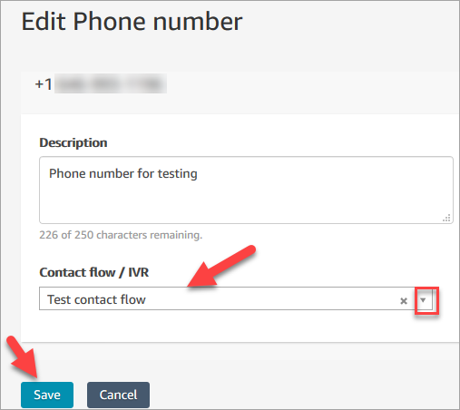

Everything is all set up! Now you're ready to test your IT Help Desk. Continue on
to [Step 6: Test a custom voice and chat
experience](#tutorial1-try-it "#tutorial1-try-it").

## Step 6: Test a custom voice and chat

experience

You're ready to try out the Amazon Lex bot, routing, and flow. The first step is to
tell Amazon Connect which flow you want to test.

1. On the navigation menu, go to the **Dashboard** and
   choose **Test chat**.
2. Choose **Test Settings**.

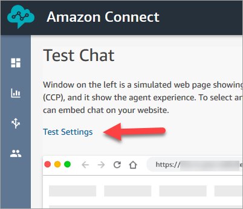 3. Use the drop-down box to choose the flow you created, for example,
**Test flow**. Choose
**Apply**.

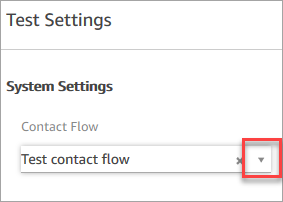

### Test a custom chat experience

1. If needed, choose the chat bubble to start a chat.

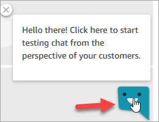 2. Amazon Connect automatically detects a contact and runs the flow that you
created. It displays messages from the flow.

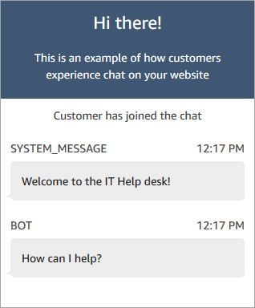 3. Enter that you need help resetting a password. Then accept the
incoming chat. The following image shows you what the chat and agent
interfaces look like when you're trying them.

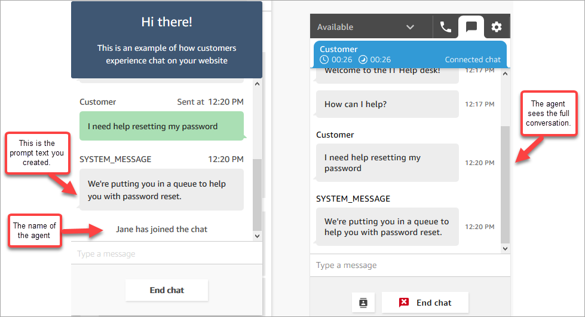 4. In the customer pane on the right, choose **End
chat** to close the chat window. 5. In the test CCP, choose **Close contact** to end the
After Contact Work (ACW).

### Test a custom voice experience

1. If the test chat window is still open, choose **End
   chat** to close it. Then you can try the voice
   experience.
2. Call your phone number.
3. When prompted, say _I'm having trouble accessing the
   internet_. You should hear the message that you're being
   transferred to the NetworkIssue queue.

###### Tip

After you're transferred, you'll hear this message:

_Thank you for calling. Your call is very important to us
and will be answered in the order it was
received._

This message is generated by a [default flow](contact-flow-default.md "contact-flow-default.md") named [Default customer
queue](default-customer-queue.md "default-customer-queue.md"). 4. Switch to the test CCP and accept the incoming call. 5. After you accept the call, but before you're connected to the
customer, you'll hear an inbound whisper stating what queue the contact
is in, for example, NetworkIssue. This helps you know what the customer
is calling about.

The inbound whisper is generated by a [default flow](contact-flow-default.md "contact-flow-default.md") named [Default agent whisper](default-agent-whisper.md "default-agent-whisper.md"). 6. When done, end the call. 7. In the CCP, choose **Clear contact** to end After
Contact Work (ACW).

**Congratulations!** You built and tested an
omnichannel IT Help Desk that leverages Amazon Lex and offers customers both chat and
voice.

###### Tip

If you don't want to keep the phone number that you claimed for testing,
you can release it back to inventory. For instructions, see [Release a phone number from Amazon Connect back to
inventory](release-phone-number.md "release-phone-number.md").
