# Set up your Amazon Connect

instance

You can have multiple instances of Amazon Connect. Each instance contains all the resources
related to your contact center, such as phone numbers, agent accounts, and
queues.

In this tutorial, you open Amazon Connect, create an instance of Amazon Connect, and claim a phone
number that you can use for testing.

###### Contents

- [Step 1: Launch Amazon Connect](#tutorial1-login-aws "#tutorial1-login-aws")
- [Step 2: Create an instance](#tutorial1-create-instance "#tutorial1-create-instance")
- [Step 3: Claim a phone number for your
  instance](#tutorial1-claim-phone-number "#tutorial1-claim-phone-number")

## Step 1: Launch Amazon Connect

This step walks you through finding Amazon Connect in the AWS console, and opening the
Amazon Connect console.

1. Log in to the [AWS Management
   Console](https://console.aws.amazon.com/console "https://console.aws.amazon.com/console") (https://console.aws.amazon.com/console) using your
   AWS account.
2. In the AWS Management Console, at the top of the page, choose the
   **Services** drop-down menu.

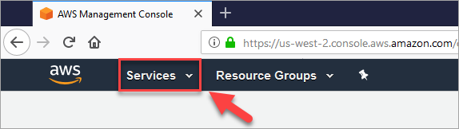 3. In the search box, type **Amazon Connect**.

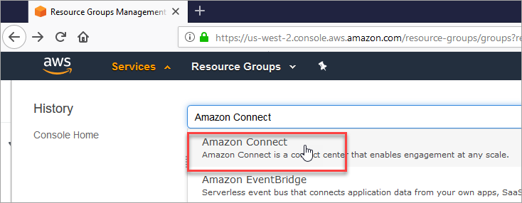 4. Choose **Amazon Connect**.

If this is the first time you've been to the Amazon Connect console, you'll see the
following Welcome page.

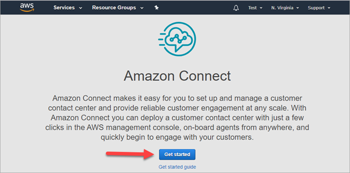 5. Choose **Get started**.

**Congratulations!** You found and accessed Amazon Connect.
You can use these same steps to search for and launch any AWS service.

Go to [Step 2: Create an instance](#tutorial1-create-instance "#tutorial1-create-instance").

## Step 2: Create an instance

1. On the **Amazon Connect virtual contact center instances** page,
   choose **Add an instance**.
2. On the **Set identity** page, in the **Access
   URL** box, type a unique name for your instance. For example,
   the following image shows **mytest10089** as a name. Choose
   a different name for your instance. Then choose
   **Next**.

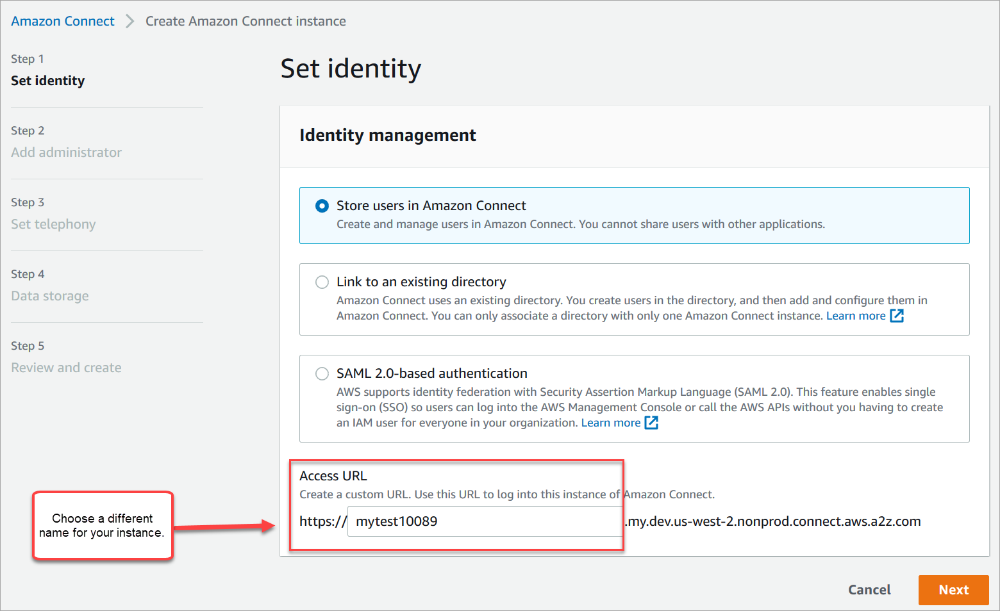 3. On the **Add administrator** page, add a new
administrator account for Amazon Connect. Use this account to log in to your instance
later using the unique access URL. Choose **Next**.

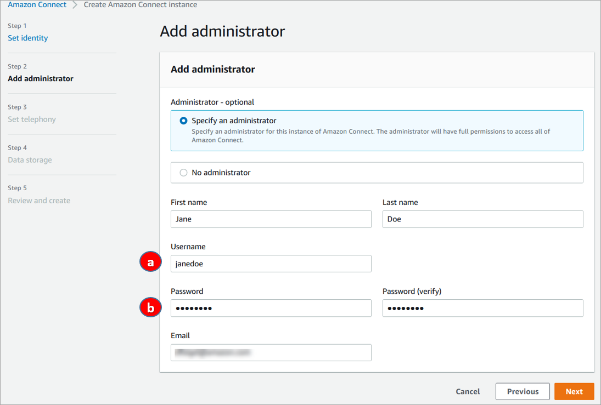

    1. The user name will be your Amazon Connect login. It's case
     sensitive.
    2. The password must be between 8-64 characters, and must contain at
     least one uppercase letter, one lowercase letter, and one
     number.

4. On the **Set telephony** page, accept the default
   settings to allow incoming and outgoing calls. Choose
   **Next**.

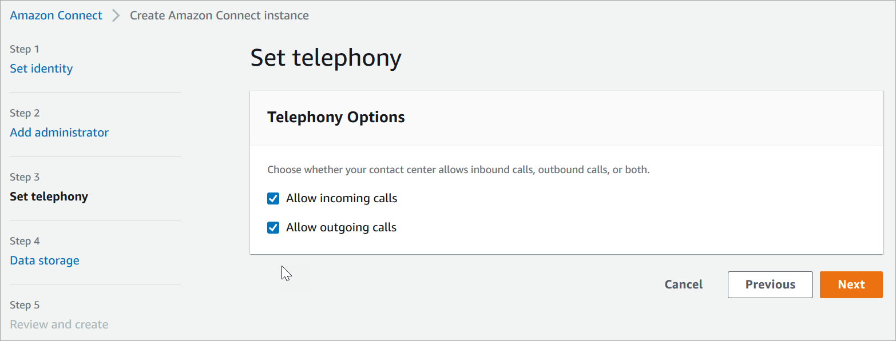 5. On the **Data storage** page, accept the default settings
and choose **Next**.

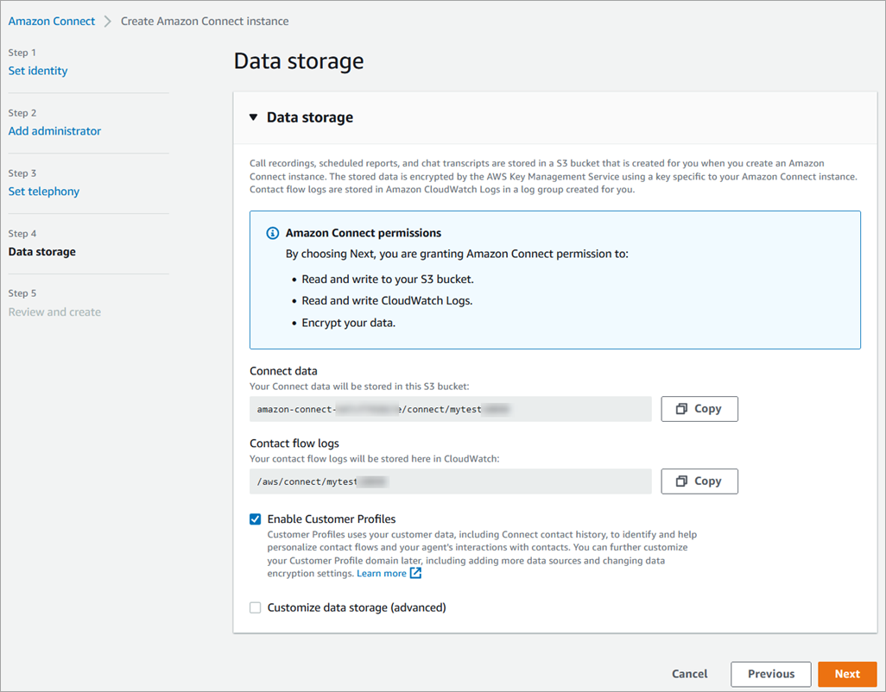 6. On the **Review and create** page, choose
**Create instance**.

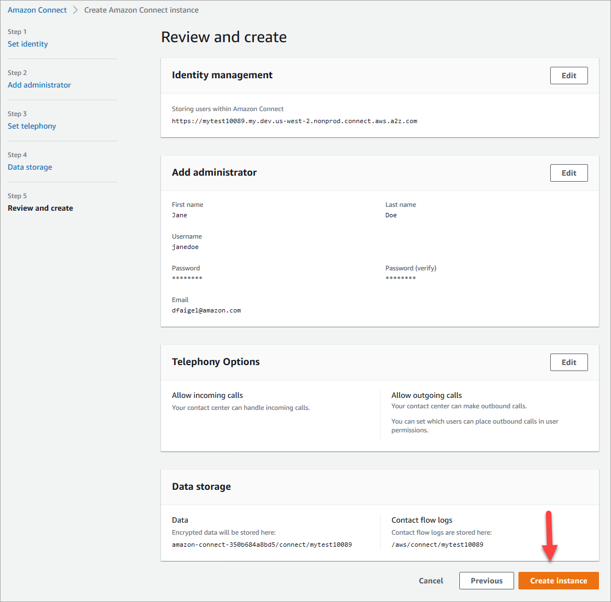 7. After the instance is created, choose **Get
started**.

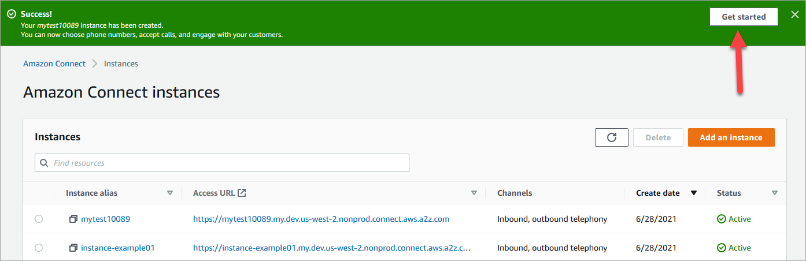 8. On the **Welcome to Amazon Connect** page, choose **Skip
for now**.

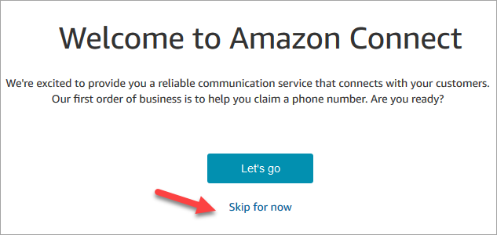 9. You're now on the Amazon Connect dashboard. Your instance name (also called an
**alias**) displays in the URL. On the left
is the navigation menu.

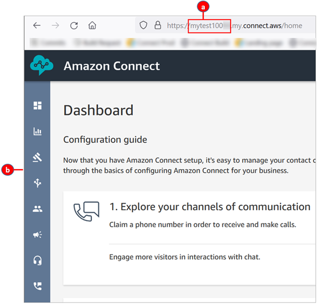

    1. Your instance alias is located in the first part of the
     URL.
    2. The navigation menu.

Congratulations! You set up your instance and now you're on the Amazon Connect dashboard.
Go to [Step 3: Claim a phone number for your
instance](#tutorial1-claim-phone-number "#tutorial1-claim-phone-number").

## Step 3: Claim a phone number for your

instance

In this step, you set up a phone number so that you can experiment with
Amazon Connect.

1. On the Amazon Connect navigation menu, choose **Channels**,
   **Phone numbers**.

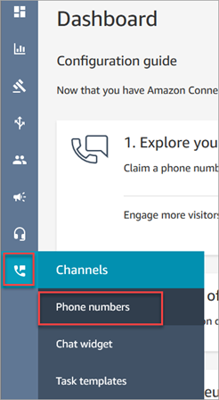 2. On the right side of the **Manage Phone numbers** page,
choose **Claim a number**.

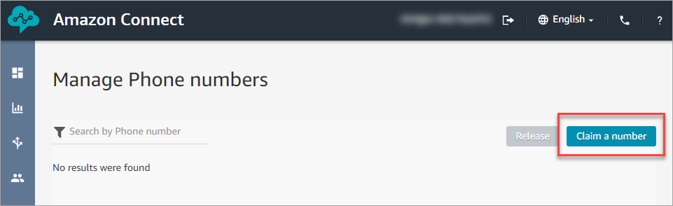 3. Select the **DID (Direct Inward Dialing)** tab. Use the
drop-down arrow to choose your country/region. If you're in the US, you can
specify the area code you want for your number, and only available numbers
with that area code will be displayed. When numbers are returned, choose
one.

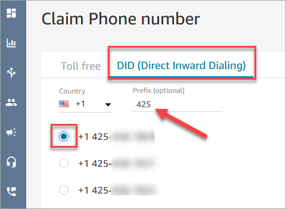 4. Write down the phone number. You call it later in this tutorial. 5. In the **Description** box, type this note: **this number is for testing**.

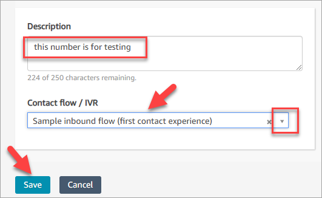 6. In the **Flow / IVR** box, choose the drop-down arrow,
and then choose **Sample inbound flow (first contact
experience)**. 7. Choose **Save**.

**Congratulations!** You set up your instance and
claimed a phone number. Now you're ready to experience how chat and voice work in
Amazon Connect. Go to [Test the sample voice and
chat experience in Amazon Connect](tutorial1-explore-voice-and-chat.md "tutorial1-explore-voice-and-chat.md").
