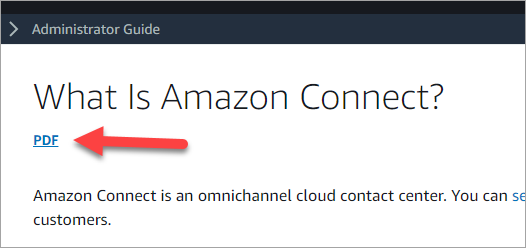

# Tutorials: An introduction to Amazon Connect

The tutorials in this section are provided to help you start using Amazon Connect. They show you
how to set up your first instance, and test a sample voice and chat experience. Next, they
show you how to set up an IT Help Desk contact center that uses the features in Amazon Lex.

These tutorials are suitable for both knowledge workers and developers.

**Prerequisite**

- An AWS account. If you don't already have one, create an account at: [aws.amazon.com](https://aws.amazon.com/ "https://aws.amazon.com/").
  **Print the tutorials**

If you want to print the tutorials, choose the PDF icon at the top of any page, as shown
in the following image.

A PDF version of the documentation opens. Press **Ctrl+Home** to return
to the beginning of the PDF, then scroll down to the table of contents. Choose which pages
to print.

###### Contents

- [Set up your Amazon Connect
  instance](tutorial1-set-up-your-instance.md "tutorial1-set-up-your-instance.md")
- [Test the sample voice and
  chat experience in Amazon Connect](tutorial1-explore-voice-and-chat.md "tutorial1-explore-voice-and-chat.md")
- [Create an IT help desk in Amazon Connect](tutorial1-create-helpdesk.md "tutorial1-create-helpdesk.md")
