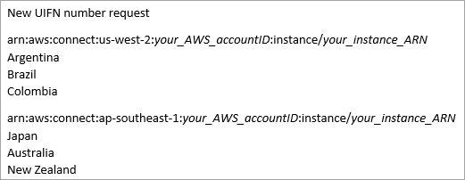

# Amazon Connect support of the inbound only UIFN service

A Universal International Freephone number (UIFN) is a unique **inbound only** freephone number that can be used throughout the world. It
provides toll-free calling from international locations to your contact center.

Amazon Connect supports UIFN in more than [60
countries](#list-of-uifn-countries "#list-of-uifn-countries") that are registered with the International Telecommunications
Union, an organization that supports the administration of the UIFN service.

###### Note

Amazon Connect allows you to enable UIFNs in as many countries as you need, however, it
requires a minimum of 5 countries.

A UIFN is composed of a 3-digit country code for a global service application, such as
**800**, and an 8-digit Global Subscriber Number (GSN).
This results in an 11-digit fixed format.

For example, your UIFN could be +800 12345678, where 12345678 is your number.

Due to the special nature of UIFN, attempting to call a UIFN from Amazon Connect in a "loopback
mode" is not supported. UIFNs are designed to be called from end phone configurations in
the country's public telephone network.

## How to get a UIFN

To request a UIFN within a specific AWS Region, create an AWS Support case. In the
support case, provide the following information.

- Choose the countries you want to enable from the [list of available countries](#list-of-uifn-countries "#list-of-uifn-countries").
- The Amazon Connect instance(s) associated with the new UIFN numbers. Amazon Connect can
  support routing numbers to multiple Regions, such as Australia to the
  Asia Pacific (Sydney) Region, United States to a US Region, or if desired to a single
  global instance.
- The required ID verification for your country. Most countries subscribe to
  [standard ID verification
  requirements](phone-number-requirements.md#uifn-requirements "phone-number-requirements.md#uifn-requirements") for ordering UIFN numbers. However, we recommend
  checking [Region requirements for ordering and porting
  phone numbers in Amazon Connect](phone-number-requirements.md "phone-number-requirements.md") for your country to be sure.

For number portability, after you open a case, Amazon will provide you
with _Service Provider Change Authorization and Designation of
Agency_ document.

Amazon Connect can route UIFNs to multiple AWS Regions. For example, if a UIFN is enabled
for Australia, it can be routed to your Amazon Connect instance that is located in the
Asia Pacific (Sydney) Region. If a UIFN is enabled for **more**
countries, each country can be routed to your Amazon Connect instance, which may be in any
supported AWS Region.

The following image shows the body of a sample UIFN request submitted to
AWS Support. This request is for two UIFNs. The first is for a UIFN that is enabled
for Argentina, Brazil, and Colombia, and connected to an Amazon Connect instance in the
US West (Oregon) Region. The second request is for a UIFN that is enabled for Japan,
Australia, and New Zealand and connected to an Amazon Connect instance located in the
Asia Pacific (Singapore) Region.

###### Important

**UIFN is an inbound-only service**. Before
opening a ticket to request a UIFN:

1. Ensure you understand that this number cannot be used for
   outbound.
2. Check the National reachability of the country in the following
   section.
   Full National reachability means the UIFN reaches all local (in-country)
   networks. UIFNs in some countries have limited reachability and will only work
   with specific carriers/networks where you need to use different codes to dial
   the number (for example, Japan).

## Countries that support UIFNs

| Country                   | How to dial a UIFN and Reachability                                                                                                                                                                                                                                  | How many days it takes a UIFN to be set up |
| ------------------------- | -------------------------------------------------------------------------------------------------------------------------------------------------------------------------------------------------------------------------------------------------------------------- | ------------------------------------------ |
| Argentina                 | 00-800-XXXX-XXXX National reachability: all fixed networks                                                                                                                                                                                                           | 10-25                                      |
| Australia                 | 0011-800-XXXX-XXXX National reachability: Optus, Telstra, Vodafone mobile                                                                                                                                                                                            | 10-30                                      |
| Austria                   | 00-800-XXXX-XXXX National reachability: full                                                                                                                                                                                                                         | 10-15                                      |
| Belgium                   | 00-800-XXXX-XXXX National reachability: full                                                                                                                                                                                                                         | 10-15                                      |
| Brazil                    | 0021-800-XXXX-XXXX National reachability: full Activation of international direct dialing service is required for calling parties for both fixed and mobile lines. The subscriber must have enabled the use of Embratel/Claro's international selection code (0021). | 20-30                                      |
| Bulgaria                  | 00-800-XXXX-XXXX National reachability: full                                                                                                                                                                                                                         | 10-20                                      |
| Canada                    | 011-800-XXXX-XXXX National reachability: full Calling from payphones is not supported.                                                                                                                                                                               | 20-40                                      |
| China                     | 00-800-XXXX-XXXX National reachability:  • China telecom fixed and mobile networks  • China Unicom fixed network                                                                                                                                               | 20-40                                      |
| Colombia                  | Dialing format:  • TIGO landline: 005-800 -XXXX-XXXX  • TIGO: 00414-800-XXXX-XXXX  • CLARO: 00444-800-XXXX-XXXX  • MOVISTAR: 009-800-XXXX-XXXX National reachability: full                                                                               | 30-60                                      |
| Costa Rica                | 00-800-XXXX-XXXX National reachability: full                                                                                                                                                                                                                         | 15-30                                      |
| Croatia                   | 00-800-XXXX-XXXX National reachability: all fixed; T-Mobile network                                                                                                                                                                                                  | 20-30                                      |
| Czech Republic            | 00-800-XXXX-XXXX National reachability: full                                                                                                                                                                                                                         | 20-30                                      |
| Denmark                   | 00-800-XXXX-XXXX National reachability: full                                                                                                                                                                                                                         | 10-20                                      |
| Estonia                   | 00-800-XXXX-XXXX National reachability: full                                                                                                                                                                                                                         | 15-25                                      |
| France                    | 00-800-XXXX-XXXX National reachability: full, including Monaco                                                                                                                                                                                                       | 10-15                                      |
| French Guiana             | 00-800-XXXX-XXXX National reachability: full                                                                                                                                                                                                                         | 30-60                                      |
| Germany                   | 00-800-XXXX-XXXX National reachability: full                                                                                                                                                                                                                         | 10-15                                      |
| Greece                    | 00-800-XXXX-XXXX National reachability: all fixed; Cosmotel mobile network                                                                                                                                                                                           | 10-15                                      |
| Guadeloupe                | 00-800-XXXX-XXXX National reachability: full                                                                                                                                                                                                                         | 30-60                                      |
| Hong Kong                 | 006-800-XXXX-XXXX National reachability: full CLI not guaranteed.                                                                                                                                                                                                    | 20-40                                      |
| Hungary                   | 00-800-XXXX-XXXX National reachability: full Activation of international direct dialing service is required for calling parties for both fixed and mobile lines. Airtime charges may apply when calling from mobiles.                                                | 10-15                                      |
| Iceland                   | 00-800-XXXX-XXXX National reachability: all fixed; Iceland Telecom, IMC, Vodafone mobile networks.                                                                                                                                                                   | 10-20                                      |
| Israel                    | Dialing format:  • LANLI: 012800XXXXXXX  • BEZEQ: 013800XXXXXXX  • BARAK: 014800XXXXXXX National reachability: full                                                                                                                                         | 20-50                                      |
| Italy                     | 00-800-XXXX-XXXX National reachability: all fixed networks, including Vatican and San Marino                                                                                                                                                                         | 10-15                                      |
| Japan                     | Dialing format:  • **KDDI**: 001-010-800-XXXX-XXXX **SoftBank**: 0061-010-800-XXXX-XXXX National reachability: full                                                                                                                                               | 20-40                                      |
| Latvia                    | 00-800-XXXX-XXXX National reachability: full                                                                                                                                                                                                                         | 10-15                                      |
| Lithuania                 | 00-800-XXXX-XXXX National reachability: all fixed networks; Telia LT mobile                                                                                                                                                                                          | 15-30                                      |
| Luxembourg                | 00-800-XXXX-XXXX National reachability: full                                                                                                                                                                                                                         | 10-15                                      |
| Macao                     | 00-800-XXXX-XXXX National reachability: full                                                                                                                                                                                                                         | 15-25                                      |
| Macedonia                 | 00-800-XXXX-XXXX National reachability: MakTel fixed, T-Mobile network                                                                                                                                                                                               | 40-60                                      |
| Malta                     | 00-800-XXXX-XXXX National reachability: GO and VANILLA fixed networks. GO mobile networks.                                                                                                                                                                           | 10-15                                      |
| Martinique                | 00-800-XXXX-XXXX National reachability: full                                                                                                                                                                                                                         | 30-60                                      |
| Mayotte                   | 00-800-XXXX-XXXX National reachability: full                                                                                                                                                                                                                         | 30-60                                      |
| Monaco                    | 00-800-XXXX-XXXX National reachability: full                                                                                                                                                                                                                         | 20-30                                      |
| Netherlands               | 00-800-XXXX-XXXX National reachability: full                                                                                                                                                                                                                         | 10-15                                      |
| New Zealand               | 00-800-XXXX-XXXX National reachability: full                                                                                                                                                                                                                         | 10-15                                      |
| Peru                      | 00-800-XXXX-XXXX National reachability: America Moviles, Nextel, Telefonica Moviles, TESAM, Globalstar networks. Telefonica del Peru fixed and mobile network                                                                                                        | 30-50                                      |
| Philippines               | 00-800-XXXX-XXXX National reachability: all fixed networks                                                                                                                                                                                                           | 10-15                                      |
| Portugal                  | 00-800-XXXX-XXXX National reachability: full                                                                                                                                                                                                                         | 10-15                                      |
| Reunion                   | 00-800-XXXX-XXXX National reachability: full                                                                                                                                                                                                                         | 30-60                                      |
| Romania                   | 00-800-XXXX-XXXX National reachability: Orange fixed and mobile network, Rodasy fixed and mobile network, Romtelekom fixed and mobile network, Cosmote mobile network                                                                                                | 10-30                                      |
| Saint Pierre And Miquelon | 00-800-XXXX-XXXX National reachability: full                                                                                                                                                                                                                         | 30-60                                      |
| Singapore                 | 001 800 XXXX XXXX Activation of international direct dialing service is required for calling parties of both fixed and mobile lines. Airtime charges may apply when calling from mobiles. Calling from Starhub payphones is not supported.                           | 20-30                                      |
| Slovakia                  | 00-800-XXXX-XXXX National reachability: full                                                                                                                                                                                                                         | 15-30                                      |
| Slovenia                  | 00-800-XXXX-XXXX National reachability: full                                                                                                                                                                                                                         | 15-30                                      |
| South Africa              | 00-800-XXXX-XXXX National reachability: partial Not reachable from MTN and prepaid subscribers.                                                                                                                                                                      | 10-15                                      |
| South Korea               | 002-800-XXXX-XXXX National reachability: full                                                                                                                                                                                                                        | 10-20                                      |
| Spain                     | 00-800-XXXX-XXXX National reachability: full Concurrent calls: 100 concurrent calls                                                                                                                                                                                  | 10-15                                      |
| Switzerland               | 00-800-XXXX-XXXX National reachability: full                                                                                                                                                                                                                         | 10-15                                      |
| Taiwan                    | 00-800-XXXX-XXXX National reachability: full                                                                                                                                                                                                                         | 10-15                                      |
| Thailand                  | 001-800-XXXX-XXXX National reachability: full                                                                                                                                                                                                                        | 10-20                                      |
| United Kingdom            | 00-800-XXXX-XXXX National reachability: BT, Vodafone, EE networks                                                                                                                                                                                                    | 20-40                                      |
| Uruguay                   | 00-800-XXXX-XXXX National reachability: full                                                                                                                                                                                                                         | 15-25                                      |
