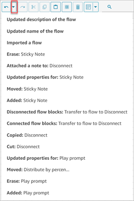

# Undo and redo actions in the flow designer in

Amazon Connect

You can undo and redo actions in the flow designer. Choose the undo and redo items on
the toolbar. Or, with your cursor on the flow designer canvas, use the shortcut keys:
Ctrl+Z to undo, Ctrl+Y to redo.

###### Tip

On a Mac, Ctrl+Y opens the history page instead of performing a redo.

To access a history of your actions that you can undo, choose the
**Undo** dropdown button on the toolbar, as shown in the following
image.

## Limits

| Action                         | Limit                                                         |
| ------------------------------ | ------------------------------------------------------------- |
| History limit                  | Up to 100 actions can be undone.                              |
| Dragging unconnected connector | This action cannot be undone.                                 |
| Folding of notes               | This action cannot be undone.                                 |
| Page reload                    | The undo history is not retained after a page is reloaded. |
