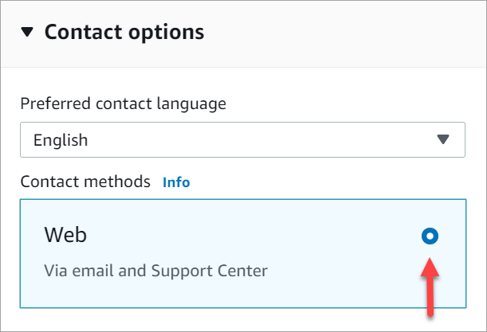

# Update an Apple Messages for Business integration with

Amazon Connect

You will need to update your Apple Messages for Business integration if you want to change the flow ID or
other information.

1. Open an [Support ticket](https://console.aws.amazon.com/support/home#/case/create?issueType=customer-service&serviceCode=customer-account&categoryCode=activation "https://console.aws.amazon.com/support/home#/case/create?issueType=customer-service&serviceCode=customer-account&categoryCode=activation").

If prompted, login using your AWS account. 2. In the **Use case description** box, copy and paste the
following template to indicate this is an **update** request:

```
Subject: Update Apple Messages for Business Integration request
Body:
   Apple Messages for Business Account ID (required): `enter your current account ID` change to `new account ID`
   Apple Token (required): `enter your token`
   Amazon Connect Instance ARN (required): `enter your current instance ARN` change to `new instance ARN`
   Amazon Connect Flow ID (required): `enter your current flow ID` change to `new flow ID`

```

###### Note

If you update your Amazon Connect Instance ARN, you must also update your contact
flow ID. 3. Expand **Contact options**, and then choose your
**Preferred contact language**, and then choose
**Web** as the contact method, if it's not selected by
default.

 4. Choose **Submit**. 5. Support will work directly with the Amazon Connect team on your request and follow up
with any additional questions.
