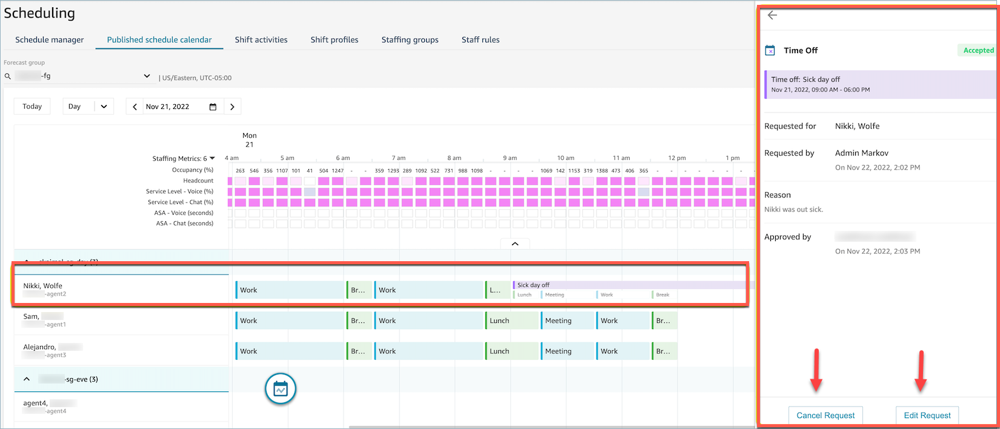
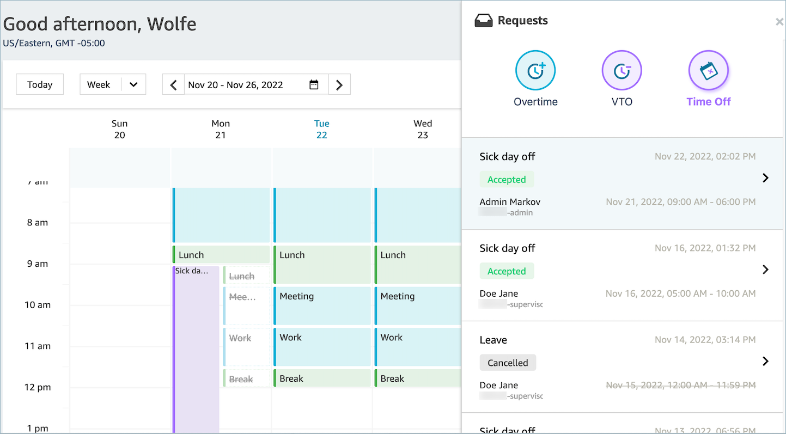

# Update or cancel a time off request in

Amazon Connect

A supervisor can cancel or edit a time off request by choosing the
**Cancel Request** or **Edit Request** buttons
at the bottom of the request drawer window. The following image shows the time off
requests from Nikki Wolfe.

An agent will see the updated time off status in their calendar and request
drawer. The following image shows the status of Nikki Wolfe's time off requests. Her
requests for Sick day off were Accepted.

