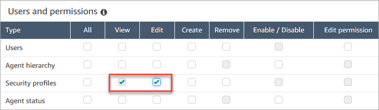

# Update security profiles in Amazon Connect

You can update a security profile at any time to add or remove permissions.

## Required permissions

to update security profiles

Before you can update permissions in a security profile, you must be logged in
with an Amazon Connect account that has the following permissions: **Security
profiles - Edit**.

By default, the Amazon Connect **Admin** security profile has these
permissions.

## How to update security

profiles

1. Log in to the Amazon Connect admin website at https://`instance name`.my.connect.aws/. You must be logged in with an Amazon Connect account that has
   permissions to update security profiles.
2. Choose **Users**, **Security
   profiles**.
3. Select the name of the profile.
4. Update the name, description, permissions, access control, and resource
   tags as needed.
5. Choose **Save**.

###### Note

Modifying the access control or resource tags on a security profile may impact
the features or resources that a user with this security profile can
access.
