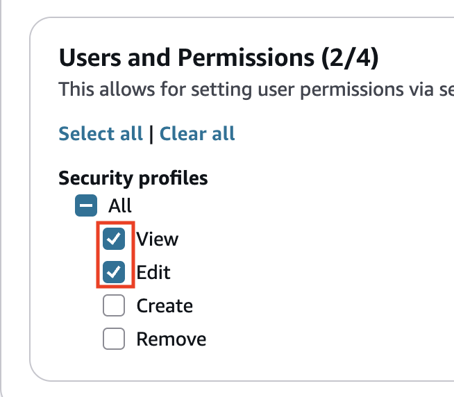

# Update security profiles in Connect Customer

You can update a security profile at any time to add or remove permissions.

## Required permissions to update security profiles

Before you can update permissions in a security profile, you must be logged in
with a Connect Customer account that has the following permissions: **Security
profiles - Edit**.

By default, the Connect Customer **Admin** security profile has these
permissions.

## How to update security profiles

1. Log in to the Connect Customer admin website at https://`instance name`.my.connect.aws/. You must be logged in with a Connect Customer account that has
   permissions to update security profiles.
2. Choose **Users**, **Security
   profiles**.
3. Select the name of the profile. The security profile detail page
   opens.
4. To update permissions, choose **Edit permissions**
   from the **Permissions** tab. To update the name or
   description, choose the **Details** tab. To update
   access control or resource tags, choose the corresponding tab.
5. Choose **Save**.

###### Note

Modifying the access control or resource tags on a security profile might impact
the features or resources that a user with this security profile can
access.
