# Upgrade your Contact Control Panel (CCP) when your

CCP URL ends with /ccp#

Upgrading to the latest CCP is easy. If you want, you can try out the latest CCP and
then at a later date make the switch. Here's what you do:

1. **Try it out**: Change the URL in your browser
   from **/ccp#** to **/ccp-v2**. The latest CCP
   appears automatically. If you want, change it back to /ccp# to return to the
   earlier CCP.
2. **Upgrade**: Change the URL in your browser from
   **/ccp#** to **/ccp-v2**. Bookmark the
   URL.
3. If you access the CCP through the Amazon Connect console by choosing the phone icon on
   the top right of a page, you will be re-directed according to the automatic
   upgrade date sent by email. Please reach out to your Amazon Solution Architect
   if your request is more urgent.

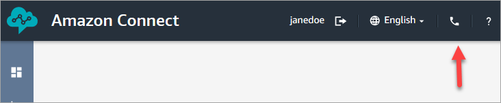 4. After the upgrade happens, if you use the /ccp# URL, it resolves to
**/ccp-v2**.

## Verify your network

settings

We highly recommend setting up your network to use [Option 1 (recommended): Replace Amazon EC2 and CloudFront IP range
requirements with a domain allowlist](ccp-networking.md#option1 "ccp-networking.md#option1").

Using this option helps Amazon Connect Support to quickly troubleshoot any issues you have.
Specifically, using **\*.telemetry.connect.{region}.amazonaws.com** passes more metrics to
our Support team to help with troubleshooting.

## Update your SAML URL to ccp-v2

If you use SAML 2.0 as your identity management system, be sure to update the
destination in your relay state URL to **ccp-v2**.

Change `destination=/connect/ccp` to
`destination=/connect/ccp-v2`.

For more information, see [Use a destination in your relay state URL](configure-saml.md#destination-relay "configure-saml.md#destination-relay")

## Compare the earlier and latest CCP

The images in this section show you how the latest CCP differs from the earlier CCP for
common tasks that agents perform. The images show both CCP versions in their default state.

###### Tip

The chat tab appears on an agent's CCP only if their routing profile includes
chat.

### Set status, use chat, access quick connects

and number pad

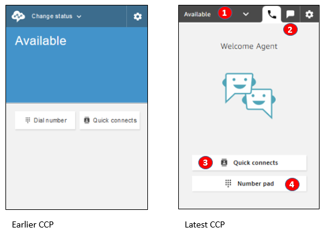

1. Agents use a dropdown to set their status.
2. If you have enabled chat for the agent’s routing profile, the chat tab
   appears.
3. Choose the **Quick connects** button to type and call a phone
   number, or select a quick connect.
4. Choose the **Number pad** button to type and call a phone
   number. This is useful when the phone number has letters.

### Receive a call

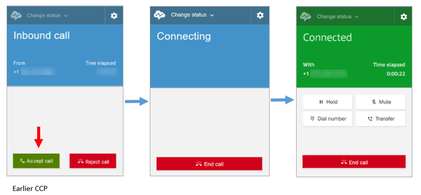

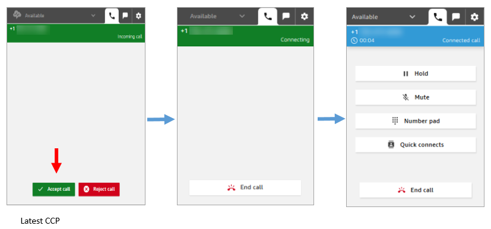

### Miss a call

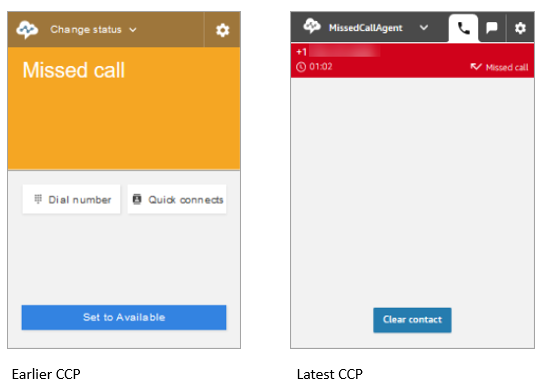

### Make a call: When to use Quick

connects

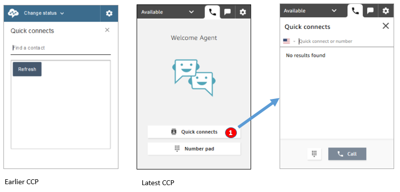

- Use the **Quick connects** button to type a number or select
  a quick connect.

### Make a call: When to use

Number pad

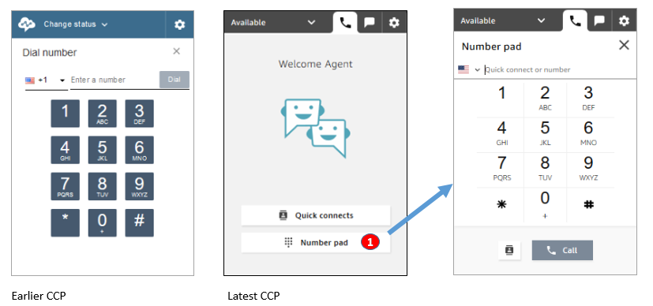

- Choose the **Number pad** button to type and call a number.
  This is useful for corporate numbers with letters (for example, 1-800-EXAMPLE).

### Make an outbound call

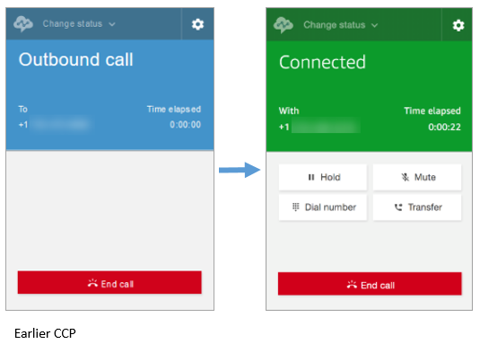

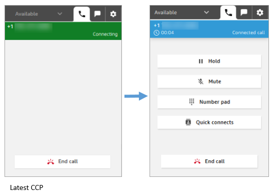

### Agent ends a call

before being connected to the other party

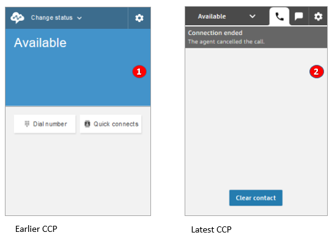

1. If an agent ends a call before being connected, they are then available for a
   new contact to be routed to them automatically.
2. If an agent ends a call before being connected, they are prompted to choose
   **Clear contact**.

### Make another call while connected on a

call

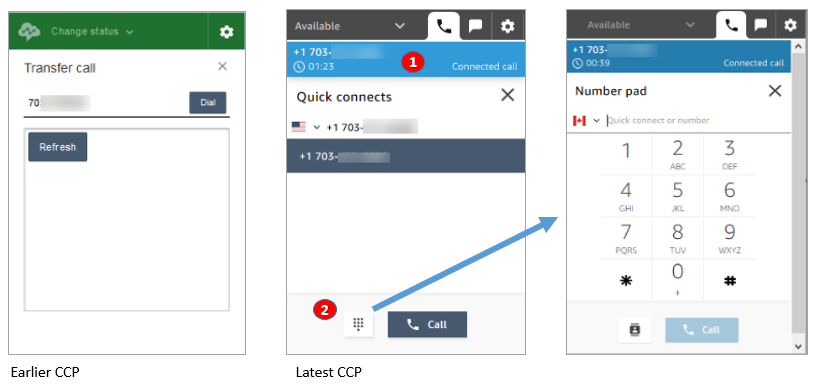

1. You can see the call that you are on while typing another number or selecting
   a quick connect.
2. After choosing **Quick connects**, you can choose the
   **Number pad** button. Then on the **Number
   pad** page, you can enter a number.

### Enter DTMF input while connected on a call

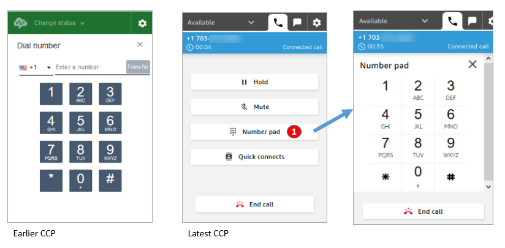

- While on a call, only use **Number pad** to enter DTMF input.

### Conference call scenario 1: Leaving a

call when one party is on hold and the other is connected

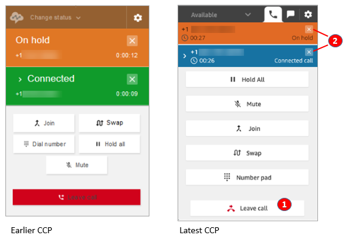

1. Choose **Leave call** to leave the call. This automatically
   takes the first party off hold and connects them to the second party.
2. If instead you want to end the call, choose the **x** next to
   each party's number. This disconnects each party.

### Conference call scenario 2: Leaving a

call when the other parties are joined

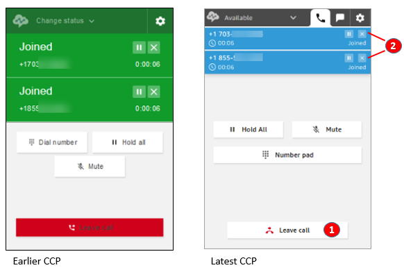

1. Choose **Leave call** to leave the call. The other two
   parties stay joined.
2. If instead you want to end the call, choose the **x** next to
   each party's number. This disconnects each party.

### Conference call scenario 3: Leaving a

call when the other parties are on hold

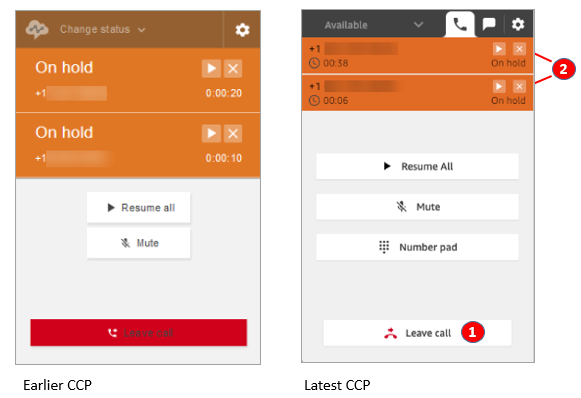

1. Choose **Leave call** to leave the call. The other two
   parties are automatically taken off hold and connected.
2. If instead you want to end the call, choose the **x** next to
   each party's number. This disconnects each party.

### Receive a queued

callback

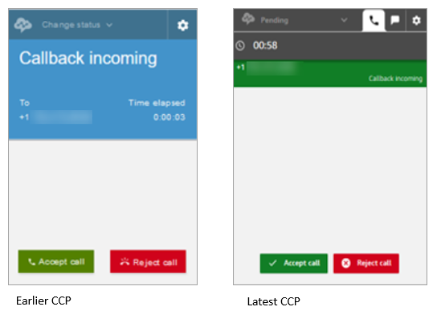

### Miss a queued callback

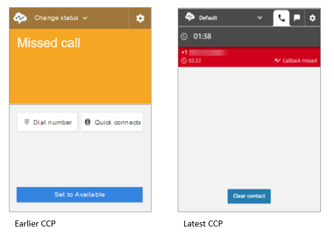

### Finish After contact work (ACW)

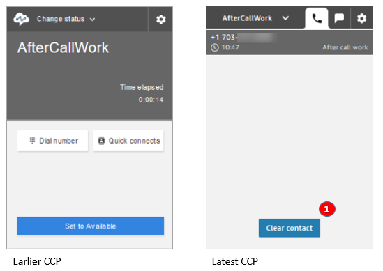

- During After contact work (ACW), agents can finish follow-up work, and then
  choose **Clear contact**.
