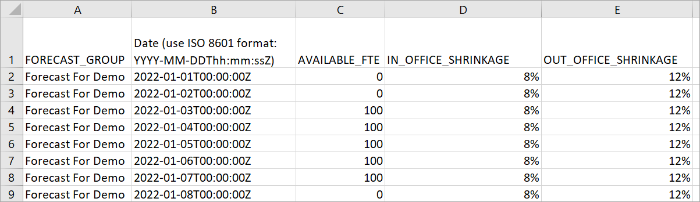

# Import estimated future

shrinkage and available full-time employees in Amazon Connect

You can increase capacity planning accuracy by providing estimated future data
(Available FTE and Shrinkage) for your existing forecast groups. Providing Available
FTE and shrinkage data is optional. Amazon Connect can generate a capacity plan without it,
but providing it improves the accuracy of your plan.

## How to import data

1. Log in to the Amazon Connect admin website with an account that has security profile
   permissions for **Analytics**, **Capacity
   planning - Edit**.

For more information, see [Assign
permissions](required-optimization-permissions.md "required-optimization-permissions.md"). 2. On the Amazon Connect navigation menu, select **Analytics and
optimization**, **Capacity
Planning**. 3. On the **Import Data** tab, choose **Upload
data**.

The .csv file you upload must have the following headings:
FORECAST_GROUP, Date, AVAILABLE_FTE,
IN_OFFICE_SHRINKAGE_OUT_OFFICE_SHRINKAGE. These are shown in the
following image of a .csv file opened with Excel.

 4. Update values in this template, and then choose `Upload
 CSV` to upload it. Choose `Upload`.

It usually between 2 - 5 minutes for the .csv file to upload. If the upload
fails, check if the `FORECAST_GROUP` name in the .csv file matches
the name of the forecast group that you created.

## Important things

to know about your .csv file

- FORECAST_GROUP: Enter the EXACT name of the forecast group you
  created. You can add multiple forecast groups in this `.csv`
  file.
- Date: Each row is one day. In the previous image, row 2 is January 1,
  row 3 is January 2, row 4 is January 3, and so on. Use ISO 8601 format
  ending with Z. The time component of this field must represent midnight
  the time zone of the long term forecast. For example, if the long term
  forecast is in US/Pacific time, then the Date field should be as
  follows: 2024-05-30T07:00:00Z
- AVAILABLE_FTE: Based on your estimation, how many full-time agents
  will be available for working that day. For example, your contact center
  currently has 100 FTEs and you expect this number to be the same next
  year.

In the previous image, 0 indicates no full-time agents are available
on January 1 for the forecast group named **Forecast For
Demo**. On January 3, 100 agents are available.

###### Tip

Required FTE (the output) is how many full-time agents are
required to meet the Service Level target. For example, if the
Required FTE = 120 and Available FTE = 100 for next year, then that
means a deficit = 20.

- IN_OFFICE_SHRINKAGE: Percentage of agents in the office but not in
  production mode. For example, they might be in training or in
  meetings.
- OUT_OFFICE_SHRINKAGE: Percentage of agents absent from work (for
  example, no show or personal time off).

###### Note

The latest uploaded .csv file always overrides the previous one you
updated. Make sure errors aren't introduced to the uploaded .csv file
accidentally. For example, don't press **Enter** and add
new rows to the end of the file. Otherwise, the data won't validate and an
error message is displayed.
