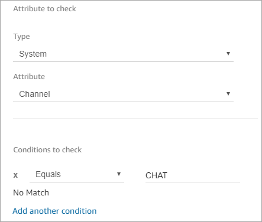
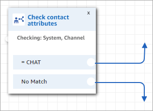

# Personalize a contact's experience based on

how they contact your contact center

You can personalize the customer's experience based on the channel that they use to
contact you. Here's what you do:

1. Add a **Check contact attributes** block to the beginning of your
   flow.
2. Configure the block as shown in the following image. In the **Attribute to
   check** section, set **Type** to **System**,
   set **Attribute** to **Channel**. In the
   **Conditions to check** section, set it to **Equals
   CHAT**.

 3. The following image of the configured Check contact attributes block shows two
branches: **CHAT** and **No Match**. If the customer is
contacting you through chat, specify what should happen next. If the customer is
contacting you through a call (No Match), specify the next step in the flow.

