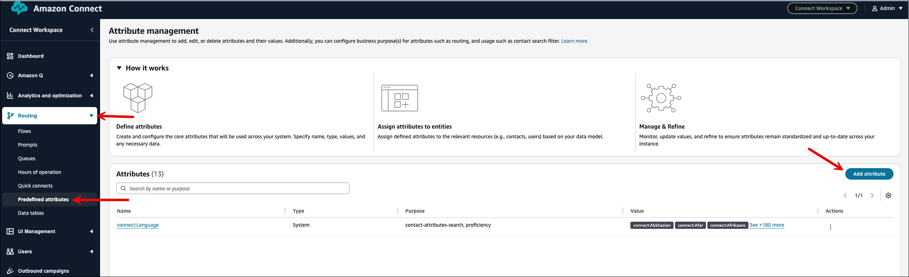
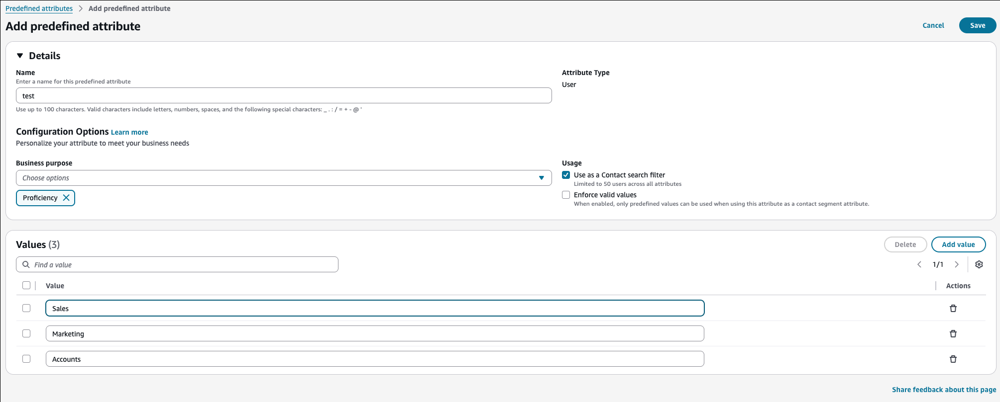
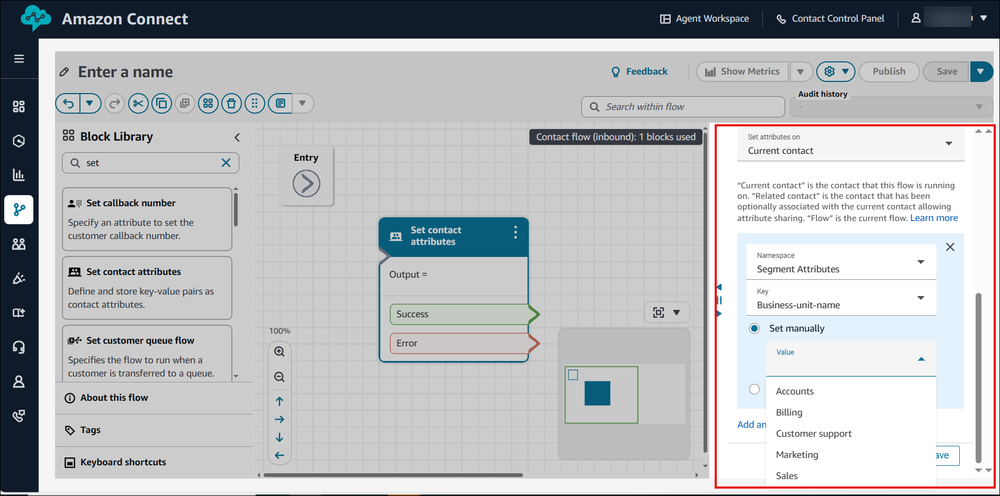

# Use contact segment attributes

For scenarios where information for a contact varies between transfers or conferences,
such as business unit names that may change as a contact moves between departments, you need
to use _contact segment attributes_.

Contact segment attributes keep the values that remain specific to individual contact
segments. (For a discussion about the difference between contact attributes and contact
segment attributes, see [Contacts, contact chains, and contact
attributes](contacts-contact-chains-attributes.md "contacts-contact-chains-attributes.md").)

To implement contact segment attributes, you first create predefined attributes, and then
use the [Set contact
attributes](set-contact-attributes.md "set-contact-attributes.md") block to attach them to the contact as contact segment attributes. There are two ways you
can do this:

- Use the Amazon Connect admin website, as described in this topic.
- Use the [CreatePredefinedAttribute](../APIReference/API_CreatePredefinedAttribute.md "../APIReference/API_CreatePredefinedAttribute.md") to create the predefined attributes
  programmatically, and use the [UpdateContact](../APIReference/API_UpdateContact.md "../APIReference/API_UpdateContact.md")
  API to attach a predefined attribute as a contact segment attribute.

###### Contents

- [Step 1: Create a predefined
  attribute](#create-predefined-attribute "#create-predefined-attribute")
- [Step 2: Attach a predefined attribute to
  the contact segment](#attach-predefined-attribute "#attach-predefined-attribute")

## Step 1: Create a predefined

attribute

1. Log in to the Amazon Connect admin website at https://`instance
name`.my.connect.aws/. Use an **Admin** account,
   or an account assigned to a security profile that has
   **Routing** - **Predefined attributes** -
   **Create** permission.
2. In Amazon Connect, on the left navigation menu, choose **Routing**,
   **Predefined attributes**.
3. On the **Attribute management** page, choose **Add
   attribute**, as shown in the following image.

 4. On the **Add predefined attributes** page, add the name in
the **Predefined attribute** box and the value in the
**Value** box. The following example image shows a
predefined attribute named **test**, and three values: Sales,
Marketing, and Accounts.

 5. Choose **Add value** to add more values to the predefined
attribute. 6. To use this attribute and its values to filter contact search results, select
**Use as Contact search filter**. 7. To enforce value validations when attaching the attribute and value to a
contact segment, select **Enforce valid values**.

## Step 2: Attach a predefined attribute to

the contact segment

The following image shows the properties panel of the [Set contact
attributes](set-contact-attributes.md "set-contact-attributes.md")
block.

When **Namespace** = **Segment attributes**, the
**Key** dropdown menu lists the predefined attributes.

Under the **Set manually** option, you can set a
**Value** based on established values for the selected predefined
attribute.

For information about filtering contacts by contact segment attributes, see [Search by custom contact
attributes or contact segment attributes](search-custom-attributes.md "search-custom-attributes.md").
