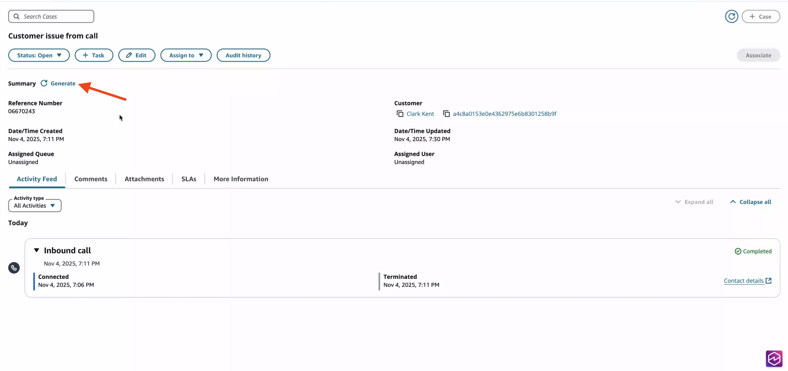
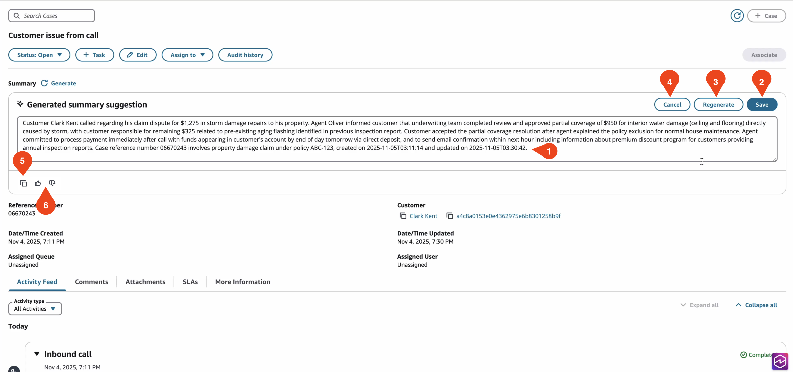

# Use generative AI-powered case summarization

To help agents to handle cases more efficiently, they can use generative AI-powered case summarization. This AI agent and Amazon Connect Cases feature – available to unlimited AI customers – helps agents gather context faster and expedites their time to resolution of customer issues.

When an agent views a Case that is enabled with AI agents, they can use the **Generate** button to produce a summary of the Case and its Activity Feed.

## Case Summarization

AI agent automatically analyzes the Case and generates a summary that includes information from:

- Fields on the case
- Comments on the case.
- SLAs related to the case.
- Transcripts from chat, and voice contacts related to the case (30-day transcript retention period).
- Details from Tasks related to the case

This summary helps agents quickly understand the context and history of the case without having to read through the entire activity feed.

The following [default AI agent and prompt](default-ai-system.md "default-ai-system.md") are used to generate the case summarization:

- QinConnectCaseSummarizationPrompt

## Actions agents can take on Case Summary

After a case summary is generated, the agent can:

1. Manually edit the summary in the text box.
2. Save the summary to the case.
3. Regenerate a new summary from scratch.
4. Cancel the summary without storing it.
5. Choose **Copy** to copy the contents of the summary.
6. Choose the Thumbs up or Thumbs down icons to provide immediate feedback to their contact center manager so they can improve the AI agent responses. For more information, see [TRANSCRIPT_RESULT_FEEDBACK](monitor-ai-agents.md#documenting-cw-events-ih "monitor-ai-agents.md#documenting-cw-events-ih").

## Configure case summarization

Following is an overview of the steps to configure case summarization for your contact center.

1. [Enable Connect AI agents for your instance](ai-agent-initial-setup.md "ai-agent-initial-setup.md").
2. [Enable Cases for you instance](enable-cases.md "enable-cases.md").
3. Add the [Connect assistant](connect-assistant-block.md "connect-assistant-block.md") block to your flows before a contact is assigned to your agent.
4. Customize the outputs of your cases generative AI-powered assistant by [defining your prompts](create-ai-prompts.md "create-ai-prompts.md") to guide the AI agent with generating responses that match your company's language, tone, and policies for consistent customer service.

## Best practices to ensure quality responses

To ensure the best quality response from AI agent, implement the following best practices:

- Train your agents to review all AI-generated content before storing it on a case.
- Use AI guardrails to ensure appropriate content generation. For more information, see [Create AI guardrails for Connect AI agents](create-ai-guardrails.md "create-ai-guardrails.md").
- Monitor AI agent performance through CloudWatch Logs logs for:
  - Response feedback from your agents. For more information, see [TRANSCRIPT_RESULT_FEEDBACK](monitor-ai-agents.md#documenting-cw-events-ih "monitor-ai-agents.md#documenting-cw-events-ih").
  - Generated email responses shown to agents. For more information, see [TRANSCRIPT_RECOMMENDATION](monitor-ai-agents.md#documenting-cw-events-ih "monitor-ai-agents.md#documenting-cw-events-ih").
