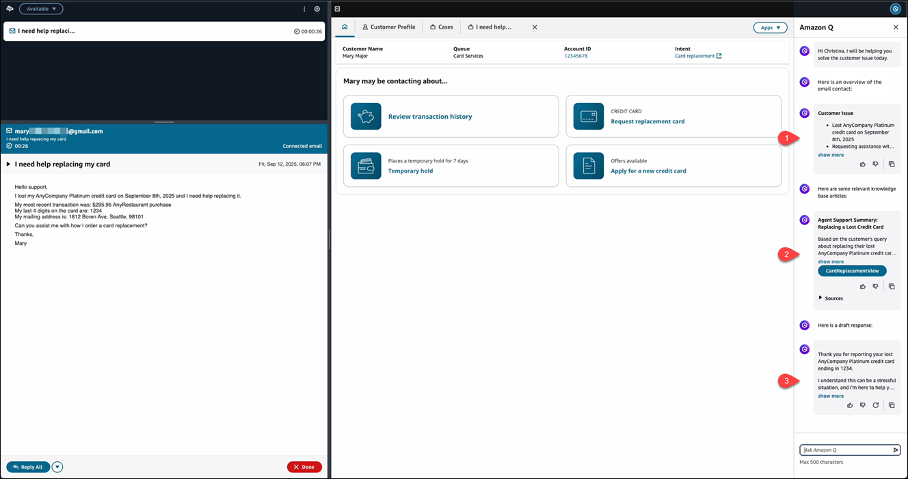
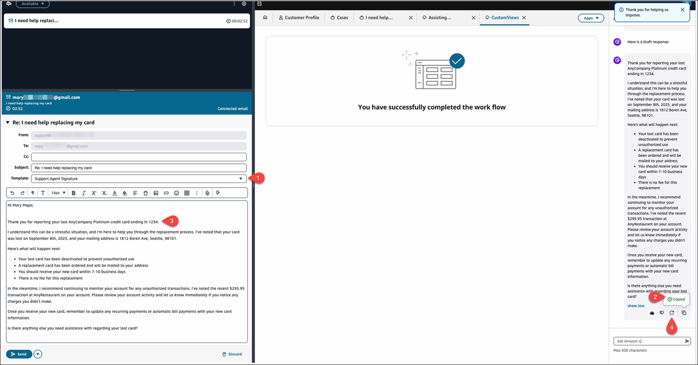

# Use generative AI-powered email conversation

overviews and suggested responses

To help agents to handle emails more efficiently, they can use generative AI-powered
email responses. This Amazon Q in Connect feature helps agents provide faster email responses and more
consistent support to customers.

When an agent accepts an email contact that is [enabled](enable-q.md#enable-q-step4 "enable-q.md#enable-q-step4") with Amazon Q in Connect, they automatically receive three types of proactive
responses in their Amazon Q panel on the agent workspace:

1. [Email conversation overview](#email-conversation-overview "#email-conversation-overview"). For example, it provides key information about the customer's purchase history.
2. [Knowledge base and guide
   recommendations](#knowledge-base-recommendations "#knowledge-base-recommendations"). For example, it recommends as refund resolution step-by-step guide.
3. [Generated email responses](#generated-email-responses "#generated-email-responses")
   These response types are shown in the following image.

## Email conversation overview

Amazon Q in Connect automatically analyzes the email conversation (thread) and provides a
structured overview that includes:

- The customer's key issues.
- Previous agent actions (if the email is a reply to another agent's reply
  on the same thread).
- Important contextual details.
- Required next steps.

This overview helps agents quickly understand the context and history of the email
conversation without having to read through the entire thread. Amazon Q in Connect analyzes the
entire email conversation (thread), focusing and putting more weight on the current
email message (contact) while maintaining context from the previous email messages
in the conversation.

The following [default AI agent and prompt](default-ai-system.md "default-ai-system.md")
are used to generate the email conversation overview:

- **QinConnectEmailOverviewAIAgent**
- **QinConnectEmailOverviewPrompt**

## Knowledge base and guide

recommendations

Amazon Q in Connect automatically suggests relevant content from your knowledge base to assist
your agent with understanding how to handle the customer's issue. It
suggests:

- [Knowledge articles](enable-q.md#enable-q-step-3 "enable-q.md#enable-q-step-3")
- [Step-by-step guides associated
  with the knowledge article](integrate-q-with-guides.md "integrate-q-with-guides.md")

The agent can choose **Sources** to view the original knowledge
base articles from which the recommendation came from and choose the specific
knowledge base article link to open a preview of it in their agent workspace.

The following [default AI agent and
prompts](default-ai-system.md "default-ai-system.md") are used to generate knowledge base and guide
recommendations:

- **QinConnectEmailResponseAIAgent**
- **QinConnectEmailResponsePrompt**
- **QinConnectEmailQueryReformulationPrompt**

## Generated email responses

Amazon Q in Connect automatically suggests a drafted response to the agent based on the context
from the email overview and your knowledge base articles available. It does the following:

- Analyzes the email conversation context
- Incorporates relevant knowledge base content
- Generates a professional email response draft that includes:
  - Appropriate greeting and closing
  - Response to specific customer questions
  - Relevant information from your knowledge base
  - Proper formatting and tone

When an agent chooses **Reply all**, they can:

1. Select an [email template](create-message-templates1.md "create-message-templates1.md")
   to set the branding and signature for their response.
2. Copy the generated response from the Amazon Q panel.
3. Paste the generated response into their response editor, and
   either:
   - Use the generated response as-is
     — OR —

   - Edit it before sending

4. If the generated response does not meet the agent's needs, they can choose
   **Regenerate** icon in the Amazon Q panel to request a
   new generated response.

These options are shown in the following image.

By default, the content copied from generated email responses in raw HTML format
works best with Amazon Connect's rich text editor for agents responding to email contacts. To
customize the output of this response, edit
**QinConnectEmailGenerativeAnswerPrompt** as part of the
**QinConnectEmailGenerativeAnswerAIAgent** to output the
response in your preferred format (for example, plain text or markdown).

###### Important

You cannot use information from Amazon Connect Customer Profiles, Amazon Connect Cases, email
templates, and quick responses in generated responses.

The following [default AI agent and
prompts](default-ai-system.md "default-ai-system.md") are used to generate email responses:

- **QinConnectEmailGenerativeAnswerAIAgent**
- **QinConnectEmailGenerativeAnswerPrompt**
- **QinConnectEmailQueryReformulationPrompt**

## Actions agents can take on all proactive

responses

For all proactive responses shown when the agent accepts an email contact, the
agent can:

- Choose the Show more or Show less icons to expand and collapse the
  response shown in the Amazon Q panel.
- Choose the Thumbs up or Thumbs down icons to provide immediate feedback to
  their contact center manager so they can improve the Amazon Q in Connect responses. For
  more information, see [TRANSCRIPT_RESULT_FEEDBACK](monitor-q-assistants-cloudwatch.md#documenting-cw-events-ih "monitor-q-assistants-cloudwatch.md#documenting-cw-events-ih").
- Choose **Copy** to copy the contents of the response. By
  default, the content copied from any of the responses are in raw HTML format
  to work best with Amazon Connect's rich text editor for agents responding to email
  contacts. To customize the output of this response, edit the prompts and
  agents to output the response in your preferred format (for example, plain
  text or markdown).

## Configure generative email responses

###### Important

Generative email is for agent assistance with inbound email contacts.

If an outbound email is sent to the [Amazon Q in Connect](q-block.md "q-block.md") block within the [Default outbound flow](default-outbound.md "default-outbound.md"), **you will be charged for the analysis of the outbound email
contact**. To prevent this, add a [Check contact
attributes](check-contact-attributes.md "check-contact-attributes.md") block before [Amazon Q in Connect](q-block.md "q-block.md") and route the contact
accordingly.

Following is an overview of the steps to configure generative email responses for
your contact center.

1. [Enable Amazon Q in Connect for your instance](enable-q.md "enable-q.md").
2. Add a [Check contact
   attributes](check-contact-attributes.md "check-contact-attributes.md") block to check it's an
   email contact, and then add the [Amazon Q in Connect](q-block.md "q-block.md") block to your flows before an email
   contact is assigned to your agent.
3. Customize the outputs of your email generative AI-powered assistant by
   [adding knowledge bases](enable-q.md#enable-q-step-3 "enable-q.md#enable-q-step-3") and [defining your prompts](create-ai-prompts.md "create-ai-prompts.md") to guide the AI
   agent with generating responses that match your company's language, tone,
   and policies for consistent customer service.

## Best practices to ensure quality responses

To ensure the best quality response from Amazon Q in Connect, implement the following best
practices:

- Train your agents to review all AI-generated content before sending to
  customers or using in comments or notes.
- Leverage email templates to ensure consistent formatting. For more
  information, see [Create message templates](create-message-templates1.md "create-message-templates1.md").
- Maintain up-to-date knowledge base content to improve response quality.
  For more information, see [Step 3: Create an integration (knowledge
  base)](enable-q.md#enable-q-step-3 "enable-q.md#enable-q-step-3").
- Use AI guardrails to ensure appropriate content generation. For more
  information, see [Create AI guardrails for Amazon Q in Connect](create-ai-guardrails.md "create-ai-guardrails.md").
- Monitor Amazon Q in Connect performance through Amazon CloudWatch logs for:
  - Response feedback from your agents. For more information, see
    [TRANSCRIPT_RESULT_FEEDBACK](monitor-q-assistants-cloudwatch.md#documenting-cw-events-ih "monitor-q-assistants-cloudwatch.md#documenting-cw-events-ih").
  - Generated email responses shown to agents. For more information,
    see [TRANSCRIPT_RECOMMENDATION](monitor-q-assistants-cloudwatch.md#documenting-cw-events-ih "monitor-q-assistants-cloudwatch.md#documenting-cw-events-ih").
