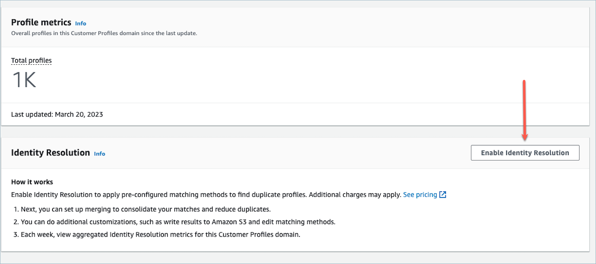

# Use Identity Resolution to consolidate similar profiles in

Amazon Connect

A _similar profile_ is when two or more profiles are determined to
be for the same contact. There can be multiple profiles when customer records are
captured across multiple channels and applications for the same customer, and do not
share a common unique identifier.

Identity Resolution automatically finds similar profiles and helps you consolidate them. It runs an
Identity Resolution Job on a weekly basis, which performs the following steps:

1. [Automatic profile matching](how-identity-resolution-works.md#auto-profile-matching "how-identity-resolution-works.md#auto-profile-matching")
2. [Automatic merging of similar
   profiles](how-identity-resolution-works.md#auto-profile-merging "how-identity-resolution-works.md#auto-profile-merging") based on your consolidation criteria
   Each time an Identity Resolution Job runs, it displays metrics on the **Customer Profiles** page.
   The metrics show the number of profiles it reviewed, the number of match groups found,
   and the number of profiles consolidated.

Additional charges may apply for enabling Identity Resolution. For more information, see [Amazon Connect pricing](https://aws.amazon.com/connect/pricing/ "https://aws.amazon.com/connect/pricing/").

