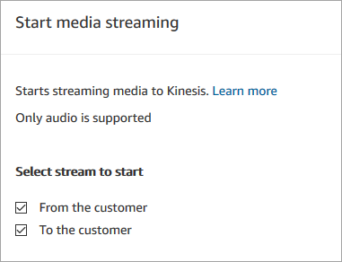
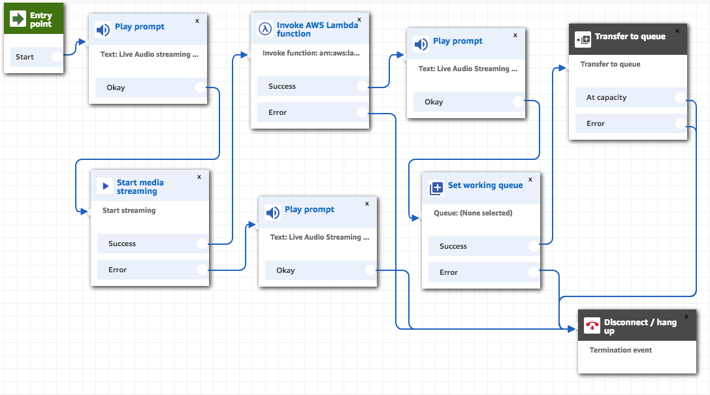

# Example flow for testing live media streaming

in Amazon Connect

Here's how you can set up a flow to test live media streaming:

1. Add a **Start media streaming** block at the point where you
   want to enable customer audio streaming.
2. Connect the **Success** branch to the rest of your
   flow.
3. Add a **Stop media streaming** block to where you want to
   stop streaming.
4. Configure both blocks to specify what you want to stream: **From the
   customer** and/or **To the customer**.

Customer audio is captured until a **Stop media streaming** block is
invoked, even if the contact is passed to another flow.

Use the contact attributes for media streaming in your flow so that the contact record
includes the attributes. You can then view the contact record to determine the media
streaming data associated with a specific contact. You can also pass the attributes to
an AWS Lambda function.

The following example flow shows how you might use media streaming with attributes for
testing purposes. This flow includes a **Start media streaming** block
but it is missing the **Stop media streaming** block.

After the audio is successfully streamed to Kinesis Video Streams, the contact attributes are
populated from the **Invoke AWS Lambda function** block. You can use
the attributes to identify the location in the stream where the customer audio starts.
For instructions, see [Contact attributes for live media streaming
in Kinesis Video Streams](media-streaming-attributes.md "media-streaming-attributes.md").
