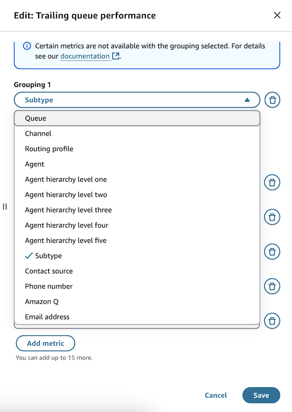
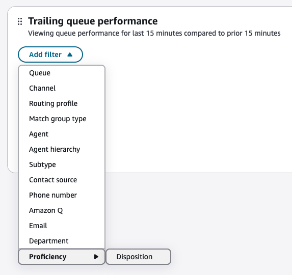
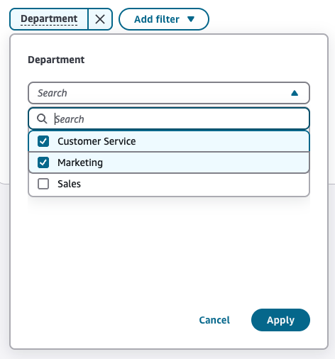

# Use predefined attributes in dashboards

Predefined attributes are available to use on dashboards for grouping and filtering different
real-time and historical contact-related metrics. Some system defined attributes have been enabled by
default for grouping and filtering. Filtering by user defined attributes is only available for
historical contact metrics in instances that are enabled for Amazon Connect with unlimited AI capabilities. To
set up analytics for filtering with user defined predefined attributes, see [Use contact segment
attributes](use-contact-segment-attributes.md "use-contact-segment-attributes.md").

Historical contact metrics can be found in the [Metric definitions](metrics-definitions.md "metrics-definitions.md")
page by looking for metrics that have a category of **Contact record-driven metric** and are
available on the dashboard page.

Real time contact metrics include: [Contacts in queue](metrics-definitions.md#contacts-in-queue "metrics-definitions.md#contacts-in-queue"), [Contacts scheduled](metrics-definitions.md#scheduled "metrics-definitions.md#scheduled"), [Oldest contact age](metrics-definitions.md#oldest-real-time "metrics-definitions.md#oldest-real-time"), etc.

###### Contents

- [Group by predefined attributes](#group-by-predefined-attributes "#group-by-predefined-attributes")
- [Filter by predefined attributes](#filter-by-predefined-attribute "#filter-by-predefined-attribute")

## Group by predefined attributes

There are two system defined attributes that can be used for grouping:

- Subtype (connect:Subtype)
- Contact source (connect:ValidationTestType)

1.  To group by one of the above attributes, navigate to **Dashboards and reports page**
    and select an existing template/report or create a custom one.
2.  In a widget that has only real-time or historical contact metrics, select the **Actions**
    icon and then choose **Edit**.
3.  Click on a groupings dropdown and select **Subtype** or **Contact source**.

        1. For real-time widgets, these grouping options will show up in the second grouping dropdown if
         the first grouping has been selected to be **Queue**.

    

4.  Click **Save** to apply your changes to the widget.

## Filter by predefined attributes

There are system defined attributes such as Subtype (connect:Subtype) or Contact source
(connect:ValidationTestType) that can be used for filtering, along with any user defined
attribute that has been enabled to be used for analytics.

1.  To group by one of the above attributes, navigate to **Dashboards and reports page**
    and select an existing template/report or create a custom one.
2.  In a widget that has only real-time or historical contact metrics, select the **Add filter**
    button. If enabled, user defined attributes will be displayed in the dropdown for historical widgets,
    either within the dropdown or under the business purpose associated with it.

        1. In the below example, **Department** and **Disposition** are both user
         defined attributes. **Department** was not associated with a business purpose and is
         displayed within the dropdown. **Disposition** shows up under **Proficiency**,
         because this is the business purpose associated with it.

    

3.  Once a filter has been selected, select one or more values to be filter by.

 4. Click **Apply** to apply your changes to the widget.
