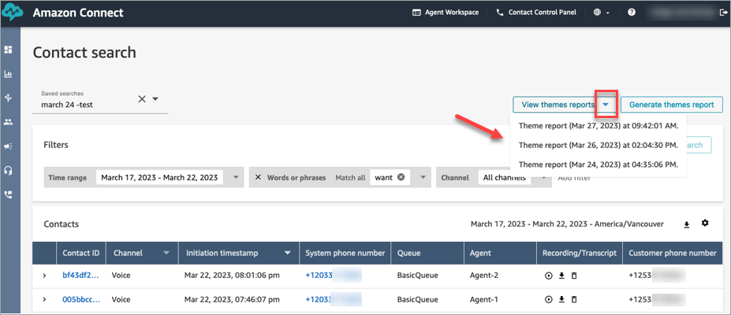
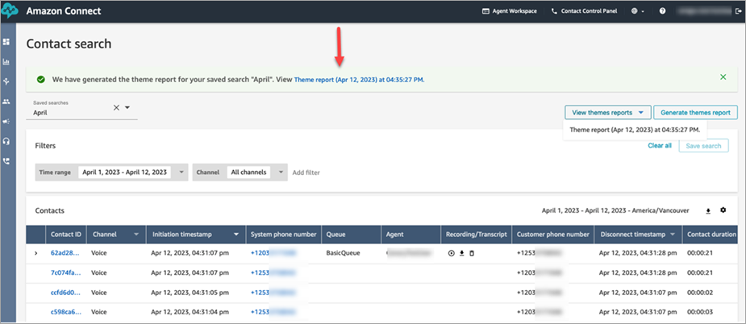
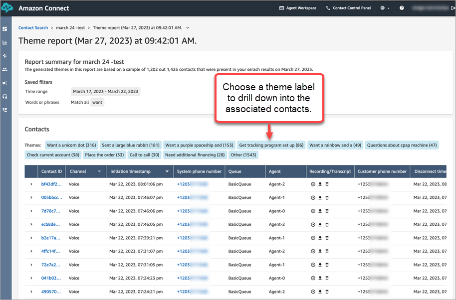

# Use theme detection in Amazon Connect

Contact Lens to discover issues with contacts

Use theme detection to discover previously unknown or emerging contact themes from
thousands of customer interactions. For example, you can spot common reasons for
customer outreach such as "cancel reservation" or "delayed order." You can then take
appropriate actions to improve the customer experience by expediting issue
resolution, and improving IVR options, knowledge base articles, and agent
training.

## Important things to know

- Theme detection is available in the following languages supported by
  Amazon Connect Contact Lens:

| Language (country)       | Language code |
| ------------------------ | ------------- |
| English (United States)  | en-US         |
| English (United Kingdom) | en-GB         |
| English (Australia)      | en-AU         |
| English (India)          | en-IN         |
| English (Ireland)        | en-IE         |
| English (Scotland)       | en-AB         |
| English (Wales)          | en-WL         |
| English (New Zealand)    | en-NZ         |
| English (South Africa)   | en-ZA         |

- Theme detection is supported on contacts that were created on or after
  January 30, 2023.
- The **Generate themes report** button is enabled only
  when your saved search contains at least 300 contacts with issues
  detected by Contact Lens.
- The theme detection report is generated for the 3,000 most recent
  contacts.
- Theme detection reports are available for 30 days after they are
  created. After 30 days, the reports are deleted from the database and
  cannot be retrieved.
- The most recent 20 theme reports for a saved search are available in
  the **View theme reports** dropdown menu, as shown in
  the following image.

## How to generate a theme report

1. Login to Amazon Connect using an account that has the following security
   profile permissions:
   - **Contact search - Access**
   - **Contact Lens - theme detection -
     Create**
   - **Contact Lens - theme detection -
     View**

2. In Amazon Connect, on the left navigation menu, choose **Analytics and
   optimization**, **Contact search**.
3. On the **Contact search** page, apply filters to
   select a group of contacts that have been analyzed by
   Contact Lens.

###### Important

Your search query must return at least 300 contacts with issues
detected by Contact Lens. Otherwise, the **Generate
themes report** button is not enabled. 4. Choose **Save search** to save your results. Assign a
name to your search. 5. Choose **Generate themes report**.

Contact Lens applies machine learning to automatically group
contacts with similar issues. When the report is generated, a banner
displays a link to the theme report. An example banner is shown in the
following image.

 6. Click or tap the link for the theme report.

The theme report is displayed. It includes theme labels and a list of
contacts, as shown in the following image.

 7. Click or tap the theme labels to view associated contacts, listen to
specific recordings, and read transcripts for deeper analysis.
