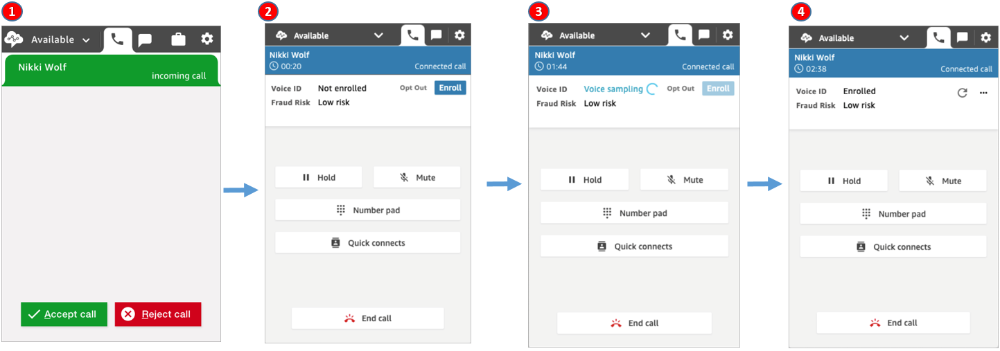
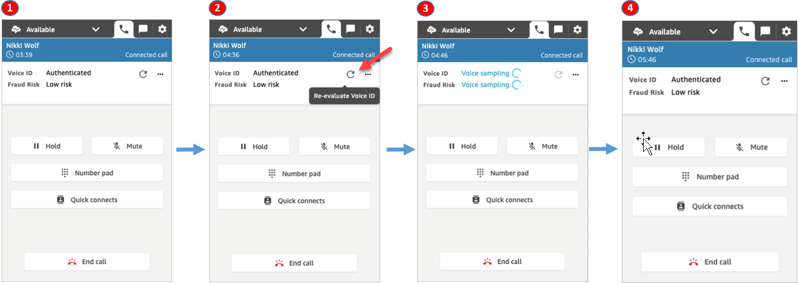
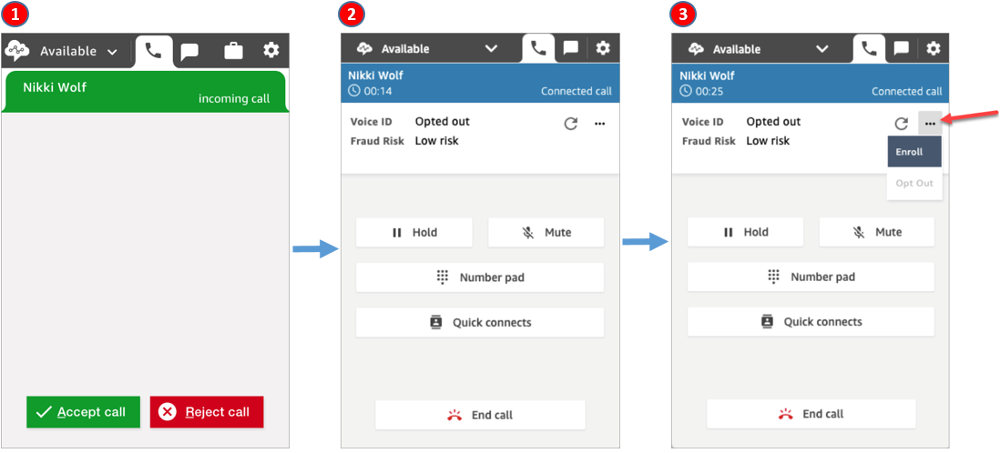
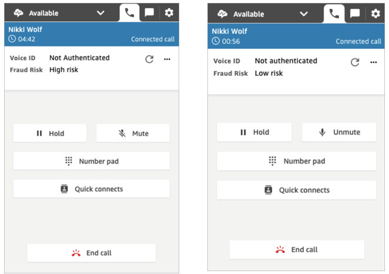
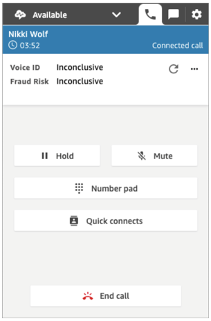

# Enroll callers in Voice ID in the Contact Control Panel

(CCP)

###### Note

End of support notice: On May 20, 2026, AWS will end support for Amazon Connect
Voice ID. After May 20, 2026, you will no longer be able to access Voice ID on the
Amazon Connect console, access Voice ID features on the Amazon Connect admin website or Contact Control Panel, or access Voice ID
resources. For more information, visit [Amazon Connect
Voice ID end of support](amazonconnect-voiceid-end-of-support.md "amazonconnect-voiceid-end-of-support.md").

This topic shows how Voice ID features appear in your Contact Control Panel
(CCP).

## Enroll a caller in Voice ID

1. You receive an incoming call.
2. The caller is not yet enrolled in Voice ID so you choose
   **Enroll**.
3. A message is displayed that Voice ID is sampling the caller's voice. It
   requires 30 seconds of speech (excluding silence).
4. The caller is now enrolled in Voice ID. This example also shows the
   caller's **Fraud risk** as lower than the threshold.

## Verification of an enrolled caller

After a customer is enrolled in Voice ID, when they call your contact center
again, you can verify they are who they say they are.

1. You receive an incoming call.
2. The caller is already enrolled in Voice ID, and their status is
   **Authenticated**. You can choose to re-evaluate
   authentication using Voice ID.
3. A message is displayed that Voice ID is evaluating the caller's speech.
   It requires between 5-10 seconds of speech, not including silences.
4. The caller has been authenticated by Voice ID. This example also shows
   the caller's **Fraud risk** is lower than the
   threshold.

## Caller has opted out

The following image shows what appears in your CCP when a caller has opted out of
Voice ID.

1. You receive an incoming call.
2. The caller has previously opted out of Voice ID.
3. You have the option to enroll them.

## Authentication status = Not

authenticated

When an enrolled caller calls your contact center, Voice ID may return a result
of **Not authenticated**. This means Voice ID was unable to
authenticate a caller's speech. The authentication score for the caller is lower
than the configured threshold.

The previous images show that the **Fraud risk** can be
**High** or **Low**, independent of whether
the caller is authenticated.

## Authentication status:

Inconclusive

When an enrolled customer calls your contact center, Voice ID may return a result
of **Inconclusive**: Voice ID was unable to analyze a caller's
speech for authentication. This is usually because Voice ID did not get the
required 10 seconds to provide a result for verification.

