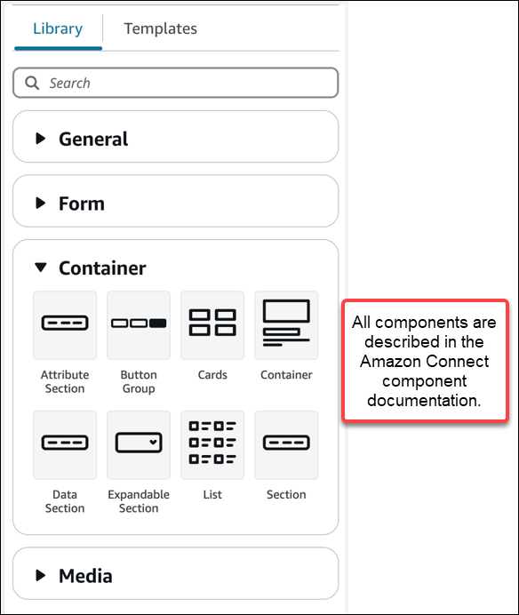
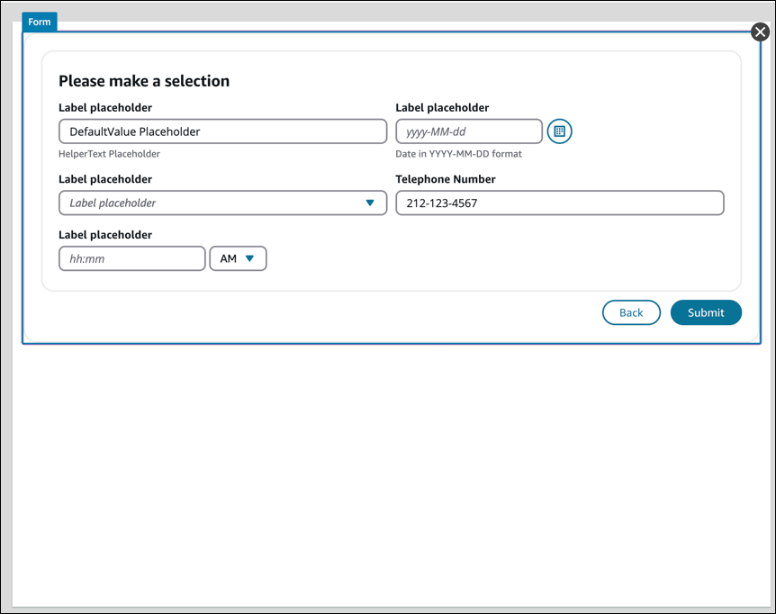

# UI component library for

UI builder in Amazon Connect

All of the UI builder components are described in the [Amazon Connect UI
component documentation](https://d3irlmavjxd3d8.cloudfront.net/?path=/docs/overview--page "https://d3irlmavjxd3d8.cloudfront.net/?path=/docs/overview--page"). This documentation shows you the individual UI
components that you can use in the UI builder, and how you can configure
them.

You access the library components in the UI builder in the
**Create** panel, the **Library** tab. The
following image shows an example of the **Library** tab and the
**Container** components.

## Use Containers to

move and organize components

Containers are a core building block to make views. You can move UI components
(including other containers) into a container to group them together logically
and visually on the page.

To keep the contents of the page relatively consistent as you customize the
top level view settings, we recommend using containers in all of your views.
Containers also come with column layout. Column layout allows you to organize
the contents within a container.

## Create a

form

To create a form for agents or customers to complete and submit, you use the
[Form](https://d3irlmavjxd3d8.cloudfront.net/?path=/story/aws-managed-views-form--with-all "https://d3irlmavjxd3d8.cloudfront.net/?path=/story/aws-managed-views-form--with-all") component. You can either:

- Drag and drop a **Form** component onto the canvas
  from the UI library.
- Or, from the **Templates** tab, select the
  **Form Example** template. It uses a form
  component.

A [Form](https://d3irlmavjxd3d8.cloudfront.net/?path=/story/aws-managed-views-form--with-all "https://d3irlmavjxd3d8.cloudfront.net/?path=/story/aws-managed-views-form--with-all") component is a special type of container into which you can
insert input fields and add a **Submit** button. When a user
who is interacting with the guide presses the **Submit**
button, Amazon Connect passes all of the values entered into the form fields to the flow.
At that point in the flow, you can customize your own business logic and
send/retrieve data to third-party systems by using the [AWS Lambda
function](invoke-lambda-function-block.md "invoke-lambda-function-block.md") block.

The following image shows an example **Form** component with
placeholder labels and a Submit Button.

