# Add users to Connect Customer

When you add users to Connect Customer, you can configure them with information appropriate to
their roles. For example, you specify their [security profile](connect-security-profiles.md "connect-security-profiles.md"), which indicates the tasks they can perform in Connect Customer admin website. For
agents you specify their [routing profile](routing-profiles.md "routing-profiles.md"), which
indicates the contacts that can be routed to them.

This topic explains how to add users using the Connect Customer admin website. To add users programmatically,
see [CreateUser](../APIReference/API_CreateUser.md "../APIReference/API_CreateUser.md") in the _Connect Customer API Reference Guide_. To use the CLI, see [create-user](../../../cli/latest/reference/connect/create-user.md "../../../cli/latest/reference/connect/create-user.md").

## Add a user individually

1. Log in to the Connect Customer admin website at https://`instance name`.my.connect.aws/. Use an **Admin** account, or an account
   assigned to a security profile that has **Users - Create**
   permission.
2. In Connect Customer, on the left navigation menu, choose **Users**.
3. Choose **Add new users**.
4. Enter the name, email address, secondary email address, mobile number, and
   password for the user.

###### Note

SAML users do not have primary email addresses or passwords. They use a username to log in. A username
is typically an email address but it does not have to be. For these users the field label
**Email address** is empty inside Connect Customer. When email notifications are sent for SAML users, they must have
a secondary email configured in order to get it. If a secondary email is not configured, the user will not receive the email.

###### Tip

Mobile number is not currently used by Connect Customer. 5. Choose a routing profile and a security profile. 6. Optionally, add tags to identify, organize, search for, filter, and
control who can access this user. For more information,
see [Add tags to resources in Connect Customer](tagging.md "tagging.md"). 7. Choose **Save**. The user detail page opens, where you
can configure additional settings.

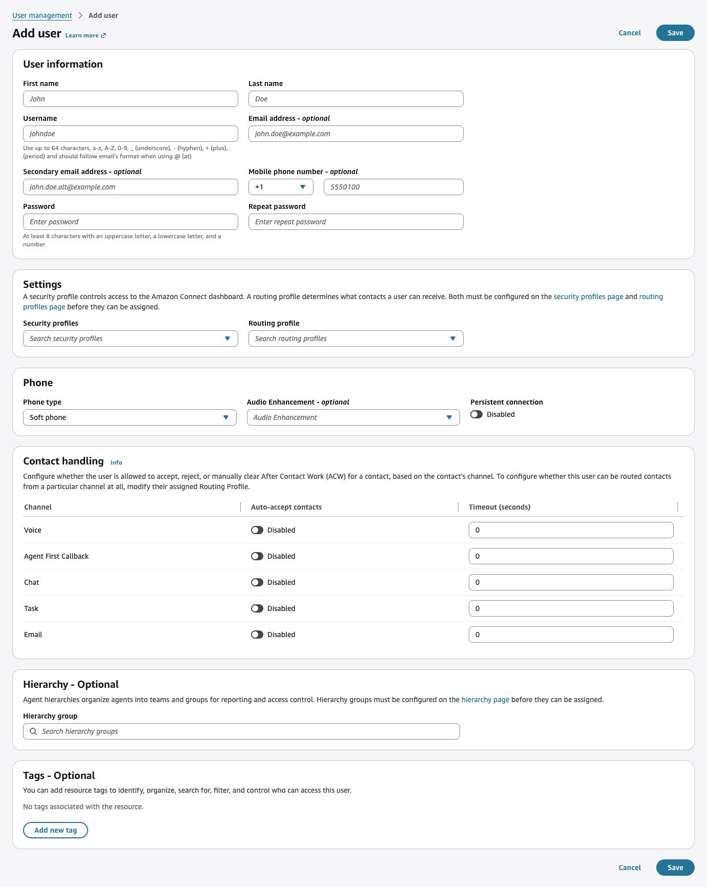 8. To configure agent-specific settings, such as phone type, auto-accept, and
the After Contact Work (ACW) timeout, edit the user after you create it. You
set auto-accept and the ACW timeout separately for each channel in the agent
Contact Handling settings. For more information, see [Configure agent settings in Connect Customer](configure-agents.md "configure-agents.md").

## Add users in bulk from a CSV file

You can add up to 1000 users at a time by using a CSV file.

###### CSV file limitations

Adding more than 100 unique values for routing profiles, security profiles,
or hierarchies to your CSV file causes validation timeouts or failures.

Bulk upload is for adding new records, not for editing existing records. To
edit user records in bulk, see [Edit users in bulk in Amazon Connect Customer](edit-users-in-bulk.md "edit-users-in-bulk.md").

Use these steps to add several users from a CSV file such as an Excel
spreadsheet.

1. Log in to Connect Customer with an **Admin** account,
   or an account assigned to a security profile that has **Users -
   Create** permission.
2. In Connect Customer, on the left navigation menu, choose **Users**.
3. Next to **Add new users**, choose the dropdown,
   and then choose **Import users**.

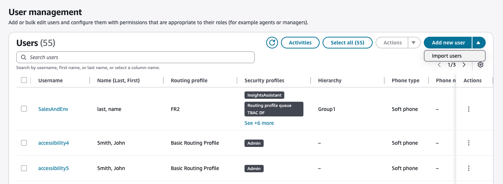 4. Download the **.csv template**. Use it as the basis
for your import file.

The CSV template has the following columns in the first row:

    * first name
    * last name
    * user login
    * agent hierarchy
    * routing profile name
    * security\_profile\_name\_1|security\_profile\_name\_2
    * user\_hierarchy\_1|user\_hierarchy\_2
    * phone type (soft/desk)
    * phone number
    * tags
    * persistent connection
    * audio enhancement(none/isolate voice/suppress noise)

The following image shows a sample of what the CSV template looks like in
an Excel spreadsheet. The first row in the spreadsheet contains the column
headings, and the second row contains sample user data.

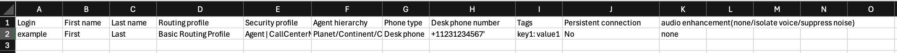 5. Add your users to the template and upload it to Connect Customer. Choose
the file to upload.

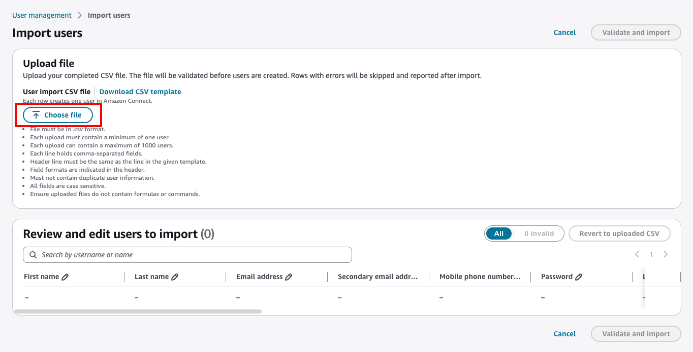 6. Review the users in the table. You can edit, remove, or add rows before
importing.

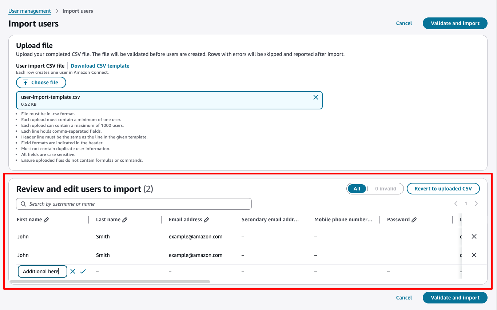 7. Choose **Validate and import**. If there are no errors,
the import runs automatically. You can view the progress on the
**Activity** page.

###### Activity data is stored locally

Your browser stores activity data locally for 7 days. This data isn't
shared or synchronized across users.

If there are errors, they appear in the table. Fix the errors directly in
the table and choose **Validate and import** again.

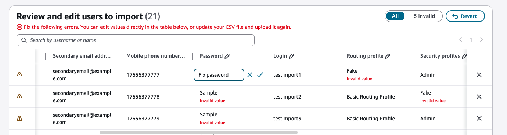

If the service fails to create some users after validation passes, the
operation banner shows a warning status when the process completes. Choose
**View results**, and then from the
**Select rows** dropdown, choose
**Edit failed rows in table** to correct the failed
entries without re-uploading the file.

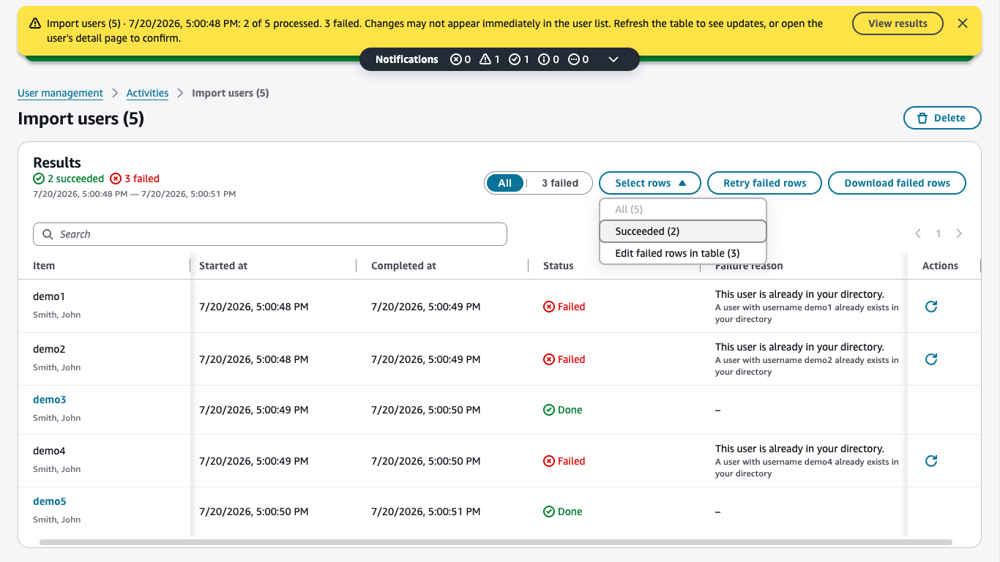

###### Tip

Although the import is running, you can continue working on
the **User management** page. You can create, edit, or
delete other user records while you wait.

###### Stay on the page

Navigating away from the **User management** page
interrupts the import. Stay on this page until the import
completes. 8. Choose **Refresh** to see the newly created users on the
**User management** page.

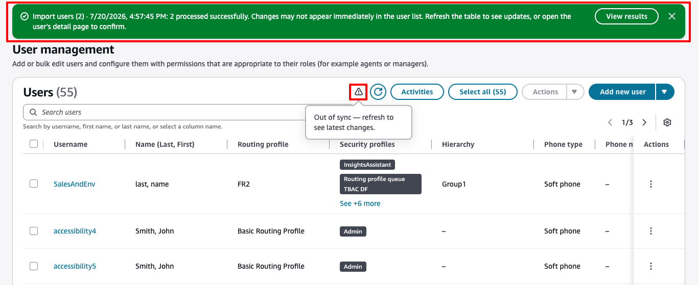 9. The CSV import excludes some user settings, such as contact handling
and proficiencies. To configure these settings, choose
**View results** in the import banner. From the
**Select rows** dropdown, choose
**Succeeded**.

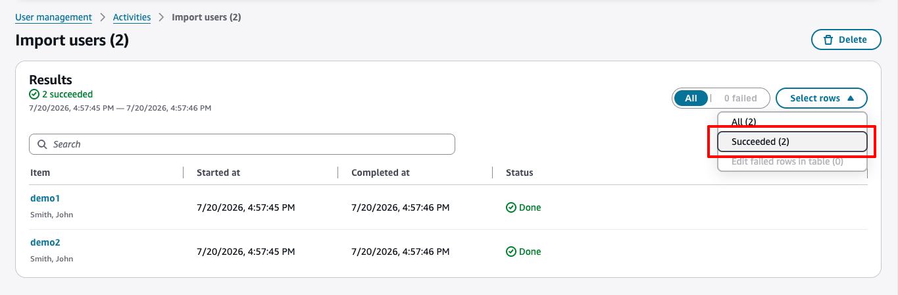 10. Choose an action from the **Actions** dropdown to
configure the additional settings in bulk.

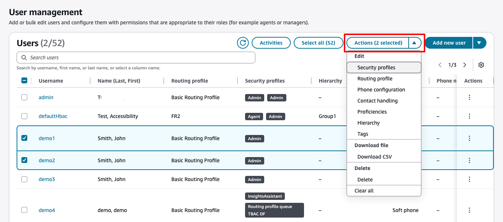

## Required permissions for adding users

Before you can add users to Connect Customer, you need the following permissions
assigned to your security profile: **Users - Create**. The
following image shows that this security profile permission is in the
**Users and permissions** section of the **Add/Edit
security profile** page.

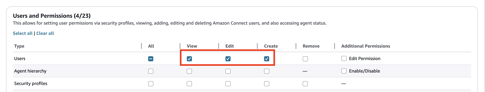

By default, the Connect Customer
**Admin** security profile has these permissions.

For information about how to add more permissions to an existing security profile,
see [Update security profiles in Connect Customer](update-security-profiles.md "update-security-profiles.md").
